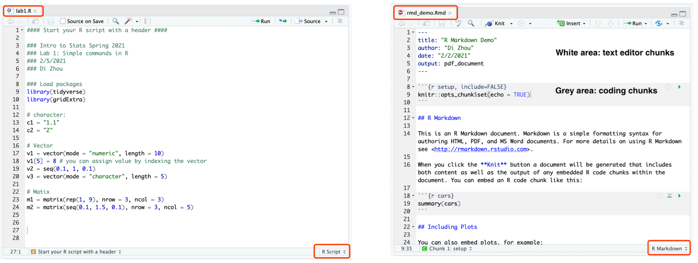
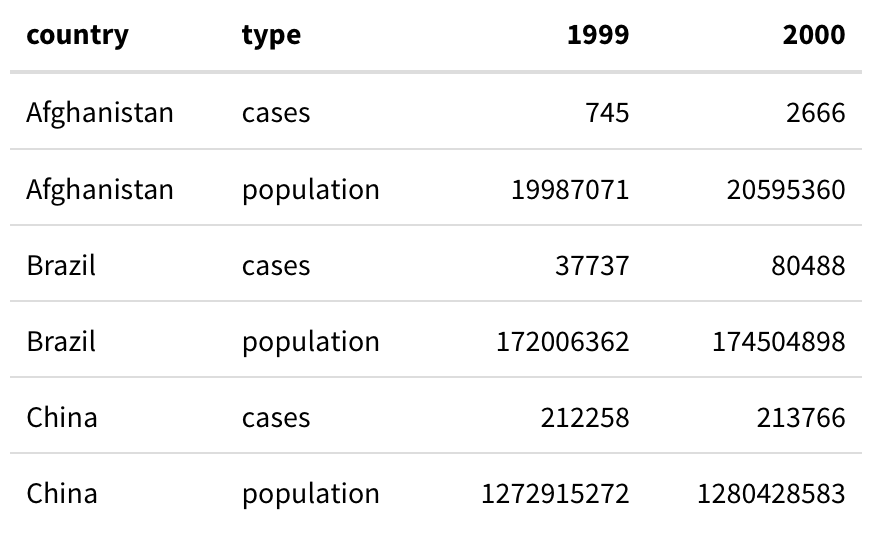
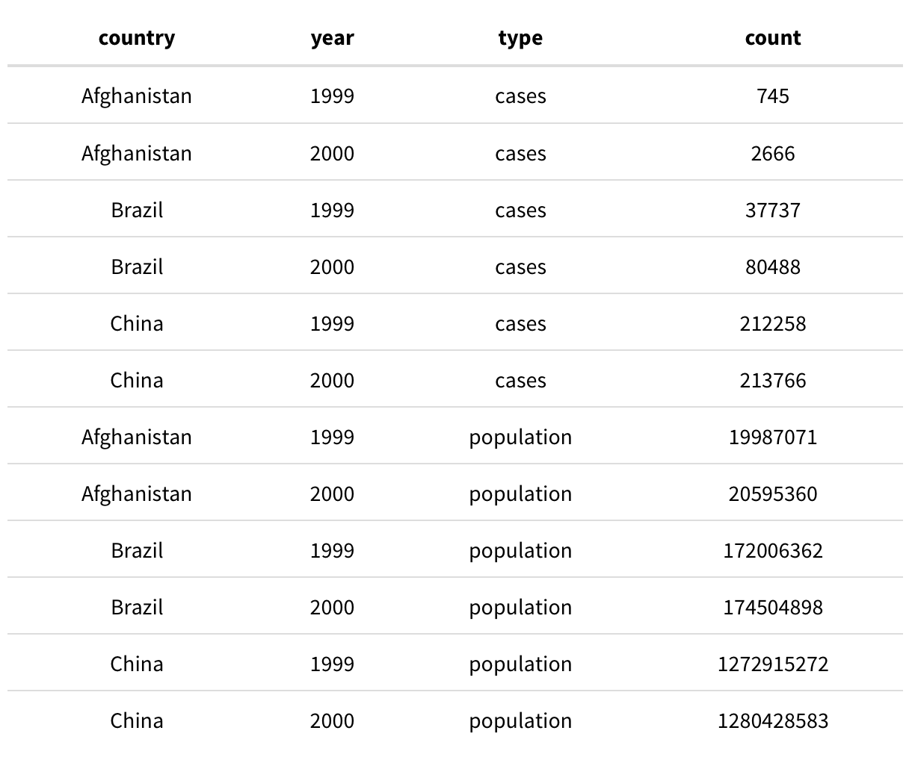
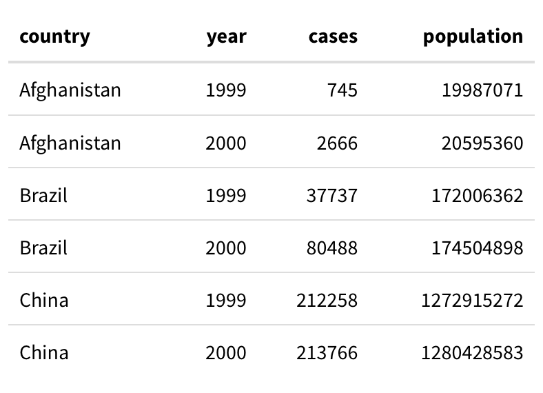
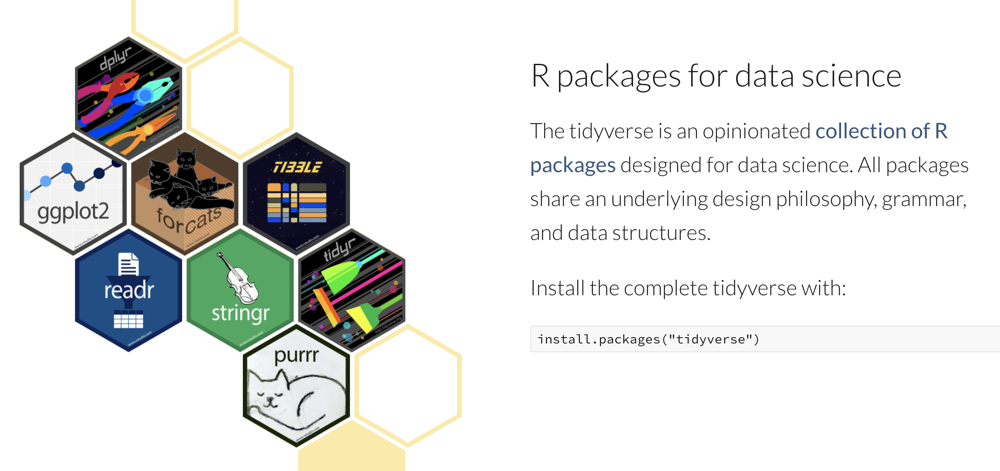

```{r setup, include=F}
knitr::opts_chunk$set(echo = TRUE)
```

# Logistics & Announcements  

* My office hour: Tuesday 2:00 pm - 4:00 pm. You may sign up [here](https://www.wejoinin.com/sheets/vqcup), or directly email me to schedule a time if the above time does not work (wj2068@nyu.edu). 

* Alternatively, you can send me emails, and I will typically respond to your question on the same day.

* Plan of assignments (tentative):  

| Assignment |  Release   |     Due     |
|:----------:|:----------:|:-----------:|
|     1      | 09/11/2024 | 09/29/2024  |
|     2      | 10/02/2024 | 10/20/2024  |
|     3      | 10/23/2024 | 11/14/2024  |
|     4      | 11/15/2024 | 12/01/2024  |  

* Please email me at least 3 days in advanced if you need additional time.

* Assignments will assist you
  * understand key concepts in statistics using simulations
  * familiarize yourself with codings in `R`
  * prepare for the final replication project

* Working in groups is strongly encouraged.

* The final replication project is based on this ASR paper: \
Going Back in Time? Gender Differences in Trends and Sources of the Racial Pay Gap, 1970 to 2010, by Hadas Mandel and Moshe Semyonov
  
# Prerequisite
* Download & install `R`: https://cloud.r-project.org/
* Download & install `RStudio`: https://rstudio.com/products/rstudio/download/
  
# Part 1: Basics of RStudio and R Markdown

## What are R & RStudio  

  + **R** is a free programming language commonly used for statistical programming and graphics. Download & install: https://cloud.r-project.org/  

  + **RStudio** is an IDE (Integrated Development Environment) for `R`. It’s an application that enables you to write, run, and save your `R` code and programming outputs. Download & install: https://rstudio.com/products/rstudio/download/
  

## The layout of RStudio

<p align="center">
{width=100%}
</p> 

## Coding in R Script vs. R Markdown

  + **R Script** is a simple code script document. The output of `R` script cannot be saved within the script.
  
  + **R Markdown** is a simple formatting syntax for authoring HTML, PDF, and even Microsoft Word documents.
  
<p align="center">
{width=100%}
</p>
  
  + Different from R Script, **R Markdown** allows users to **present both their code and the code’s output (tables, plots, etc.) in a single document**, usually by "knitting" (rendering) an R Markdown to a HTML or PDF file.  
  
  + R Markdown allows you to divide your code into sections, which helps you **better organize** your code.
  
  + R Markdown also allows you to type **mathematical equations** efficiently. Equation formats are identical to LaTeX.
  
  + If you are **coding for assignments, R Markdown is required**. If you are coding for simpler tasks, you can use R script.

## R Markdown: Layout, the Markdown languages, and Knitting

+ In a `R Markdown` file, chunks with a *white* background are *text editor* chunks. You can incorporate formatted text (including mathematical equations) using the Markdown language. Use [this cheatsheet](https://rstudio.com/wp-content/uploads/2015/02/rmarkdown-cheatsheet.pdf) for Markdown guidance.

+ Chunks with a *grey* background are *coding* chunks. You will code in these chunks.

+ You can run your code by line, or by chunk. The output (if any) will be displayed after the current coding chunk.

+ You can knit (export/convert) a `R Markdown` file to HTML, PDF, or Word using the `Knit` button.

## Additional tips: Typing equations in R Markdown

+ To type mathematical symbols and expressions, you need to follow a particular Markdown syntax. For example, to print the Greek letter $\alpha$, you need to type `$\alpha$` in the text editor chunk of your `R Markdown` file.

+ You don't need to memorize all of the expressions. Google or refer to [this guide](https://rpruim.github.io/s341/S19/from-class/MathinRmd.html) when you work on mathematical equations.

+ To insert equations, you need to wrap your expression with the dollar sign. To type "inline equations" (equations that won't break your lines), use the dollar sign `$` to wrap your expression: `$\hat{\mu} = \frac{\sum_{i = 1}^{n}y_i}{n}$` gives: $\hat{\mu} = \bar{y} = \frac{\sum_{i = 1}^{n}y_i}{n}$.  

For "displayed equations" (equations that will break your lines), use the double dollar sign `$$` to wrap your expression: `$$\hat{\mu} = \bar{y} = \frac{y_1 + y_2 + y_3 + ... + y_n}{n} = \frac{\sum_{i = 1}^{n} y_i}{n}$$` gives: $$\hat{\mu} = \bar{y} = \frac{y_1 + y_2 + y_3 + ... + y_n}{n} = \frac{\sum_{i = 1}^{n} y_i}{n}$$

+ In R Markdown, hovering over your equation expressions will give you a preview of the equation you write.

## Additional tips: Knitting R Markdown to HTML or PDF

+ As mentioned earlier, you can knit R Markdown files to HTML, PDF, or Word.

+ Before you knit, always make sure you can run your code from beginning to end. You won't be able to knit if some codes throw error messages. (We will talk about debugging later.) 

+ There are many options in R Markdown that helps you manipulate how you want to present your document. For example, you can hide the code chunk and only show the output by adding `echo = FALSE` in your code chunk options. You can also use `include = FALSE` to prevent the code AND its output to appear in your knitted document. You can also use `eval = FALSE` to prevent your code from running (but it will be displayed) in your knitted document. For detailed documentation of knitting options, read [here](https://yihui.org/knitr/options/).

# Part 2: Coding in R 

In this part, we will go through the basics of the `R` language, including installing packages, types of variable objects, types of data objects, and how to code a function in `R`.

## 1. Installing and using packages

+ Assume you are starting a new coding task, you should first open RStudio, create a coding file (either `R script` or `R Markdown`), and save the file to a path in your computer.

+ After creating a `.Rmd` or `.R` file, you need to install and load necessary packages (using `install.packages()` and `library()`) so that you can use functions from other statistical packages. 

+ You only need to install packages **once**. After they are installed, you can simply load them to your environment in the future using the `library()` function. 

+ For example, to use the packages `tidyverse`, `gridExtra`, and `kableExtra`, you need to type the following code in your coding chunk: `install.packages(c("tidyverse", "gridExtra", "kableExtra"))`, then use the `library()` function to load each of them in your environment.

```{r install and load packages, message=FALSE}
# Install packages
# After you install, you can delete the line below and keep only the 'library' line
# install.packages(c("tidyverse", "gridExtra", "kableExtra"))

# Load package to environment
library(tidyverse)
library(gridExtra)
library(kableExtra)
```

## 2. Types of variables in R 

We use `R` to perform data cleaning and statistical analysis. But before that, we need to have a basic understanding about how to create, save, and retrieve unit of information in `R`. First, we will talk about **types of variables**. This is similar but not entirely the same as the types of variables we discussed in class (categorical vs numeric). In `R`, types of variables is relevant because R processes different variable types differently.

+ Most common data types in R: 
  (i) **Logical** variable: `TRUE` (`T`) or `FALSE` (`F`)  
  (ii) **Character** variable (think of the "nominal categorical variables" we covered in lecture): a string, e.g. "female", "married"  
  (iii) **Numeric** variable: 
    + **Integer** (think of the "discrete variables" we covered in lecture): e.g. 1L, 2L, ...
    + **Double** (think of the "continuous variables" we covered in lecture): e.g. 1.44, 3.14
    + R automatically converts between these two classes when needed for mathematical purposes.

+ Variable types matter when you use different functions in R. For example, you cannot perform arithmetic (e.g. mean or median) with character variables even if they appear to be numbers. 

+ Check variable type using `class()` on the target variable or `str()` (structure) on the target dataset

+ To create a variable, you give it a name first, then use either `<-` or `=` followed by the value you want to assign. E.g. `variable1 <- "female"`

+ It's preferable to **leave spaces around your `<-` or `=`** so that your code is easy to read. 

```{r variable types, eval = FALSE}
## run the following codes in your environment:

## logical
TRUE
FALSE
1 == 2 ## == tells if A equals to B; != tells if A does not equal to B

## character
c1 = "1.1"
c2 = "2"

## numeric
n1 = 1.1
n2 = 2

## try run:
c1 + c2 ## this will throw an error message
n1 + n2

## check variable type
str(c1)
str(n1)

class(c1)
class(n1)

## you can also use is.xxx() to get a T/F for a particular data type:
is.numeric(c1)
is.numeric(n1)

is.character(c1)
is.character(n1)

is.integer(c1)
is.integer(n1)
```

## 3. Types of data in R

Here, data are defined as a collection of variables. 

+ Most common data types in R:  

  (i) ***Vectors***: A collection of elements of the same data type, e.g. logical vector, character vector, numeric vector. **In most cases, each column of a dataset (variable) is a vector**.

  (ii) **Matrices**: A vector with two dimensions. Elements in a matrix must share the same variable type (numeric, character, etc.).
  
  (iii) **Arrays**: Arrays are similar to matrices but can have more than two dimensions.
  
  (iv) ***Data frames***: Similar to matrices but different columns can have different variables types (numeric, character, logical, etc.). **In most cases, this is the format of a dataset, or a collection of vectors**.  
  
  (v) **Lists**: An ordered collection of objects with no constraint on their variable or data types, e.g. a list of character, a list of numeric, a list of vector, a list of list, a list of a mix of logical variables, character variables, and dataframes.
  
  (vi) **Factors**: A vector that is *ordered* (think of the "ordinal categorical variables" we covered in lecture). It can organize a categorical variable in a particular order for your desired ranking/ordering needs. For example, you can change a vector of educational levels `c("high school graduate", "4-year college", "some college", "below high school", "graduate or above")` to have an internal ranking `"below high school" < "high school graduate" < "some college" < "4-year college" < "graduate or above"` so that when you plot, these categories are ordered. 
  
+ Similar to variable, to create a data object, you give it a name first, then use either `<-` or `=` followed by the data object you want to assign, e.g. `vector1 = c(1, 2, 5.3, 6, -2, 4)`.

+ It's preferable to **leave space after each comma `", "`** in your code to make it easy to read.

```{r data types,  eval = FALSE}

## run the following codes in your environment:

## --------- Vector --------- ##
v1 = c(1, 2, 5.3, 6, -2, 4) ## numeric vector
v2 = c("one", "two", "three") ## character vector
v3 = c(TRUE, TRUE, TRUE, FALSE, TRUE, FALSE) ## logical vector

v1[2] = 8 ## you can assign value by indexing the vector

v4 = seq(0.1, 1, 0.1) ## seq() creates a sequence (from, to, interval)
v5 <- rep(0.1, 10) ## rep() repeats an element for n times (element, n)

## check if vector 
is.vector(v1)

## check length of vector
length(v1)

## vector operation
v6 = v4 + v5

## you can do basic calculations/have descriptions on vector (this is related to your assignment 1!)
sum(v1)
length(v1)


## --------- Data frames --------- ##
var1 <- c(1, 2, 3, 4)
var2 <- c("red", "white", "red", NA)
var3 <- c(TRUE, TRUE, TRUE, FALSE)
mydf <- data.frame(var1, var2, var3)
names(mydf) <- c("ID", "Color", "Passed") ## update variable names

## base R methods of data frame indexing 
mydf[ , 1:2] ## columns 1, 2 of data frame
mydf[c(1,3), ] ## row 1, 3 of data frame
mydf[, c("ID", "Color")] ## columns ID and Color from data frame
mydf$Color ## variable `Color` in the data frame
mydf[, "Color"] ## variable `Color` in the data frame

## convert a vector or matrix to df
as.data.frame(v1)
```

## 4. What's a function

+ Functions execute certain tasks. For example, the function `class(x)` is a function that tells you the type of your input variable or data object. Similarly, the function `library(lib_name)` is a function that loads a library you specified in the parenthesis to your environment. 

+ A function consists of a name, a set of arguments (input), and an output. The function `class(x)` has the function name `class`, and the input `x`, and will return an output -a character tells you the type of `x`. The function `library(lib_name)` has the function name `library`, the input `lib_name`, and will return an output in the form of loading the package to your environment. 

+ You can always learn about the structure of a function using the "Help" tab in RStudio. You can also call the function documentation by typing `?` followed by the function name in the Console panel in RStudio. For example you can try type `?class` in the Console panel -what do you see?

+ You can write your own functions in R using the function syntax below:

```
your_function_name <- function(input){
  
  # A series of actions or operations of your function
  code
  code
  code
  
  return(output)
  
}

```

+ For example, write a function that add 1 to each value of an vector:

```{r function,  eval = FALSE}

# function
add_one <- function(vector){
  out_vector = vector + 1
  return(out_vector)
}

# try:
add_one(v1)
```


## 5. Additional Tips for Using R

+ Managing your working environment:

  (i) Keep an eye on objects in your environment. It's always easier to keep track of your work if you clear your environment every time you start a new task. In addition, by removing large data objects in your environment, R will run more smoothly.
  
  (ii) To clean the working environment, I often change the environment display from `List` to `Grid`, and select the objects I want to remove, then use the little broom logo in the Environment tab. You can also use `rm(list=ls())` to clear everything in your work space, but use this with caution!
  
+ In-line comments and other coding style suggestions:

  (i) Make sure you comment your code (start comments with the `#` sign) **as detailed as you can**. It will help your grader, your reader, and your(future)self to understand what's going on in the code.
  
  (ii) In general, it's better to be generous in spacing. Add spaces between numbers, =, commas, etc. You can start a new line after each comma (`,`) in your code, it's often possible to **break a very long line of code to multiple lines**.
  
  (iii) R language is **case-sensitive**. Make sure you are using the correct function name, for example, `as.Dataframe()` instead of `as.date()`.

# Part 3 Tidy Data and Tidyverse

## Working with Data: The Standard Workflow (Wickham & Grolemund 2017)

A typical data science project starts with data cleaning ("tidying"). In practice, we spend a loy of time just to clean the data so that it is ready for descriptive analysis and modeling exercise. For example, dealing with missing values, incoherent variable codings across survey years, outliers, inflations, etc.

<p align="center">
\centering
{width=70%}
</p> 

## Tidy Data

+ Before doing analysis to your data, look carefully at your dataframe, and ask: **Is this a "tidy" data set?**  

+ In a tidy data set:  
  + Each unit of observation is saved in its own row.
  + Each variable is saved in its own column.
  + Each value must have its own cell.

\centering
{width=100%}
</p> 

+ Look at the following three dataframes. Which are tidy? Which are not? Why?

  + Dataframe A
  
\centering
{width=55%}
  
  + Dataframe B
  
\centering
{width=70%}
  
   + Dataframe C

\centering
{width=50%}

+ Tidy data is a foundation for data transformation in `R` using the `tidyverse` package collection. For data cleaning, we use a lot of functions from the `dplyr` package. For plotting, we often use the `ggplot2` package. By loading `tidyverse` to your environment, you will have all these packages loaded. 

\centering
{width=70%}
\flushleft

# Part 4 Using Tidyverse for Data Wrangling

## 1. Import Comma-separated files

+ Comma-separated files (.csv) are the most common data files.

+ Here I use the built-in function `read.csv()` to load .csv data files. Be sure to have the correct **working directory** (i.e., path of the folder where files are stored) before reading data.

```{r import csv}
## load csv files
gapminder <- read.csv("data/gapminder.csv") 
tidy_df1 <- read.csv("data/tidy_example_1.csv")
tidy_df2 <- read.csv("data/tidy_example_2.csv")
```

## 2. Browse data in R

+ You can click the little table logo next to your data object in the `Enviornment` panel to view data, or type `View(data_object)` in the R Console. 

+ Common things to check about your data: 
  + Sample size, i.e. number of observations: `nrow(data_object)`
  + Number of varibles: `ncol(data_object)`, and names of variables: `colnames(data_object)`
  + Alternatively, `dim(data_object)` gives both the number of observations and the number of variables.
  + Summary statistics of each variable: `summary(data_object)`
  + Type of data of each variable: `str(data_object)`
  
+ You can also view the first and last several rows of your data: `head(data_object)`, `tail(data_object)`

```{r browse data, eval = F}
## view data in a pop-up window
View(gapminder)

## summary statistics by variable
summary(gapminder)

## variable names
names(gapminder)

## number of rows and columnes
nrow(gapminder)
ncol(gapminder)
dim(gapminder)

## check first several observations
head(gapminder)
head(gapminder, n = 10)

## check last several observations
tail(gapminder, n = 5)

## check mean, variance, sd, sum, length of a variable (column)
## note that var and sd function in R uses n-1 as the denominator
mean(gapminder$lifeExp)
var(gapminder$lifeExp)
sd(gapminder$lifeExp)
sum(gapminder$lifeExp)
length(gapminder$lifeExp)

```

## 3. Basic `tidyverse` command

+ We are going to use functions from the `dplyr` package under the `tidyverse` package collection.

+ `dplyr` has a "pipeline" structure, where start from a dataframe and use the pipe `%>%` command to lay out the actions you want to take to that object. 

+ Let's start with the following basic commands for manipulating data frame:
 (i) Pick observations by their values `filter()`
 (ii) Reorder the rows `arrange()`
 (iii) Select/index observations `slice()`
 (iv) Pick variables by their names `select()`
 (v) Rename variables by `rename()`
 (vi) Create new variables with functions of existing variables `mutate()`

```{r filter-1, eval = F}

## ---------- filter ---------- ##

## filter only Asian countries:
gapminder %>% filter(continent == "Asia")

## "or": filter observations whose continent equals either Asia or Americas
gapminder %>% filter(continent == "Asia" | continent == "Americas")

## "or": Instead of using | , you can also use %in% followed by a value vector 
gapminder %>% filter(continent %in% c("Asia", "Americas"))

## "and": filter observations that satisfy both conditions
gapminder %>% filter(continent == "Asia" & year == 2007)

## negation: not equal to
gapminder %>% filter(continent != "Asia")

## negation: filter values that's not equal to any value included in the vector
gapminder %>% filter(!(continent %in% c("Asia", "Americas")))

## combine "and" and Negation:
gapminder %>% filter(continent == "Asia" & year != 2007)

# Filter only 2007 data:
gapminder %>% filter(year == 2007)
```

```{r filter-2}
## save data as a new data object
gapminder_2007 <- gapminder %>% filter(year == 2007)
```

```{r arrange, eval = F}

## ---------- arrange ---------- ##

## arrange() helps you sort observations
## sort by GDP per capita, from lowest to highest
gapminder_2007 %>% arrange(gdpPercap)

## sort by GDP per capita, from highest to lowest
## use the desc() function to your variable to sort in descending order
gapminder_2007 %>% arrange(desc(gdpPercap))
```

```{r select, eval = F}

## ---------- select ---------- ##

## select desired variables by name
gapminder %>% select(country, pop)

# You can deselect using - before column name
gapminder %>% select(-country, -pop)

```

```{r rename, eval = F}

## ---------- rename ---------- ##
gapminder %>% rename(gapminder, population = pop) ## new name = old name

```

```{r mutate, eval = F}

## ---------- mutate ---------- ##

## create new variables using "mutate"
gapminder %>%
  mutate(gdpPercap_in_thousand = gdpPercap/1000,
       gdp = pop * gdpPercap,
       log_gdp = log(gdp), ## natural log
       log2_gdp = log2(gdp),
       id = row_number())  ## create id by row number

```

```{r piping-1, eval=FALSE}

## ---------- pipeline ---------- ##

gapminder %>% 
  filter(year == 2007) %>%
  arrange(desc(gdpPercap)) %>% 
  slice(1:5)

```

## 5. Make untidy data tidy

+ In many cases, data are untidy.
+ One typical example is that the data is in a long format, with a single column containing multiple variable values.

+ What if it's not tidy?  
  + There are two `pivot` functions in `tidyverse` that help you make untidy data tidy. 
  + `pivot_longer()` helps you to bring the information in the column names to being values in a single column.
  + `pivot_wider()` does the opposite

+ Remember what count as tidy **depends on your questions**, specifically, what count as **an observation** in your study. 

```{r tidy-1, eval = F}

## observe the data structure of the two untidy examples
View(tidy_df1)
View(tidy_df2)

## for `tidy_df2`, we need "cases" and "population" to have their own columns
tidy_df2 %>%
  pivot_wider(names_from = type, 
              values_from = count)

## we can save clean df as a new object 
tidy_clean <- tidy_df2 %>%
  pivot_wider(names_from = type, 
              values_from = count)

## and export as .csv to your data folder
write.csv(tidy_clean, "tidy_clean.csv", row.names = F)

## for df1, we need to first bring years from column names to a variable
## then put values of "cases" and "population" in two columns

tidy_df1 %>%
  
  ## bring years from column names to a variable
  pivot_longer(cols = c(year_1999, year_2000), 
               names_to = "year", 
               values_to = "count") %>%
  
  ## remove "year_" prefix in the year variable
  mutate(year = str_remove(year, "year_")) %>% 
  
  ## put values of "cases" and "population" in two columns
  pivot_wider(names_from = type, 
              values_from = count)
```

## 6. Summarise and group data

+ The `summarise()` function collapses many values down to a single summary, e.g. mean, median, standard deviation, max, min, etc.

+ The `group_by()` function creates a grouped copy of a table, thus you can apply various functions to each group.

+ Combining `group_by()` with `summarise()`, you can get various **descriptive statistics** for your data, either for the entire dataset, or by group (e.g. groups by gender, race, education level, etc.). 

```{r summarise and group, eval = F}

## example for summarise()
gapminder %>%
  filter(year == 2007) %>%
  summarise(avg_life = mean(lifeExp))


## example for combining group_by() and summarise()
gapminder %>%
  filter(year == 2007) %>%
  group_by(continent) %>%
  summarise(avg_life = mean(lifeExp))


## you can get many different summary statistics for each group using summarise()
summary1 <- gapminder %>%
  filter(year == 2007) %>%
  group_by(continent) %>%
  summarise(year = 2007,
            n_country = n(),
            max_gdpPercap = max(gdpPercap), 
            min_gdpPercap = min(gdpPercap), 
            mean_gdpPercap = mean(gdpPercap),
            sd_gdpPercap = sd(gdpPercap))

summary1
```

+ Whenever there are NA values (meaning some values are not available in a column), it is necessary to add `, na.rm = T` in function. For example, 

```{r summarise and group NA value, eval = F}
gapminder %>%
  filter(year == 2007) %>%
  group_by(continent) %>%
  summarise(avg_life = mean(lifeExp, na.rm=T))
```

# Part 5 Preparations for Assignment 1

+ In lecture, we talked about the difference between population and sample, and population parameter and sample statistic. 
+ We can simulate some of the concepts using `R`, as `R` can "randomly" sample from a hypothetical "population".

```{r sample from population, eval = F}

## set randomization "seed" 
## this is to ensure you can replicate results, 
## even if population creation and sampling is "randomized"
set.seed(2023)

## create a hypothetical population where samples can be drawn
pop <- runif(100000, min = 0, max = 1) ## a uniform distribution
## other options include normal distribution: rnorm(n, mean, sd)

## sample from the population
sample <- sample(pop, size = 100, replace = FALSE) ## sample without replacement

## calculate the sd of the sample (R uses n-1 as the denominator)
sd(sample)
```

+ We know from lecture that the sample SD has a different form from the population SD.
+ The reason why we have $n-1$ as the denominator is that it gives an **unbiased** estimation of the population SD.
+ We can simulate this conclusion using R.

```{r simulate sd, eval = F}

## create an empty vector to store sample SDs (200 simulations)
sd_vector_n_1 <- rep(NA,200)
sd_vector_n <- rep(NA,200)

## "loop" or repeat the sampling process for 200 times
set.seed(2023)
for (i in seq(1,200,1)){
  sample <- sample(pop, size = 100, replace = FALSE) ## sample without replacement
  sd_vector_n_1[i] <- sd(sample)
  sd_vector_n[i] <- sd(sample)*(100-1)/100
}

## the population sd
pop_sd <- sd(pop)*(length(pop)-1)/length(pop)

## which one is closer
mean(sd_vector_n) - pop_sd
mean(sd_vector_n_1) - pop_sd
```

