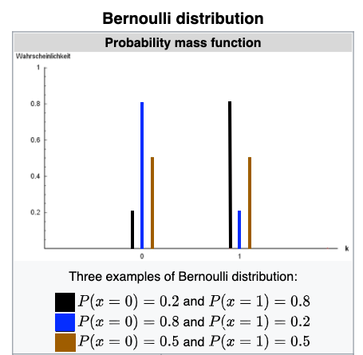

# Logistics

* Assignment 3: Due date extended to Nov. 27 (11:59pm)
* Replication project: Due data extended to Nov. 22 (11:59pm)

# Part 1: Discrete Dependent Variable

```{r setup, include=FALSE, warning=FALSE, message=FALSE}
knitr::opts_chunk$set(echo = TRUE, 
                      cache = FALSE,
                      fig.align = "center",
                      fig.width = 4.5,
                      fig.height = 4,
                      letina = TRUE)

library(tidyverse)
library(ggpubr)
```

## 1.1 Binary Response

* At this moment, we focus on the case when the dependent variable is a binary response (0 and 1). For example, we may be interested in whether one voted for Trump in the 2024 General Election (`trump == 1` if Yes) 
* As in regular OLS, we may also be interested in the association between income, gender, education, and party identification (strong Democratic = 0) on whether R voted for Trump.  

```{r load data, warning=FALSE, message=FALSE}

## load data
load("data/dat.RData")
```

## 1.2 Bernoulli Distribution

* When the outcome is binary, $Y_i \in \{0,1\}$, it is common to assume that it follows a [Bernoulli distribution](https://en.wikipedia.org/wiki/Bernoulli_distribution). A Bernoulli distribution has one parameter, which we might call $\pi$, that represents the probability of a "success." It is the convention to let $Y_i = 1$ be a success and $Y_i = 0$ be a fail; so, $\pi_i = \Pr[Y_i = 1]$.  

* An example of the Bernoulli distribution is the toss of a biased coin. We can plot the expected probability of whether we get a "tail" or "head" given how the coin is biased.  

<p align="center">
{width=50%}
</p> 

* To model binary outcomes, we are assuming the observed outcome follows a Bernoulli distribution for each unit of observation $i$ with a parameter $\pi$ that can be predicted with a set of predictors, $\boldsymbol{X}_i$.

## 1.3 The Linear Probability Model (LPM)

* Suppose that we have a binary outcome $Y_i \in \{0,1\}$, where we think that the success probability depends on a set of predictors $\boldsymbol{X}_i = \{X_{i1}, X_{i2}, ..., X_{i3}\}$. We might write this as $\pi_i = \Pr[Y_i = 1 | \boldsymbol{X}_i] = \pi(\boldsymbol{X}_i)$, where the subscript $i$ shows that the success probability will vary across units in our sample, and where we have emphasized that $\pi(\cdot)$ is a function of a set of predictors.  
* In the LPM, we assume that $\pi(\boldsymbol{X}_i)$ is a **linear** function of the predictors. That is,

$$ \pi(\boldsymbol X_i) = \mathbb{E}[Y_i | \boldsymbol X_i] = \beta_0 + \beta_1 X_{i1} + \cdots +\beta_k X_{ik},\qquad i= 1,2,...,n.$$

* Notice that the equation looks *exactly* the same as the linear regression model we have considered in the previous labs. The only difference is that the outcome is a binary variable.

* Linear Probability Model can be estimated using the same method as we estimate a regular linear model. In `R`, simply use `lm()`. In our case, we model the outcome variable `trump` using all the predictors in the dataframe.

```{r LPM, warning=FALSE, message=FALSE}
## fit LPM
lpm <- lm(trump ~ pid + log_inc + female + college, data = dat)

## print summary
summary(lpm)
```
  
* The interpretation of the coefficients of LPM is straightforward: Holding other variables constant, one unit increase in $X_k$ will increase/decrease the probability of $Y = 1$ by $\beta_k$. 

* We can plot the LPM's predicted probability of voting for Trump by Party ID. 

```{r plot LPM, warning=FALSE, message=FALSE}

## create new dataset for predictions
pred_dat <- data.frame(
  pid = 0:6,  # pid values to get predictions for
  log_inc = median(dat$log_inc, # fix inc at median 
                   na.rm = T), 
  female = 0, # fix gender at male
  college = 0 # fix education at less than BA
)

## create a new df of predict probability of voting for Trump
yhat <- cbind(pid = 0:6,
             predict(lpm, newdata = pred_dat, type = "response",
                     interval = "confidence")) %>%
  as_tibble()

## plot predicted probabilities (save plot in object lpm_plot)
lpm_plot <- yhat %>% 
  ggplot(aes(x = pid, y = fit)) +
  geom_line(col = "black") + 
  geom_ribbon(aes(ymin = lwr, ymax = upr),
              fill = "grey", alpha = .5, col = NA) +
  scale_y_continuous(
    name = "Predicted Probability\n",
    breaks = seq(0, 1, .25)) +
  scale_x_continuous(
    name = "\nParty Identification",
    breaks = seq(0, 6, 1)) + 
  geom_hline(yintercept = c(0, 1),linetype = 2) +
  geom_vline(xintercept = seq(0, 6, 1), linetype = 3, col = "grey") +
  theme_classic() +
  ggtitle("Probability of Voting for Trump by Party ID",
          subtitle = "Results from Linear Probability Model")

## print the plot
print(lpm_plot)
```

* There are three things to notice:

  + As the name of the model suggests, the predicted probability of voting for Trump is increasing *linearly* with our predictor.  

  + We see that the confidence interval at `pid = 0` (i.e., "Strong Democrats") and both the confidence interval and our fitted value at `pid = 6` (i.e., "Strong Republican") take on *impossible values*. There cannot be something like a probability that is smaller than zero or larger than 1.

  + The error distribution will not be homoskedastic

* The above issues (especially the second one) motivate a **logistic regression model** (or a **Generalized Linear Model (GLM)**) in which the predicted probabilities are guaranteed to lie between zero and one, and we allow semi-*non-linear* relations between our predictors and the outcome.

# Part 2: Logistic Regressions

## 2.1 Motivations and Basics

* To bound the predicted probability within 0 and 1, we turn to the Sigmoid Function
* $f(x) = \frac{1}{1+e^{-x}}$

```{r sigmoid,message=FALSE, fig.height=2.5, fig.width=4, fig.align="center", echo=FALSE, warning=FALSE}
data <-
  data.frame(
  x = seq(-10,10,0.05)
)
data$y <- (1)/(1+exp(-data$x))
data %>%
  ggplot(aes(x=x,y=y)) +
  geom_line(color="darkred") +
  theme_bw() +
  xlab("x") +
  ylab("f(x)") +
  ggtitle("Sigmoid Function") +
  theme(plot.title = element_text(size=10,hjust=0.5),
              axis.text.x=element_text(size=6),
              axis.text.y=element_text(size=6))
```

* The Sigmoid Function has two desired properties
  + 1. $f(x)$ is bounded within 0 and 1
  + 2. $x$ has no limit
* The Sigmoid Function is therefore a good candidate to model the **probabilities** of some categorical dependent variable (e.g., voted for Trump $\pi_i = \pi(\boldsymbol{X}_i)$), given some observed characteristics $\boldsymbol{X}_i$
* We specify the predicted conditional probability $\pi_i = \frac{1}{1+e^{-(\beta_0 + \beta_1 X_{i1} + \cdots +\beta_k X_{ik})}}$ 
* With some algebra
* $1-\pi_i = 1-\frac{1}{1+e^{-(\beta_0 + \beta_1 X_{i1} + \cdots +\beta_k X_{ik})}} = \frac{e^{-(\beta_0 + \beta_1 X_{i1} + \cdots +\beta_k X_{ik})}}{1+e^{-(\beta_0 + \beta_1 X_{i1} + \cdots +\beta_k X_{ik})}}$
* $\frac{\pi_i}{1-\pi_i} = \frac{1}{e^{-(\beta_0 + \beta_1 X_{i1} + \cdots +\beta_k X_{ik})}}$
* $\text{logit}(\pi_i) = \log(\frac{\pi_i}{1-\pi_i}) = \log \left(\frac{1}{e^{-(\beta_0 + \beta_1 X_{i1} + \cdots +\beta_k X_{ik})}} \right) = \beta_0 + \beta_1 X_{i1} + \cdots +\beta_k X_{ik}$ 
* This is the logit transformation!

## 2.2 Properties of Sigmoid and Logit

* Sigmoid function and logit function are inverse functions for each other
* Sigmoid function: $y = \frac{1}{1+e^{-x}}$
* Inverse of Sigmoid function: $x = \frac{1}{1+e^{-y}} \rightarrow y = \log(\frac{x}{1-x})$
* $\frac{1}{1+e^{-x}}$ is bounded within 0 and 1. Inversely, the $x$ in $\log(\frac{x}{1-x})$ is bounded within 0 and 1

```{r logit,message=FALSE, fig.height=2.5, fig.width=4, fig.align="center", echo=FALSE, warning=FALSE}
data <-
  data.frame(
  x = seq(0.0001,0.9999,0.0001)
)
data$y <- log(data$x/(1-data$x))
data %>%
  ggplot(aes(x=x,y=y)) +
  geom_line(color="darkred") +
  theme_bw() +
  xlab("x") +
  ylab("logit(x)") +
  ggtitle("Logit Function") +
  theme(plot.title = element_text(size=10,hjust=0.5),
              axis.text.x=element_text(size=6),
              axis.text.y=element_text(size=6))
```

## 2.3 Odds and Odds Ratios

* We call the term $\frac{\pi_i}{1-\pi_i}$ in the $\log()$ function “odds” (probability of "event" divided by probability of no "event")
* Odds $Odds = \frac{\pi_i}{1-\pi_i} = \exp(\beta_0 + \beta_1 X_{i1} + \cdots +\beta_k X_{ik})$
* We introduce the notion of odds ratio to interpret $\beta_k$
* Odds ratio = $\frac{Odds_{X_{i1}+1}}{Odds_{X_{i1}}} = \frac{\exp(\beta_0 + \beta_1 (X_{i1} + 1) + \cdots +\beta_k X_{ik})}{\exp(\beta_0 + \beta_1 X_{i1} + \cdots +\beta_k X_{ik})} = \exp(\beta_1)$
  + You may find it analogous to OLS, where $\hat{\beta_1}$ describes the (additive) change of the dependent variable when the independent variable change by 1 unit
  
## 2.4 Estimate Logistic Regression in R

* Fitting a logistic regression in R is straightforward. If we use the same predictors as those of the LPM discussed above, the code to fit the logistic regression is.

```{r logistic, warning=FALSE, message=FALSE}
## fit logistic regression model (glm)
l_reg <- glm(
    trump ~ pid + log_inc + female + college, # formula of regression
    family = binomial(link = "logit"),        # specifying the dist. of outcome
    data = dat                                # data
)

## check the class of the object
class(l_reg)

## summarize results
summary(l_reg)
```

## 2.5 Model Interpretation

* In the `summary` for logistic regression models:

  + 1. The coefficients in the `Estimate` column show the estimated regression coefficients, i.e., the $\hat\beta_k$'s.
  For example, the coefficient of the `pid` variable suggests that a unit increase in `pid` is associated with a `1.206`
  increase in the *logit* (the *log odds*) of the probability of voting for Trump. 

  + 2. We might also interpret the coefficients in terms of *odds* by exponentiating them. Hence, the odds of the
  outcome are predicted to increase **by a factor of** $e^{\hat\beta_1}$ for each unit increase in `pid`. For example, a
  unit increase in `pid` is associated with an increase of the odds of voting for Trump by a factor of $e^{1.206} = 3.340$.  

  + 3. You can calculating the exponentiated regression coefficients of a logistic regression model by using the `coef`
  function to extract the estimated coefficients from the model and, then, use the `exp()` function:
  
```{r exp, warning=FALSE, message=FALSE}
## extract coefficients
l_coef = coef(l_reg)
  
## print coefficients and their exponentiated form
rbind(coef = l_coef, exp_coef = exp(l_coef))
```

## 2.6 Predicted Probabilities

* It is always a good idea to plot the predicted probabilities (both for yourself and for your readers). In other words, we want to plot how the probability of the outcome changes when we vary a focal variable while fixing the remain variables at certain values. 

* In R, doing this is quite straightforward. We have already created a new dataset for which we want the predictions above (when plotting the predicted probabilities using the LPM). Let us use the exact same dataset again. 

```{r predicted logistic, warning=FALSE, message=FALSE}
## predict probability of voting for Trump (using logit model)
yhat_logit = cbind(pid = 0:6,
                   predict(l_reg,  # model object is different!
                           newdata = pred_dat, # data for prediction is the same!
                           type = "response")) %>%
  as.data.frame()
```

* By using the `type = "response"` option, we will obtain the predicted probabilities. However, the SE of the predicted probabilities is not available.
* SE is available, however, when we predict the *logit* by setting `se.fit = TRUE`. We specify the option `type = "link"` in the `predict` function. It can be shown that the sampling distribution of the predicted logits follow a Normal distribution in large samples
  + As the predicted logits are Normally distributed in large samples, we can use these estimated standard errors to calculate the 95% confidence intervals of the predicted logits. These intervals will have the form $\text{CI} = \text{logit}(\hat\pi_i) \pm 1.96 \times  \widehat{\text{S.E.}}(\text{logit}(\hat\pi_i))$.
  + This will give us the confidence interval for the predicted logits. But we want the 95% CIs for the predicted probabilities. Here we use the fact that the inverse-logit function is a strictly increasing function and just apply the function to both end-points of the confidence interval. This will give us the confidence interval for the predicted probabilities. That is, if the 95% CI for the predicted logits has the form $(a, b)$, then interval $(\text{logit}^{-1}(a), \text{logit}^{-1}(b))$ will be the 95% confidence interval for the predicted probabilities.

* In R, we can do this as follows:
```{r prediction, warning=FALSE, message=FALSE}
# predict the logit and standard errors
pred_logit <- predict(l_reg, 
                     newdata = pred_dat,
                     response = "link",
                     se.fit = TRUE) %>%
    as.data.frame() %>%
    select(fit, se.fit)

# calculate 95% CI for logits 
pred_logit <- pred_logit %>%
  mutate(lwr = fit - 1.96 * se.fit, 
         upr = fit + 1.96 * se.fit)

# apply inverse-logit function to get pred. probs and CI
pred_p <- pred_logit %>%
  mutate_at(1:4, function(a){1 / (1 + exp(-a))}) %>%
  mutate(pid = pred_dat$pid)

# plot predicted probabilities (save plot in object l_plot)
l_plot <- pred_p %>% 
  ggplot(aes(x = pid, y = fit)) +
  geom_line(col = "black") + 
  geom_ribbon(aes(ymin = lwr, ymax = upr),
              fill = "grey", alpha = .5, col = NA) +    
  scale_y_continuous(name = "Predicted Probability\n",
                     breaks = seq(0, 1, .25)) +
  scale_x_continuous(name = "\nParty Identification",
                     breaks = seq(0, 6, 1)) + 
  geom_hline(yintercept = c(0, 1), linetype = 2) +
  geom_vline(xintercept = seq(0, 6, 1), linetype = 3, col = "grey") +
  theme_classic() +
  ggtitle("Probability of Voting for Trump by Party ID",
          subtitle = "Results from Logistic Regression Model")

# print plot
print(l_plot)
```

* Notice that all the predictions and the corresponding confidence intervals lie between zero and one, as desired. Furthermore, we see that our model predicts that the probability voting for Trump is almost zero for Strong Democrats (`pid = 0~1`) and almost one for Strong Republicans (`pid = 5~6`). 

* This is a much more intuitive presentation of your results (or the meaning of the estimated regression coefficients) than an exponentiated coefficient of 3.341. So, whenever you run these models you should try to plot the predicted probabilities.

Lastly, we can use the `ggpubr::ggarrange`` function to compare the LPM and the logistic regression model:

```{r plot, fig.width = 8.5}
ggarrange(lpm_plot, l_plot, nrow = 1)
```

# Part 3: Maximum Likelihood Estimation (MLE)

* We think about the *joint probability* of observing the realized sample, given an underlying parameter $\beta$