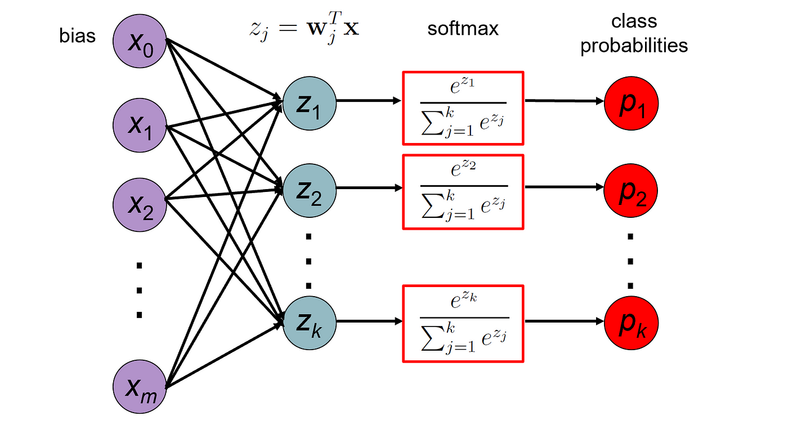

```{r setup, include=FALSE}
knitr::opts_chunk$set(echo = TRUE)

## load package
library(tidyverse)
library(stargazer)
library(effects)
library(gmodels)
library(MASS)
library(nnet)
library(ggpubr)

## load data
load("data/support_level_df.RData")
```
  
# Part 1: Bi-variate Associations (Contingency Tables)  

For today, we will use a similar dataset about same-sex marriage support. But now we have three support levels (1 = Oppose, 2 = Neutral, 3 = Support) instead of a binary outcome.

In `R`, you can create a contingency table by using the `table()` function and input the two categorical variables you are interested in. To conduct a chi-square test of independence, simply use the function `chisq.test(your_contingency_table)`. 

```{r chisquare, warning=FALSE, message=FALSE}

## create variables for contingency tables
support_df <- support_df %>%
  mutate(## convert dummies to categorical variables
         gender = ifelse(female == 0, "male", "female"),
         race = ifelse(black == 1, "black", "white"))

## simple contingency table and chi-square test for support levels and race
t1 <- table(support_df$support_level, support_df$race)
t1
chisq.test(t1)
```

## Part 1 Exercise

Recall that the $\chi^2$ statistic is defined as: 

$$\chi^2 = \sum\frac{(f^o - f^e)^2}{f^e},$$
where $f^o$ is the observed frequency and $f^e$ is the expected frequency.  

You are given the following contingency table of support levels and gender: 

```
   Cell Contents
|-------------------------|
|                       N |
|              Expected N |
|           N / Row Total |
|           N / Col Total |
|         N / Table Total |
|-------------------------|
 
Total Observations in Table:  1000 

                         | support_df$gender 
support_df$support_level |    female |      male | Row Total | 
-------------------------|-----------|-----------|-----------|
                       1 |       105 |       147 |       252 | 
                         |   123.228 |   128.772 |           | 
                         |     0.417 |     0.583 |     0.252 | 
                         |     0.215 |     0.288 |           | 
                         |     0.105 |     0.147 |           | 
-------------------------|-----------|-----------|-----------|
                       2 |       109 |       126 |       235 | 
                         |   114.915 |   120.085 |           | 
                         |     0.464 |     0.536 |     0.235 | 
                         |     0.223 |     0.247 |           | 
                         |     0.109 |     0.126 |           | 
-------------------------|-----------|-----------|-----------|
                       3 |       275 |       238 |       513 | 
                         |   250.857 |   262.143 |           | 
                         |     0.536 |     0.464 |     0.513 | 
                         |     0.562 |     0.466 |           | 
                         |     0.275 |     0.238 |           | 
-------------------------|-----------|-----------|-----------|
            Column Total |       489 |       511 |      1000 | 
                         |     0.489 |     0.511 |           | 
-------------------------|-----------|-----------|-----------|

```

1. How do you calculate the expected frequency for each cell? Verify your answer with the expected frequencies in the table.
2. State you null and alternative hypotheses of the $\chi^2$ test;
3. Calculate the $\chi^2$ statistic using the formula above;
4. Calculate the p-value of your test statistic. *Hint*: (a) recall that the degree of freedom is calculated by $\text{df} =(\text{nrow}-1)\cdot(\text{ncol}-1)$, (b) search `pchisq`   

```{r exercise, warning=FALSE, message=FALSE}

## your code here
```


# Part 2: Ordered Logit Regression Model  

## 2.1 Model Setup

* The cumulative probability for individual $i$’s choice up to response level $j$ is given by:  

$$C_{i,j} = Pr(y_i \le j) = \sum^{j}_{k = 1}Pr(y_i = k) = \frac{1}{1 + exp(-(\phi_j - x_i\beta))} \\j = 1, 2, ..., J$$

* This specific form of cumulative probability stems from the Sigmoid function:

$$
f(x) = \frac{1}{1+exp(-x)}
$$
which is monotonically increasing w.r.t. $x$

* Here we replace $x$ by the linear combination of category-specific cutpoints $\phi_j$ and individual-specific characteristics and their coefficients
  + Intuitively, we would use $\frac{1}{1 + exp(-(\phi_j + x_i\beta))}$ as in binary logistic model
  + We use $\frac{1}{1 + exp(-(\phi_j - x_i\beta))}$ because the model was specified in this way at the time of invention -- path dependence
  + It only changes the sign of $\beta$, but not its magnitude
  
* As the Sigmoid function is monotonically increasing, we will have:
  + $\phi_0 < \phi_1 < ... < \phi_J$
  + $\phi_0$ to be $-\infty$ and $\phi_J$ to be $\infty$. 

* The probability of being in response category $j$ for the same individual $i$ is:  

$$
\begin{aligned}
Pr(y_i = j) &= C_{i,j} - C_{i,j-1} \\
&= Pr(y_i \leq j) - Pr(y_i \leq j-1) \\
&= \frac{1}{1 + exp(-\phi_j + x_i\beta)} - \frac{1}{1 + exp(-\phi_{j-1} + x_i\beta)}
\end{aligned}
$$

* $\theta_j$ and $\beta$ are estimated using Maximum Likelihood Estimation (MLE). In `R`, you can estimate a ordered logit model using the `polr()` function from the `MASS` package. 

```{r ordered logit}
## estimate ordered logit model
ologit1 <- polr(support_level ~ eduy, data = support_df, method="logistic")
ologit2 <- polr(support_level ~ eduy + age, data = support_df, method="logistic")
ologit3 <- polr(support_level ~ eduy + age + female, data = support_df, method="logistic")
ologit4 <- polr(support_level ~ eduy + age + female + black, data = support_df, method="logistic")

## stargazer
stargazer(ologit1, ologit2, ologit3, ologit4, type="text")

```

## 2.2 Coefficients Interpretation  

* In ordered logit models, the coefficients capture the effect on the log odds of moving to the "higher rank". The exponentiated coefficients indicate the **ratio between the odds** after and before the given predictor increased by one unit.

* The odds here is defined as the probability of being in a higher category divided by the probability of being in the current or lower category.

$$
\begin{aligned}
\frac{\frac{Pr(y_i > j|X_k + 1)}{Pr(y_i \le j|X_k + 1)}}{\frac{Pr(y_i > j|X_k)}{Pr(y_i \le j|X_k)}} &= \frac{\frac{1-Pr(y_i \le j|X_k + 1)}{Pr(y_i \le j|X_k + 1)}}{\frac{1-Pr(y_i \le j|X_k)}{Pr(y_i \le j|X_k)}} \\
&=  \frac{exp(-\phi_j + (x_k+1)\beta_k)}{exp(-\phi_j + x_k\beta_k)}\\
&= exp(\beta_k)
\end{aligned} 
$$

* To get these odds ratios in R, use `exp(coef(your_model_object))` (same as the code you use for getting odds ratio for logistic models).

```{r exponentiated, warning=FALSE, message=FALSE}
## odds Ratio
exp(coef(ologit4))
```

* Note that the term $exp(\beta_k)$ does not depend on $j$. In other words, the effect of $X_k$ on $y_i$ moving to a higher category is the same across $j$. The effect of moving from the lowest category to higher ones is the same as from the second highest category to the highest category. This is **the proportional odds assumption/parallel regression assumption**

## 2.3 Plot Predicted Probability

```{r prediction, warning=FALSE, message=FALSE}

## dataframe for prediction
predicted_ord <- as.data.frame(Effect(c("eduy"), 
                                  ologit4,
                                  xlevels = list(
                                    eduy = seq(3, 24, by = 0.5),
                                    age = mean(support_df$age),
                                    black = mean(support_df$black),
                                    female = mean(support_df$female))
                                  ), 
                           level=95)


## get predicted yhat, pivot to long form
predicted_y_ord <- predicted_ord %>% 
  dplyr::select(eduy, prob.X1, prob.X2, prob.X3) %>%
  pivot_longer(!eduy, names_to = "level_y", values_to = "yhat") 

## get predicted upper CI of yhat, pivot to long form
predicted_upr_ord <- predicted_ord %>% 
  dplyr::select(eduy, U.prob.X1, U.prob.X2, U.prob.X3) %>%
  pivot_longer(!eduy, names_to = "level_upr", values_to = "upr") %>%
  dplyr::select(-eduy, -level_upr)

## get predicted lower CI of yhat, pivot to long form
predicted_lwr_ord <- predicted_ord %>% 
  dplyr::select(eduy, L.prob.X1, L.prob.X2, L.prob.X3) %>%
  pivot_longer(!eduy, names_to = "level_lwr", values_to = "lwr") %>%
  dplyr::select(-eduy, -level_lwr)

## combine to one df for plotting
predicted_plot_ord <- cbind(predicted_y_ord, predicted_upr_ord, predicted_lwr_ord)

## plot
figure1 <- predicted_plot_ord %>% 
  ggplot(aes(x = eduy, y = yhat, 
             ymax = upr, ymin = lwr, 
             fill = as.factor(level_y),
             linetype = as.factor(level_y))) + 
  geom_line() + 
  geom_ribbon(alpha = 0.3) +
  labs(title = "Ordered Logit",
       x = "Years of Education",
       y = "Predicted Probability") +
  scale_fill_manual(name = "",
                    values = c("#3182bd", "#31a354", "#de2d26"), 
                    label = c("Disagree", "Neutral", "Agree")) +
  scale_linetype_manual(name = "", 
                        values = c("dashed", "dotdash", "solid"), 
                        label = c("Disagree", "Neutral", "Agree")) +
  theme_bw() +
  theme(plot.title = element_text(hjust = 0.5))
figure1
```


# Part 3: Multinomial Logit Regression Model

## 3.1 Model Setup

* Multinomial logit model can be used to predict the probability of a response falling into a certain category among $K$ categories that are *not ordered*. 

* We think of the problem as fitting $K-1$ independent binary logit models, where one of the possible outcomes is defined as a pivot, and the $K-1$ outcomes are compared with the pivot outcome.
  + A binary logistic model is a special case of multinomial logit model
  + Recall a binary model has the form:
  
  $$
  \begin{aligned}
  \text{logit}(Pr(Y_i=1)) &= \log \left( \frac{Pr(Y_i=1)}{1-Pr(Y_i=1)} \right) \\
  &= \log \left( \frac{Pr(Y_i=1)}{Pr(Y_i = 0)} \right) \\
  &= \alpha_1 + \beta_1 X_i
  \end{aligned}
  $$
  
  + which essentially compares the outcome ($Y_i = 1$) with the pivot, reference outcome ($Y_i = 0$)

* Now in parallel, with multiple $K$ outcomes, the $K-1$ non-pivotal outcomes is assumed to be (assuming the first group is the pivot one): 

$$
\begin{aligned}
\log \left( \frac{Pr(Y_i=2)}{Pr(Y_i = 1)} \right) &= \alpha_2 + \beta_2 X_i \\
\log \left( \frac{Pr(Y_i=3)}{Pr(Y_i = 1)} \right) &= \alpha_3 + \beta_3 X_i \\
&...
\\
\log \left( \frac{Pr(Y_i=K)}{Pr(Y_i = 1)} \right) &= \alpha_{K} + \beta_{K} X_i
\end{aligned}
$$

* Rewriting each probability, we get:

$$
\begin{aligned}
Pr(Y_i=2) &= \exp(\alpha_2 + \beta_{2} X_i) \times Pr(Y_i = 1) \\
Pr(Y_i=3) &= \exp(\alpha_3 + \beta_{3} X_i) \times Pr(Y_i = 1) \\
&...
\\
Pr(Y_i=K) &= \exp(\alpha_{K} + \beta_{K} X_i) \times Pr(Y_i = 1) 
\end{aligned}
$$

* As $\sum_{k=1}^{K}Pr(Y_i=k) = 1$, we get:

$$
\begin{aligned}
Pr(Y_i=1) &= \frac{1}{1+\sum_{k=2}^{K} \exp(\alpha_k + \beta_{k}X_i)} \\
Pr(Y_i=2) &= \frac{\exp(\alpha_k + \beta_2X_i)}{1+\sum_{k=2}^{K} \exp(\alpha_k + \beta_{k}X_i)} \\
...\\
Pr(Y_i=K) &= \frac{\exp(\alpha_k + \beta_2X_i)}{1+\sum_{k=2}^{K} \exp(\alpha_k + \beta_{k}X_i)}
\end{aligned}
$$

  + Here we have $\alpha_k$ that was omitted in lecture notes. Lecture notes expressed it in a matrix form, where the intercept is absorbed by a vector of 1 in matrix $\mathbf{X}_i$
  
* Multinomial logit model can be estimated using the `multinom()` function from the `nnet` package.  

```{r multinom, warning=F, message=F}

## estimate multinomial logit models
mlogit1 <- multinom(support_level ~ eduy, data = support_df)
mlogit2 <- multinom(support_level ~ eduy + age, data = support_df)
mlogit3 <- multinom(support_level ~ eduy + age + female, data = support_df)
mlogit4 <- multinom(support_level ~ eduy + age + female + black, data = support_df)

stargazer(mlogit1, mlogit2, mlogit3, mlogit4, 
          type="text")
```

## 3.2 Coefficients Interpretation

* The exponentiated regression coefficients from the multinomial logit model can be interpreted in terms of **relative risk ratios**. This makes the interpretation of the coefficients a bit more intuitive, compared to the coefficients from either binary or ordinal logistic regression.  

$$
\begin{aligned}
\text{Relative Risk Ratio} &= \frac{\frac{Pr(Y_i=k|x_i + 1)}{Pr(Y_i=1|x_i+1)}}{\frac{Pr(Y_i=k|x_i)}{Pr(Y_i=1|x_i)}} \\
&= \frac{\exp(\alpha_k)\exp \left[\beta_k (x_i + 1) \right]}{\exp(\alpha_k)\exp(\beta_kx_i)} \\
& =\exp(\beta_k)
\end{aligned}
$$  
  
* The interpretation for $\beta_k$ is: holding others at constant, for one unit increase of the predictor, the relative risk of falling into the category $k$, compared with falling into the baseline category, increases by a factor of $exp(\beta_k)$.

* To get the relative risk ratios in R, use `exp(coef(your_model_object))` (same as the code you use for getting odds ratio for logistic models).

```{r exponentiate}
## get relative risk ratios for the 4th model
exp(coef(mlogit4))
```

## 3.3 Plot Predicted Probabilities
  
* We can also plot the predicted effect for multinomial logistic models. For example, we can plot the predicted probabilities for the three possible outcomes (support, neutral, oppose) using the `Effect()` function.

```{r plot predictions, warning=FALSE, message=FALSE}
# Get predicted y values
predicted_mul <- as.data.frame(Effect(c("eduy"), 
                                  mlogit4,
                                  xlevels = list(
                                    eduy = seq(3, 24, by = 0.5),
                                    age = mean(support_df$age), 
                                    black = mean(support_df$black), 
                                    female = mean(support_df$female))
                                  ), 
                           level=95)

# Get predicted yhat, pivot to long form
predicted_y_mul <- predicted_mul %>% 
  dplyr::select(eduy, prob.X1, prob.X2, prob.X3) %>%
  pivot_longer(!eduy, names_to = "level_y", values_to = "yhat") 

# Get predicted upper CI of yhat, pivot to long form
predicted_upr_mul <- predicted_mul %>% 
  dplyr::select(eduy, U.prob.X1, U.prob.X2, U.prob.X3) %>%
  pivot_longer(!eduy, names_to = "level_upr", values_to = "upr") %>%
  dplyr::select(-eduy, -level_upr)

# Get predicted lower CI of yhat, pivot to long form
predicted_lwr_mul <- predicted_mul %>% 
  dplyr::select(eduy, L.prob.X1, L.prob.X2, L.prob.X3) %>%
  pivot_longer(!eduy, names_to = "level_lwr", values_to = "lwr") %>%
  dplyr::select(-eduy, -level_lwr)

# Combine to one df for plotting
predicted_plot_mul <- cbind(predicted_y_mul, predicted_upr_mul, predicted_lwr_mul)

# Plot
figure2 <- predicted_plot_mul %>% 
  ggplot(aes(x = eduy, y = yhat, 
             ymax = upr, ymin = lwr, 
             fill = as.factor(level_y),
             linetype = as.factor(level_y))) + 
  geom_line() + 
  geom_ribbon(alpha = 0.3) +
  labs(title = "Multinomial Logit",
       x = "Years of Education",
       y = "Predicted Probability") +
  scale_fill_manual(name = "",
                    values = c("#3182bd", "#31a354", "#de2d26"), 
                    label = c("Disagree", "Neutral", "Agree")) +
  scale_linetype_manual(name = "", 
                        values = c("dashed", "dotdash", "solid"), 
                        label = c("Disagree", "Neutral", "Agree")) +
  theme_bw() +
  theme(plot.title = element_text(hjust = 0.5))

ggarrange(figure1, figure2, ncol=2, common.legend = TRUE,
          legend="right")

```

# Part 4: Conditional Logit Regression Model

## 4.1 Model Setup

* For subject $i$ and response choice $j$. Suppose there are $Q$ possible choices. Let $X_{ij}$ denote the expected utility for $i$ to choose $j$ (which may depend on characteristics of both $i$ and $j$). 

* The probability of person $i$ selecting option $j$ is:

$$
\begin{aligned}
\pi_{ij} &= \frac{exp(\beta^{T}X_{ij})}{\sum_{q=1}^{Q} exp(\beta^{T}X_{iq})}
\end{aligned}
$$
* The Softmax function has several advantages, including the linearity of the relative probability between $\pi_{ij}$ and $\pi_{iq}$

* $$log(\frac{\pi_{ij}}{\pi_{iq}}) = \beta^{T}X_{ij} - \beta^{T}X_{iq}$$

## 4.2 Real-world Applications

* The model frequently appear in the Machine Learning literature, commonly referred as a Softmax function.

  + In ML, it is most commonly used as the last activation layer of a neural network to normalize the output of a network to a probability distribution over predicted output classes

{width=70%}

* One important application of the function is the Word Embedding Model (Skip-Gram with Negative Sampling, SGNS) that is influential in e.g. information retrieval (in CS, [Mikolov et al. 2013](https://arxiv.org/abs/1301.3781)), documenting semantic change of words (in Linguistics, [Hamilton et al. 2016](https://arxiv.org/abs/1605.09096)) and understanding collective schema (in Sociology, [Kozlowski et al. 2019](https://journals.sagepub.com/doi/full/10.1177/0003122419877135))
  + The intuition of the model is to maximize the probability that the target word $w_{t+j}$ appears in the context window of the central word $w_t$, expressed as $P(w_{t+j}|w_t)$
  + Both target and central words are $n$-dimensional vectors (e.g., 300-dimension) summarized by parameter $\theta$. The "utility" of two words to co-occur is $u_{w_{t+j}}^{T} v_{w_t}$. SGNS models the probability as:
  
  $$
  P(w_{t+j}|w_t, \theta) = \frac{exp \left( u_{w_{t+j}}^{T} v_{w_t} \right)}{\sum_{k \in V} exp\left( u_{k}^{T} v_{w_t} \right)}
  $$
  + where the total "options" of words given the central word is the whole vocabulary list
