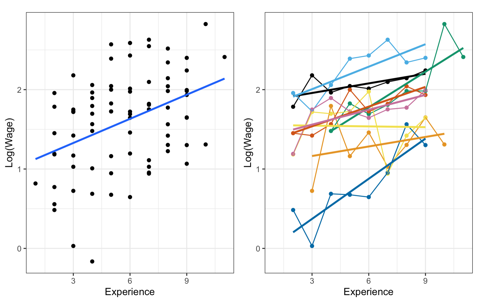

# Logistics  

* Assignment 3: Due date extended to Nov. 27 (11:59pm)
* Replication project: Due Nov. 22 (11:59pm)

```{r setup, include=FALSE}
knitr::opts_chunk$set(echo = TRUE)

library(tidyverse)
library(stargazer)
library(plm)
library(lme4)
library(wooldridge)
library(effects)
library(ggpubr)
library(ggthemes)
```

# Part 1 Review of the Lecture

## 1.1 Overview

* We use longitudinal data where individuals are observed multiple times to make inferences
  + Observation within-unit changes
  
## 1.2 Fixed-effects Model

* FE models control for unit-specific time-invariant characteristics and use within-unit changes for estimation

$$
Y_{it} = \alpha + \beta X_{it} + \eta_i + \epsilon_{it}
$$

* where $\eta_i$ represents unit-specific time-invariant characteristics
  + We do not impose any restrictions on the relation between $\eta_i$ and $X_{it}$
  + For example, in estimating (the existence of) male marriage premium, personality that is roughly stable but unobserved can be correlated with a man gets married and with his income. In FE model, personality is "absorbed" and controlled by $\eta_i$
  
* We assume that the slope remains the same across units (i.e., we specify $\beta$ rather than $\beta_{i}$; for recent discussions of unit-variant slopes and new methods, see [Brand and Xie (2010)](https://doi.org/10.1177/0003122410363567)), but we allow units to have their own intercepts. That is, each unit $i$'s intercept would be $\alpha_i = \alpha + \eta_i$
  + We essentially model:

$$ 
Y_{it} = \alpha_i + \beta X_{it} + \epsilon_{it}
$$

* Therefore, as we already learned in previous sessions, the model can be estimated by including $n - 1$ unit dummy variables into our model
  + This is called Least Squares Dummy Variables (LSDV) estimation
  + This can be cumbersome if there is a large number of units. Alternatively, software such as `R` uses a within-estimator. Take the mean of both sides of the equation **for each unit** $i$:
  
$$
\bar{Y}_{i} = \alpha_i + \beta \bar{X}_{i} + \bar{\epsilon}_{i}  
$$

* Take the difference of the two equations, we get:

$$
\begin{aligned}
Y_{it} - \bar{Y}_{i} &= \alpha_i- \alpha_i + \beta (X_{it} - \bar{X}_{i}) + (\epsilon_{it} - \bar{\epsilon}_{i}) \\ 
 &= \beta (X_{it} - \bar{X}_{i}) + v_{it}
\end{aligned}
$$

* By comparing each unit's value at time $t$ with its mean value over time, the estimation uses only within-individual changes of both explanatory and dependent variable

* By demeaning data within each unit, any time-invariant variables, such as race, cannot be estimated in an FE model

* One classic example in family sociology is to determine whether marriage rewards men's income
  + Comparing the income of married men and unmarried men can lead to biased estimation
  + Comparing the income of the **same** man before and after marriage using the fixed-effects model
  + However, it does not exclude the possibility of self-selection and anticipation. For example, men who anticipate a higher growth of wage may be more likely to choose marriage soon (check this ASR paper that discusses this problem [Ludwig and Bruderl (2018)](https://doi.org/10.1177/0003122418784909))
  
## 1.3 Random-effects Model

* Compared with the FE model, RE model imposes stronger assumption that is not always met

* Recall when we the mean of both sides of the equation **for each unit** $i$, we get a between-estimator:
  
$$
\begin{aligned}
\bar{Y}_{i} &= \alpha_i + \beta \bar{X}_{i} + \bar{\epsilon}_{i} \\
&= \underbrace{\alpha}_{\text{constant for all units}} + \beta \bar{X}_{i} + \underbrace{\eta_i + \bar{\epsilon}_{i}}_{v_i}
\end{aligned}
$$

* RE model assumes that $\eta_i$ is uncorrelated with $X_{it} \text{ for } \forall t=1,2,...,T$; we therefore get $Cov(v_i,\bar{X}_{i}) = 0$
  + If $\mathbb{E}[v_i |\bar{X}_{i} ] = 0$, OLS estimator $\hat{\beta}$ can be an unbiased and consistent estimator
  + But OLS mixes in two different "random shocks", one that is truly stochastic across units ($\bar{\epsilon}_{it}$), and the other that is specific to each unit $\eta_i$
  + To take into account the additional information introduced by $\eta_i$, we assume the two "random shocks" are normally distributed **independently**. $v_i = N(0, \sigma_{\eta}^2) + N(0, \sigma_{\epsilon}^2)$
  + Therefore, another within-estimator exists: 
  
$$
\begin{aligned}
Y_{it} - \bar{Y}_{i} &= \eta_i - \bar{\eta_i} + \beta (X_{it} - \bar{X}_{i}) + (\epsilon_{it} - \bar{\epsilon}_{i}) \\ 
&= \underbrace{\eta_i - \bar{\eta_i}}_{\neq 0} + \beta (X_{it} - \bar{X}_{i}) + \mu_{it}
\end{aligned}
$$

  + The estimated $\beta$ takes into account both within- and between-unit variations
  + We estimate $\beta$ through MLE

* By including between-unit variations, RE model allows time-invariant independent variables

* Can you think of scenarios where $Cov(v_i,X_{it}) = 0, X_{it} \text{ for } \forall t=1,2,...,T$ may be satisfied, and RE model is useful?

# Part 2 Panel Data Structure 

* To demonstrate the `R` implementation of FE and RE models, we will use a dataset `wagepan` provided by the R package `wooldridge`. This is a panel of 545 young men from 1980 to 1987 used in the article by F. Vella and M. Verbeek (1998), “Whose Wages Do Unions Raise? A Dynamic Model of Unionism and Wage Rate Determination for Young Men.”  

* For the purpose of demonstration, this panel data is already organized in the tidy "long-format" with every person-year observation saved in each row. In addition, there is no missing data. 
  
* Load the data into your R environment. Look at the data carefully and answer the following questions
  
  + (1) Over how many time points were these individuals followed? Is this a balanced, or unbalanced panel?  
  
  + (2) Among all the variables, which one(s) do you expect to be time invariant? 
  
```{r load data, warning=FALSE, message=FALSE}
## load data into the environment
data(wagepan, package = "wooldridge")

## Question (1)
wagepan %>%
  group_by(nr) %>%
  summarize(times = sum(!is.na(lwage))) %>%
  summarize(max = max(times),
            mean = mean(times))

## Question (2)
wagepan %>% 
  group_by(nr) %>% 
  summarize_all(~ var(.)) %>%
  summarize_all(~ mean(.))
```

## Part 2 Exercise 

* Before estimating models, let's create some descriptive plots for exploratory purposes. Suppose we are interested in the relationship between **labor market experience** and **log(wage)**. Replicate the the plot below following the listed steps. 
  + This plot contains two panels, with one illustrating the aggregate relationship and the other the individual-level trajectories.
  
```{r include figure, fig.cap="Graphical Demonstration of KOB Decomposition", out.width = '65%', fig.align='center'}

```

* 1. Sample ten persons from the dataset;
* 2. Create an "aggregate trend" scatter plot of these individuals across all observation years with an OLS regression line for the variable `exper` and `lwage` (the upper panel);
* 3. Similarly, create an "individual trend" scatter plot (the lower panel);
* 4. Arrange the two plots using `ggarrange()`;
* 5. How does the relationship between `exper` and `lwage` differ in these two plots? What would be the possible reasons for the difference?   
  
  + Note: Due to sample randomness, it is okay if your plot looks different from the example

```{r exercise-part2, warning=FALSE, message=FALSE}

## your code here
set.seed(930412)
nr_sample <- sample(wagepan$nr, 10, replace = FALSE)

## look at aggregate trend
fig1 <- wagepan %>%
  filter(nr %in% nr_sample) %>%
  ggplot(aes(x = exper, y = lwage)) +
  geom_point() +
  geom_smooth(method = "lm", se = F)

## look at individual trend
fig2 <- wagepan %>%
  filter(nr %in% nr_sample) %>%
  ggplot(aes(x = exper, y = lwage, color = as.factor(nr), group = as.factor(nr))) +
  geom_point() +
  geom_line() +
  geom_smooth(method = "lm", se = F) +
  scale_colour_colorblind() +
  theme(legend.position = "none")

ggarrange(fig1, fig2)
```

# Part 3: R Implementation of Panel Models

* In addition to a simple bivariate relationship, we can further explore how individual wage trajectories vary by race. For the purpose of demonstration, we can sample 5 individuals from each racial group, and plot their wage trajectories. 
  
```{r plot by race, warning=FALSE, message=FALSE}  

## create a character variable "race" for plotting
wagepan <- wagepan %>%
  mutate(race = case_when(black == 1 ~ "black",
                          hisp == 1 ~ "hisp",
                          black == 0 & hisp == 0 ~ "white")) 

## sample pid by race
set.seed(123456)
nr_byrace <- wagepan %>%
  # get a list of distinct person id number, keep other variables
  distinct(nr, .keep_all = T) %>%
  # group by race
  group_by(race) %>%
  # sample 5 persons
  sample_n(5) %>%
  ungroup() %>%
  # extract person id number
  pull(nr)

## aggregate trend
fig3 <- wagepan %>%
  filter(nr %in% nr_byrace) %>%
  ggplot(aes(x = exper, y = lwage, color = race, group = race)) +
  geom_point() +
  geom_smooth(method = "lm", se = F, size = 0.5) +
  labs(title = "Scatterplot with OLS Line, by Race") +
  scale_colour_colorblind() +
  theme_bw()

## look at individual trend
fig4 <- wagepan %>%
  filter(nr %in% nr_byrace) %>%
  ggplot(aes(x = exper, y = lwage, color = race, group = as.factor(nr))) +
  geom_point() +
  geom_smooth(method = "lm", se = F, size = 0.5) +
  labs(title = "Scatterplot with OLS Line, by Person and Race") +
  scale_colour_colorblind() +
  theme_bw()

## show the two figures
ggarrange(fig3, fig4, ncol = 2,
          common.legend = TRUE,
          legend = "bottom")
```

* As you may have observed, the relationship between work experience and log wage revealed by the two different estimation approaches are quite different. 

* We might even run into the Simpson's paradox, where the OLS model slope of the aggregate data is negative, whereas the OLS model slopes of the individual trends are mostly positive.
  
* Once we look into the **within-individual** relationship between the outcome and the predictor, we see that a simple OLS model's predictions are not really in line with the data. This is also expected as there is a lot of **between-individual heterogeneity in the trends, which we cannot capture when we pool across all observations**.

## 3.1 Estimating FE and RE Models in R

* To estimate fixed effects and random effects models in `R`, we use the `plm` package
  + Another common package is `lme4`
  + For fixed effects models, as we have mentioned earlier, you can also fit a simple linear model with "unit dummies"
    + that is, for $n$ unique persons, create $(n-1)$ dummy variables and include them in regression
    + you can do this using `as.factor(person_id)` when you estimate the model  
  
* We want to estimate a model predicting mean log wage using years of working experience and race

```{r fit models, warning=FALSE, message=FALSE}

## simple OLS model (for purpose of comparison)
m_ols <- lm(lwage ~ exper + black + hisp, data = wagepan)

## fixed effects model - using person dummies
m_fe_dummy <- lm(lwage ~ exper + as.factor(nr) , data = wagepan)

## fixed effects model
## model = "within" indicates fixed effects model
## index = c("nr") is the grouping variable in your fixed effects model
m_fe <- plm(lwage ~ exper, data = wagepan, 
            model = "within", 
            index = c("nr"))

## random effects model - using plm package
m_re <- plm(lwage ~ exper + black + hisp, data = wagepan, 
            model = "random", 
            index = c("nr"))

## random effects model - using lme4 package
m_re2 <- lmer(lwage ~ exper + black + hisp + (1 | nr), wagepan)
## only intercepts are random; slopes are constant across units

## display modeling results 
stargazer(m_ols, m_fe, m_re, m_re2,
          type = "text", 
          column.labels = c("OLS", "FE", "RE-plm", "RE-lme4"),
          model.names = F,
          omit.stat = c("f", "ser"))


## you can also compare the coefficients of your person dummy linear model and
## your fixed effects model
```


## 3.2 Plot Predicted Effects
  
* Let us compare the results of the fixed effects model and the random effects model by plotting the predicted log wage by the predictors. For demonstration purposes, we will use the race-balanced sample ($n = 5$ for each race) obtained earlier.  
  
```{r plot predictions FE RE, warning=FALSE, message=FALSE}

## save a subsample of the race-balanced 15 individuals sampled earlier 
wagepan_sample <- wagepan %>%
  filter(nr %in% nr_byrace) %>%
  dplyr::select(nr, lwage, exper, black, hisp, race)

## a df that match nr with race
sample_race_key <- wagepan %>%
  dplyr::select(nr, race) %>%
  distinct(nr, .keep_all = T)

## find the range of experience in the subsample
summary(wagepan_sample$exper)
# min = 1, max = 14

## create a number sequence for years of experience
exp_seq = seq(1, 14, 1)

#~#~#~#~#~# predicted effect of the fixed effects model #~#~#~#~#~#

## create a dataframe with nr and years of experience based on the subsample
IV_fe <- data.frame(
  # each pid will repeat for 14 times for each value of exp
   nr = rep(nr_byrace, length(exp_seq)),
  # the exp seq will repeat 15 times so that it matches with 15 nr
  exper = rep(exp_seq, times = 15)
  )

## get predicted Y using the OLS dummy model
yhat_fe <- predict(m_fe_dummy, newdata = IV_fe, interval = "confidence")

## combine results
predict_fe <- cbind(IV_fe, yhat_fe) %>%
  left_join(sample_race_key, by = "nr")
  
## plot predicted effect, with original subsample's scatterplot
fig_fe <- ggplot() +
  # observed scatterplot
  geom_point(aes(x = exper, y = lwage, color = race), data = wagepan_sample) +
  # connecting observed dot with dashed lines
  geom_line(aes(x = exper, y = lwage,  group = as.factor(nr), color = race), 
            linetype = "dashed", data = wagepan_sample) +
  # fixed effect model curves
  geom_line(aes(x = exper, y = fit, group = as.factor(nr), color = race), 
            size = 0.2, data = predict_fe) +
  labs(title = "Predicted Wage (Fixed Effects)",
       x = "Years of Full-time Work Experience", 
       y = "Log_e(Wage)") + 
  theme_bw() +
  theme(legend.position = "bottom") +
  scale_colour_colorblind()


#~#~#~#~#~# predicted effect of the random effects model #~#~#~#~#~#

## dataset to make predictions
IV_re <-  data.frame(
    nr = rep(nr_byrace, each = length(exp_seq)),
    exper = rep(exp_seq, times = 15)
    ) %>%
  left_join(sample_race_key, by = "nr") %>%
  mutate(black = ifelse(race == "black", 1, 0),
         hisp = ifelse(race == "hisp", 1, 0))

## here predictions are based on alpha + \betaX_{it}
yhat_temp_re <-  predict(m_re, newdata = IV_re)
    
# predict \eta using `ranef` function
eta_re <- ranef(m_re) %>%
  cbind(nr = as.numeric(names(.)), 
        eta = .) %>%
  as.data.frame() %>%
  filter(nr %in% wagepan_sample$nr)

# merge predicted eta_i to tmp_rand
predict_re <- cbind(IV_re, yhat_temp_re) %>%
  left_join(eta_re, by = "nr") %>%
  # add \eta_i to alpha + \betaX_{it}
  mutate(yhat_re = yhat_temp_re + eta)

## plot
fig_re <- ggplot() +
  geom_point(aes(x = exper, y = lwage, color = race), data = wagepan_sample) +
  geom_line(aes(x = exper, y = lwage,  group = as.factor(nr), color = race), 
            linetype = "dashed", data = wagepan_sample) +
  geom_line(aes(x = exper, y = yhat_re, group = as.factor(nr), color = race), 
            size = 0.2, data = predict_re) +
  labs(title = "Predicted Wage(Random Effects)",
       x = "Years of Full-time Work Experience", 
       y = "Log_e(Wage)") + 
  theme_bw() +
  theme(legend.position = "bottom") +
  scale_colour_colorblind()

## combine plots
ggarrange(fig_fe, fig_re, ncol = 2)
```


```{r plot prediction OLS, fig.width=10, fig.height=6}

#~#~#~#~#~# predicted effect of the OLS model #~#~#~#~#~#

## create a dataframe with race and years of experience based on the subsample
IV_ols <- data.frame(
  # each pid will repeat for 14 times for each value of exp
   black = rep(c(rep(1,length(exp_seq)), rep(0,length(exp_seq)), rep(0,length(exp_seq)))),
   hisp = rep(c(rep(0,length(exp_seq)), rep(1,length(exp_seq)), rep(0,length(exp_seq)))),
   white = rep(c(rep(0,length(exp_seq)), rep(0,length(exp_seq)), rep(1,length(exp_seq)))),
  # the exp seq will repeat 15 times so that it matches with 15 nr
  exper = rep(exp_seq, 3)
  )

predict_ols <- IV_ols %>%
  mutate(fit = predict(m_ols,IV_ols)) %>%
  pivot_longer(cols=c("fit"),values_to = "fit")  %>%
  select(-name) %>%
  mutate(race=case_when(
    black==1 ~ "black",
    hisp==1 ~ "hisp",
    white==1 ~ "white"
  ))
  

## plot
fig_ols <- ggplot() +
  geom_point(aes(x = exper, y = lwage, color = race), data = wagepan_sample) +
  geom_line(aes(x = exper, y = lwage,  group = as.factor(nr), color = race), 
            linetype = "dashed", data = wagepan_sample) +
  geom_line(aes(x = exper, y = fit, color = race), size = 0.2, data = predict_ols) +
  labs(title = "Predicted Wage(OLS)",
       x = "Years of Full-time Work Experience", 
       y = "Log_e(Wage)") +
  theme_bw() +
  theme(legend.position = "bottom") +
  scale_colour_colorblind()

## combine plots
ggarrange(fig_ols,  
             fig_fe, 
             fig_re,
             ncol = 3)

```

# Part 4 Exercise

* Reproduce the figure below that demonstrates the three different model curves by each individual's `nr`. Make sure that you run all the code chunks before this question to ensure you have necessary objects in your R environment. Then, to simplify the steps, you can create a dataframe that is ready for plotting using the code provided in the following code chunk. 

{width=100%}

```{r prepare plot}

# Prepare df for combining
predict_fe_temp <- predict_fe %>% 
  dplyr::select(nr, exper, race, fit) %>%
  rename(yhat_fe = fit)

predict_re_temp <- predict_re %>% 
  dplyr::select(nr, exper, race, yhat_re)

predict_ols_temp <- merge(predict_ols %>% 
  dplyr::select(exper, race, fit) %>%
  rename(yhat_ols = fit),
  sample_race_key %>%
  filter(nr %in% wagepan_sample$nr),
  by="race")

# Combine yhat of three models
predict_combine <- predict_fe_temp %>%
  full_join(predict_re_temp, by = c("nr", "exper", "race")) %>%
  left_join(predict_ols_temp, by = c("nr", "exper", "race")) %>%
  left_join(wagepan_sample, by = c("nr", "exper", "race"))

```

Your code for plotting below:

```{r exercise-part4, warning=FALSE, message=FALSE}

# Your code here
predict_combine %>%
  ggplot() +
  geom_point(aes(x = exper, y = lwage), shape = 1, alpha = 0.6) +
  geom_line(aes(x = exper, y = yhat_ols, color = "OLS")) +
  geom_line(aes(x = exper, y = yhat_fe, color = "Fixed Effects")) +
  geom_line(aes(x = exper, y = yhat_re, color = "Random Effects")) +
  facet_wrap(.~nr) + 
  labs(x = "years of experience", y = "log wage") +
  scale_colour_colorblind()
```


