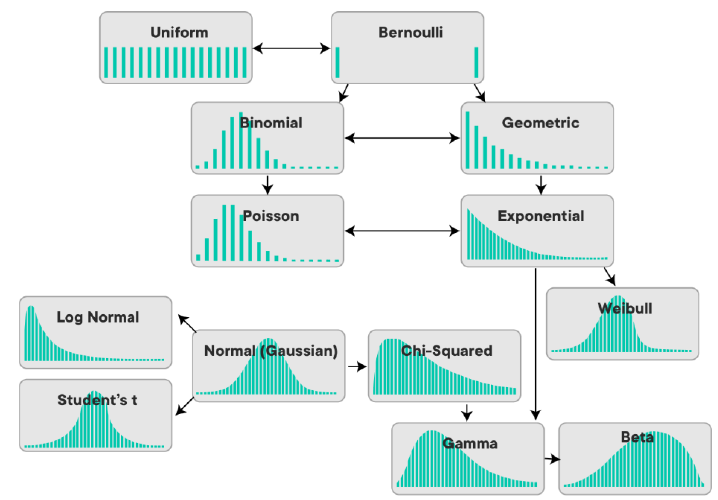
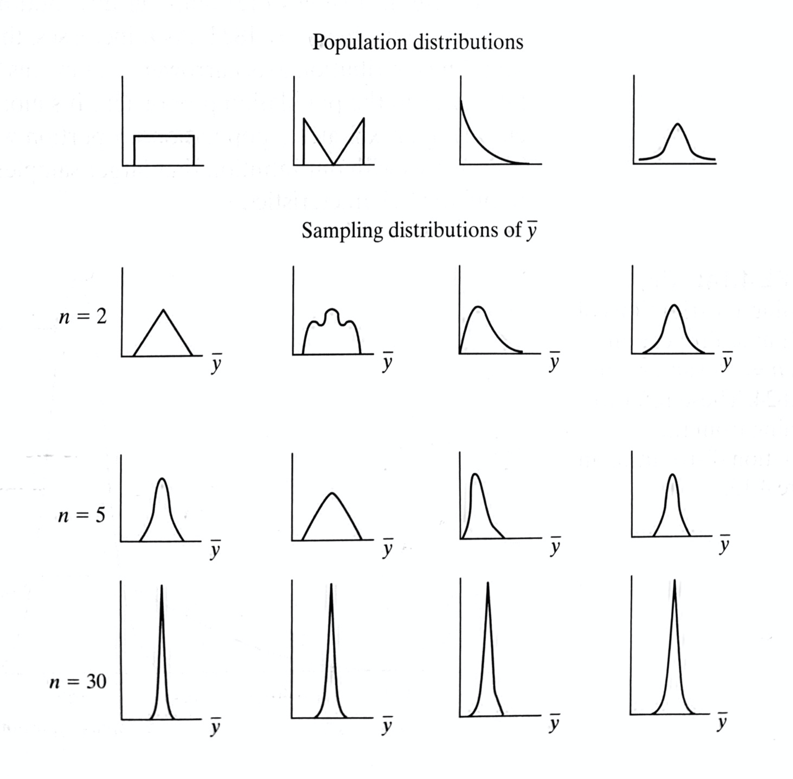

# Part 0: Prerequisites

```{r setup, include=TRUE, message=FALSE, warning=FALSE}
knitr::opts_chunk$set(echo = TRUE)
knitr::opts_chunk$set(tidy = TRUE)
knitr::opts_chunk$set(fig_crop = FALSE)

# Load package to environment
library(tidyverse)
library(ggplot2)
library(gridExtra)
library(kableExtra)

# Load csv files
gapminder <- read.csv("data/gapminder.csv") 
```

# Part 1 Population, Sample, and Sampling Distribution

## 1. Population

### Basics

+ Population is the total set of subject of interest in a study.

+ Given a population of size $N$, the three important **population parameters** are: 
  + Population mean: $$\mu = \frac{1}{N}\sum_{i=1}^N y_i$$
  + Population variance: $$\sigma^2 = \frac{1}{N}\sum_{i=1}^N(y_i-\mu)^2$$
  + And population standard deviation: $$\sigma = \sqrt{\sigma^2}$$
  
+ Varieties of a population's probability distributions:

  + The population distribution is usually *unknown*. We make inference about its characteristics based on what we observe in the sample, as well as our knowledge/guesses about the data-generating process. For example, we may assume that the distribution of SAT score is approximately a bell-shaped normal distribution.  
  
  + So far we have only come across the **normal distribution** (also called the **Gaussian** distribution): 
  $$N(\mu, \sigma^2) = \frac{1}{\sigma \sqrt{2\pi}} e^{-\frac{(x - \mu)^2}{2\sigma^2}}$$  

  + The **two key parameters** for this distribution, as the notation suggests, are the **population mean** $\mu$, and the **population variance** $\sigma^2$ (and also the population standard deviation, $\sigma$, which is given by variance). 
    
  + Under standard normal distribution
  + **Mean ± 1 SD** contain **68.2%** of all values.  
  + **Mean ± 2 SD** contain **95.5%** of all values.  
  + **Mean ± 3 SD** contain **99.7%** of all values.

<center>
{width=80%}
</center>  

  + You may have heard of other distributions, such as the Student t-distribution, chi-square distribution, Poisson distribution, etc. For each kind of distribution, the population parameters that decide the shape of the distribution may differ. 
  
<center>  
  {width=60%}
</center>  

  + For today's demo, we will look at a **Bernoulli distribution** for a binary outcome variable that can take the value of either 0 or 1, with probability $p$ for having value 1.

### Simulate a population in `R`:  
  
+ We can simulate many different distributions in `R`. [Here](https://stat.ethz.ch/R-manual/R-devel/library/stats/html/Distributions.html) is a list of the functions R offers for simulating random numbers that follow different distributions.  
  
+ For example, let's generate population that follows a Bernoulli distribution with a probability of 0.5. A Bernoulli distribution is the distribution of two possible outcomes with a defined probability of the two outcomes (such as having 50% probability of getting "head" or "tail" when you toss an unbiased coin). We will encounter this distribution when learning regressions for binary outcomes.

```{r simulate bernoulli, message = F, out.width="70%", fig.align="center"}
# set a seed to ensure your code is reproducible 
# the seed number can be any number, and you should always run this line 
# together with the code that involves generation of random numbers
set.seed(11011)

# generate a random number that follows a Bernoulli distribution with p = 0.5
# then covert the vector to a data frame
pop_binom <- rbinom(n = 100000, size = 1, p = 0.5)

## normal distribution
## rnorm(n = 10000, mean = 0, sd = 1)

# plot the population
pop_binom %>%
  # Convert vector to a tibble dataframe
  as_tibble() %>%
  ggplot(aes(x = value)) +
  geom_histogram(color = "black", fill = "grey") +
  labs(title = "Histogram of Simulated Population with Bernoulli Distribution",
       subtitle = "N = 100000, p = 0.5",
       x = "")

```

## 2. Sample

* Sample is the data we **actually observe**. When we say sample, we usually mean a "random sample." That is, the subjects chosen in the sample are randomly drawn from the population.

* Sample statistics: 
  + Sample mean: $$\bar{y} = \frac{1}{n}\sum_{i=1}^n y_i$$
  + Sample variance: $$s^2 = \frac{1}{n-1}\sum_{i=1}^n(y_i-\bar{y})^2$$
  + Sample standard deviation: $$s = \sqrt{s^2}$$
  + Standard error of the sample mean (which is the standard deviation of the mean in the **sampling distribution of the mean**): 
  
  $$\hat{\sigma}_{\bar{y}} = \frac{\sigma}{\sqrt{n}}$$
* What are i.i.d. samples? 

  + "i.i.d." stands for "independent, identically distributed," meaning these samples are drawn independently. That is, what you choose for your first random sample does not affect what you choose for the rest of the random samples. 

* **(Weak) Law of Large Numbers**:  
  + This law states that with a sufficiently **large sample** there will be a very high probability that the average of the observations will be **close to the population mean**. 
  + $$\lim_{n \to \infty} P\left( \left| \frac{1}{n} \sum_{i=1}^{n} X_i - \mu \right| \geq \epsilon \right) = 0$$
  
  + Let's see how our sample mean change as we increase our sample size from 10 to 10,000:

```{r LLN, message=F, warning=F}

# First create four df of random samples
set.seed(2023)

sample10 <- pop_binom %>% 
  # Sample from pop
  sample(size = 10, replace = FALSE) %>%
  # Convert to tidy data object
  as_tibble() %>% 
  # Add a new variable called "sample_size" that equals to the sample size
  mutate(sample_size = 10)

sample100 <- pop_binom %>% 
  sample(size = 100, replace = FALSE) %>%
  as_tibble() %>% 
  mutate(sample_size = 100)

sample1000 <- pop_binom %>% 
  sample(size = 1000, replace = FALSE) %>%
  as_tibble() %>% 
  mutate(sample_size = 1000)

sample10000 <- pop_binom %>% 
  sample(size = 10000, replace = FALSE) %>%
  as_tibble() %>% 
  mutate(sample_size = 10000)

# Combine df, recode variables (rbind stands for "row bind")
sample_df <- rbind(sample10, sample100, sample1000, sample10000) 

# Plot 
sample_df %>%
  # Covert numeric variable to character variable (b/c we only have two possible outcomes)
  mutate(value = as.character(value)) %>%
  ggplot(aes(x = value, fill = value)) +
  geom_bar(stat = "count", width = 0.5) +
  facet_wrap(~sample_size, scales = "free") +
  labs(title = "Sample Distribution for Different Sample Size")

# List sample size & sample mean
sample_df %>%
  group_by(sample_size) %>%
  summarise(sample_mean = mean(value)) %>%
  mutate(diff_to_true_mean = 0.5 - sample_mean) %>%
  kbl(align = "c") %>%
  kable_styling()

```
  
  + As you can see, **by the Law of Large Numbers, our sample mean gets closer to the population mean as sample size increases**.

## 3. Sampling Distribution of the Sample Mean

* **Definition**: A sampling distribution describes the distribution of a statistic, such as a sample mean or variance. Because **a sample statistic is itself a random variable**, as we draw different samples from the population we will obtain a *distribution* of this sample statistic. 

* While there are the sampling distribution of the sample mean and the sampling distribution of sample variance, we only cover the **sampling distribution of the sample mean**. This concept is important because it helps us understanding the principle behind **hypothesis testing**, which is at core of most quantitative social science research.

* The **stand error** of a sample's mean is defined as the **standard deviation** of the sampling distribution of the mean.

* The **Central Limit Theorem**: 
As sample size gets larger, the *sampling distribution of the sample mean* will increasingly approximate a *normal distribution*. This applies to population distribution of **any kind**. 

<center>
{width=50%}
</center>

## 4. Simulate the Sampling Distribution in `R` (`for`-loop): 

+ In order to get the sampling distribution of the sample mean, we need to repeat the action of "drawing a random sample" for many times.  
  
+ When we need to complete the same operation many times, we can use a `for`-loop. In R, you can do this using a the `for`-loop syntax. 

```
for (i in 1:n){

  code expression of the iterative operation 

}
```

```{r for-loop form, eval=FALSE}
for (i in 1:100){
  ## draw sample
  
}
```

+ The `i` in the loop is an number for indexing. Whether you use `i` or `j` or other names doesn't matter. The `1:n` indicate the number of iterations you need for the loop (You don't always start from `1`, it depends on your specific problem). Together, `for(i in 1:n){...}` means "for `i` that ranges from 1 to n, do the operation that is specified in the `{}`."  
  
+ For example, we can use a `for`-loop to repeatedly sample from the population and save the mean of each sample in a vector. Let's try getting 100 samples with each sample n = 50.

```{r for-loop, warning = F}
## we create a "container" object to save the result
## it can be a vector, a matrix, a list, etc. as long as it fits your purpose
mean_container <- rep(NA, 10000)

## for-loop
set.seed(10010)
for (i in 1:10000){
  ## inside the for-loop, you first randomly sample 50 rows from the pop
  sample <- sample(pop_binom, size = 50, replace = FALSE)
  ## calculate the mean and save it as the i-th number in the vector
  mean_container[i] <- mean(sample)
}

## check the result
head(mean_container, n = 10)
```

+ The value vector `mean_container` contains 100 mean values of the 50 samples we randomly draw from the virtual population. We can plot the distribution of these mean values, i.e., the sampling distribution of the sample mean. Note that the solid lines show the range of 1 standard deviation around the mean.  

```{r plot sampling dist, warning = F}

# Mean and SD of the sampling distribution
mean = mean(mean_container)
sd_pos = mean + sd(mean_container)
sd_neg = mean - sd(mean_container)

# Plot
mean_container %>% 
  as_tibble() %>%
  ggplot(aes(value)) +
  geom_histogram(binwidth = 0.01, fill = "grey", color = "black") +
  geom_vline(aes(xintercept = sd_neg), color = "red", linetype = "dashed") +
  geom_vline(aes(xintercept = mean), color = "red", linetype = "solid") +
  geom_vline(aes(xintercept = sd_pos), color = "red", linetype = "dashed") +
  scale_x_continuous(limits=c(0, 1)) +
  labs(title = "Sampling Distribution of the Sample Mean (100 iterations of sample n = 50)",
       subtitle = "Mean marked by the dashed line, 1 standard deviation around the mean marked by solid lines")

```

## CLT Continued in Simulation

 + By CLT, although our virtual population is a Bernoulli distribution, as we increase the sample size, the sampling distribution of the sample mean should increasingly approximate a normal distribution
 
 + Suppose we want to set the sample size to 3, 5, 30, and 100, we need to change the sample size in the above code. But instead of copy-pasting your code four times, you can modify the above code into a **function** so that you can change the critical parameters by changing the value of the function's arguments. This simplifies your code.

 + For example, we will build a function called `plot_sampling_mean` that takes four arguments:  
    (i) number of repetitions (how many random samples we want to draw from the population);
    (ii) sample size (what we need to vary for visualizing CLT);
    (iii) the population data frame;
    (iv) the histogram's binwidth (so that we can manipulate the layout more flexibly)  

This function takes these four parameters as input, and return a histogram illustrating the sampling distribution of the sample mean. 

```{r CLT, warning = F, message = F}

## build the function
plot_sampling_mean <- function(reptition, sample_size, pop_vec, hist_binwidth){
  
  ## create the empty vector to store mean values
  sample_mean <- rep(NA, reptition)
  
  ## repeat the sample process for `repetition` times
  for (i in 1:reptition){
  sample <- sample(pop_vec, size = sample_size, replace = FALSE)
  sample_mean[i] <- mean(sample)
  }
  
  ## plot the histogram
  hist <- sample_mean %>% 
    as_tibble() %>%
    ggplot(aes(value)) +
    geom_histogram(binwidth = hist_binwidth, fill = "grey", color = "black") +
    geom_vline(aes(xintercept = mean(sample_mean)), color = "red", linetype = "dashed") +
    geom_text(aes(x = mean(sample_mean) + 15*hist_binwidth, 
                  y = 0,
                label = paste("mean =", round(mean(sample_mean), 4))),
            colour = "red") +
    scale_x_continuous(limits=c(0, 1)) +
    labs(title = "Sampling Dist of Sample Mean",
       subtitle = paste("Sample size =", sample_size, "; Reptition =", reptition))
   
  return(hist)
  
}

## plot (you can play with function parameter values to see how they change the output)
set.seed(1008)
p1 <- plot_sampling_mean(reptition = 1000, sample_size = 3, pop_binom, 0.01)
p2 <- plot_sampling_mean(reptition = 1000, sample_size = 5, pop_binom, 0.01)
p3 <- plot_sampling_mean(reptition = 1000, sample_size = 30, pop_binom, 0.01)
p4 <- plot_sampling_mean(reptition = 1000, sample_size = 100, pop_binom, 0.01)

## combine the plots
grid.arrange(p1, p2, p3, p4, ncol = 2)

```

# Part 2 Exercise  

Create a sampling distribution of the sample mean  
  (1) Create a virtual population that follows a normal distribution of mean = 0 and variance = 1, with 10,000 observations. *Hint*: use `rnorm()`.  
  (2) Use this population and a `for`-loop, get a sampling distribution of the sample mean by sampling 100 observations from the population for 1,000 times.  
  (3) Plot a histogram of your sampling distribution of the sample mean. You can add lines for mean and SD as demonstrated in the figure above.  

*Note:* Use the `set.seed()` function every time you perform a random process. That is, add the `set.seed()` function before every part of your code that involves a random process and run the `set.seed()` function together with that code for every run.     
    
```{r CLT exercise}

## your code here

```

# Part 3 Using Tidyverse for Plotting (`ggplot2`)

+ As covered in our lecture, making plot is usually the very first thing we do to understand data. Plotting can reveal trends that it's hard to observe by just looking at the values in a table. 

+ In general, for uni-variant analysis (i.e. one variable), you will look at the histogram plot for numeric variables, and a frequency bar plot for categorical variables. For bi-variant analysis (i.e. two variables), you will look at a scatterplot for numeric variables. 

+ When you conduct your own research, instead of directly running regressions, it is always necessary to do some visualization. Outliers, for example, can seriously distort regression analysis and should be identified in the first step.

+ You can plot in `R` using the built-in `R` plotting functions, but a more popular syntax is `ggplot2`, a package that's already included when you load the `tidyverse` package.

## 1. Basic syntax for `ggplot2`: 

```
data %>%
  ggplot(mapping = aes()) + 
  geom_bar() + 
  geom_histogram() +
  ...

```
  + The `mapping = aes()` can either be within the`ggplot()` function, or within the specific `geom_xxx()` function. 

  + `mapping = aes()` tells the plotting function which variables to plot, with additional arguments -- see the last bullet point below. You can skip `mapping = ` in your code.
   
  + In a simple one-variable case, you only need to put `mapping = aes(pop)`. In a two-variable scenario, you will need to put (for example) `mapping = aes(x = pop, y = lifeExp)`. You can skip the `x = ` and `y = `, and the function will assume the first variable is the `x` and the latter as the `y`. Note that `aes` in `aes()` stands for "aesthetic."

  + The `mapping = aes()` you put in the `ggplot()` line will be inherited by the subsequent `geom_xxx()` lines that you added (`+`) following the `ggplot()` line. Therefore, if you want each `geom_xxx()` to plot different variables, specify your `mapping = aes()` not within the `ggplot()` but within each `geom_xxx()`.

  + You can use other features to add variables to your plot. For example, you can color-code your points or bars by using `mapping = aes(x = pop, y = lifeExp, color = continent)`. There are different argument options for different  `geom_` graphs. Use the [`ggplot2` cheatsheet](https://github.com/rstudio/cheatsheets/raw/master/data-visualization-2.1.pdf) to find out more. 


## 2. Histograms

To check the distribution of one numeric variable.

```{r histogram, message = FALSE}

## histogram
## for example, if we want to know the distribution of GDP per Capita in the data
gapminder %>%
  ggplot(aes(x = gdpPercap)) +
  geom_histogram()

## you can adjust the binwidth and other features of the histogram
gapminder %>%
  ggplot(aes(x = gdpPercap)) +
  geom_histogram(binwidth = 2000, fill = "grey", color = "black")

## instead of frequency (count) you can use percentage on the y axis, and overlay a density curve
## notice we have different aesthetic mappings for geom_histogram and geom_density
gapminder %>%
  ggplot() +
  geom_histogram(
    aes(x = gdpPercap, y = ..density..),
    binwidth = 2000, 
    fill = "grey", 
    color = "black"
    ) + 
  geom_density(
    aes(x = gdpPercap),
    color = "red"
    )


## you can do log transform directly when plotting
gapminder %>%
  ggplot() +
  geom_histogram(
    aes(x = log(gdpPercap), y = ..density..),
    binwidth = 0.1, 
    fill = "grey", 
    color = "black"
    ) + 
  geom_density(
    aes(x = log(gdpPercap)),
    color = "red"
    )
```

### 3. Bar Plots

To check the distribution of one categorical or numeric-discrete variable.

```{r bar plot}

## bar plot
## bor example, to check the number of countries with a life expectancy less than 60 over the years  
gapminder %>%
  filter(lifeExp <= 60) %>%
  ggplot(aes(x = year)) +
  geom_bar()

## you can add a group variable using the `fill =` argument in aesthetic mapping
gapminder %>%
  filter(lifeExp <= 60) %>%
  ggplot(aes(x = year, fill = continent)) +
  geom_bar()

## the positions of the bar can be customized to "fill", "dodge", or "stack" (default)
gapminder %>%
  filter(lifeExp <= 60) %>%
  ggplot(aes(x = year, fill = continent)) +
  geom_bar(position = "fill")

## dodge
gapminder %>%
  filter(lifeExp <= 60) %>%
  ggplot(aes(x = year, fill = continent)) +
  geom_bar(position = "dodge")
 
```

## 4. Scatter Plots

To check the joint distribution of two numeric variables.

```{r scatter plot}

## scatter plot: 
## relationship between GDP per capita and life expectancy 
gapminder %>%
  ggplot(aes(x = gdpPercap, y = lifeExp)) +
  geom_point()

## you can also add additional aesthetic mapping arguments to show group differences 
gapminder %>%
  ggplot(aes(x = gdpPercap, y = lifeExp, color = continent)) +
  geom_point(alpha = 0.7, size = 1.5)

## let's see how the scatter plot of log(GDP per capital) and life expectancy 
gapminder %>%
  ggplot(aes(x = log(gdpPercap), y = lifeExp, color = continent)) +
  geom_point(alpha = 0.7, size = 1.5)

## change point size according to population size
gapminder %>%
  ggplot(aes(x = log(gdpPercap), y = lifeExp, color = continent, size = pop)) +
  geom_point(alpha = 0.7) +
  guides(size = "none") ## this removes the legend for size
```

### 5. Line plot

```{r line plot}

## geom_line() + geom_point() are often used to plot change over time
gapminder %>%
  filter(country == "Sweden") %>% 
  ggplot(aes(x = year, y = gdpPercap)) + 
  geom_point() + 
  geom_line()


## you can use the "color" argument in aesthetic mapping to plot trend by group
## for example, if we want to compare GDP trend over years for North American countries:
gapminder %>%
  filter(country %in% c("United States","Mexico","Canada")) %>% 
  ggplot(aes(x = year, y = gdpPercap, color = country)) + 
  geom_point() + 
  geom_line()

```

## 6. Fit Model Curves using `geom_smooth`

+ `geom_smooth` can estimate the relationship between x and y based on the model you choose to fit. 

+ It's useful as an **exploratory** tool. 

+ It includes linear and nonlinear methods which can be useful if you want to compare the fit between linear and nonlinear assumptions. 

+ We usually plot the smoothing on top of a scatter plot, so that we can see how well the model curve fits the data. 

```{r fit line to scatter plot, message=FALSE}

## for example, if we want to explore the relationship between GDP and life expectancy

## if we fit the data with linear models
gapminder %>%
  ggplot(aes(x = gdpPercap, y = lifeExp)) +
  geom_point(shape = 1, alpha = 0.5) +
  geom_smooth(method = "lm")
  
## if we fit the data with a nonlinear assumption, 
## there are various smoothing method you can choose from. See documentation for details. 
gapminder %>%
  ggplot(aes(x = gdpPercap, y = lifeExp)) +
  geom_point(shape = 1, alpha = 0.5) +
  geom_smooth(method = "loess")

## let's try with the log(gdpPercap)
gapminder %>%
  ggplot(aes(x = log(gdpPercap), y = lifeExp)) +
  geom_point(shape = 1, alpha = 0.5) +
  geom_smooth(method = "lm")

gapminder %>%
  ggplot(aes(x = log(gdpPercap), y = lifeExp)) +
  geom_point(shape = 1, alpha = 0.5) +
  geom_smooth(method = "loess")
```

## 7. Faceting

+ Faceting creates subplots based on one or more discrete variables

+ Faceting is useful when you want to compare or display relationships by groups in separate plots. 

```{r facet}
## for example, if we want to compare how the relationship between 
## lifeExp and gdpPercap have changed from 1952 to 2007 in five continents:
gapminder %>%
  filter(year == 1952 | year == 2007) %>%
  ggplot(aes(x = log(gdpPercap), y = lifeExp, color = factor(year))) + 
  geom_point(alpha = 0.5) + 
  facet_wrap(vars(continent))
```

## 8. Arrange plots using `grid.arrange()`

You can put together graphs using `grid.arrange()` from the `gridExtra` package.

```{r gridarrange, message=FALSE}

## combine multiple plots
plot1 <- gapminder %>%
  ggplot(aes(x = log(gdpPercap), y = lifeExp)) +
  geom_point(shape = 1, alpha = 0.5) +
  geom_smooth(method = "lm")

plot2 <- gapminder %>%
  ggplot(aes(x = log(gdpPercap), y = lifeExp)) +
  geom_point(shape = 1, alpha = 0.5) +
  geom_smooth(method = "loess")

## grid combine
grid.arrange(plot1, plot2, ncol = 2)

```

## 9. Manipulate plot layout

+ To clearly communicate your data, please always make sure:
 (i) Your axes are readable, including the tick labels
 (ii) Your plot has a title or caption
 (iii) The size, shape, and color of your plot is easy to follow 

+ You can add title and axes labels using `+ labs()` 

+ You can manipulate the font size, angle, and position of axes by using ` + theme(axis.text.x = ..., axis.text.y = ...)`

+ Customize your axes' breaks using `+ scale_x_continuous()` or `+ scale_x_discrete()`

+ You can also turn your colorful plot to greyscales by using `+ scale_colour_grey()` for points, lines, etc.
and `+ scale_fill_grey()` for box plot, bar plot, violin plot, etc.

+ You can also adjust the theme by `+ theme_xxx()` --see [`ggplot2` cheatsheet](https://github.com/rstudio/cheatsheets/raw/master/data-visualization-2.1.pdf)

+ There are a million things you can do to manipulate your plot. Google it or use the [`ggplot2` cheatsheet](https://github.com/rstudio/cheatsheets/raw/master/data-visualization-2.1.pdf) to discover more. 

```{r layout}
## let's add titles and optimize plot layout for North American country GDP plot
gapminder %>%
  filter(country %in% c("United States","Mexico","Canada")) %>% 
  ggplot(aes(x = year, y = gdpPercap, color = country)) + 
  geom_point() + 
  geom_line() + 
  labs(title = "GDP per capita (1952 to 2007)", 
       x = NULL,
       y = "GDP per capita",
       color = "Country") +
  theme_bw() +
  scale_color_grey() +
  scale_x_continuous(breaks = unique(gapminder$year)) +
  theme(axis.text.x = element_text(size = 8, angle = 90, vjust = 0.6))
```

## 10. Save plots in R

+ Use `ggsave()` for quick saving

```{r ggsave, eval = F}

## to save a plot, add ggsave(filename = , plot = ) to save
## if you don't name the plot specifically, it automatically save the last plot you've run
## for example, since we just ran the above plot, we can save it:
ggsave("graph/gdp_bric.png")

# You can customize the specs of the image:
ggsave("graph/gdp_bric_2.png", height = 4, width = 6, units = c("in"), dpi = 160)

```

# Part 4 Exercise

1. In the `gapminder` data, which are the top 5 countries in Europe in terms of their GDP per capita in 2002? Use `dplyr` functions to create a table for your result.

```{r part4-q1}

## your code here

```

2. Using the `gapminder` data, generate a table summarizing the mean, median, and standard deviation of life expectancy in Europe and Africa in 2002.

```{r part4-q2}

## your code here

```
