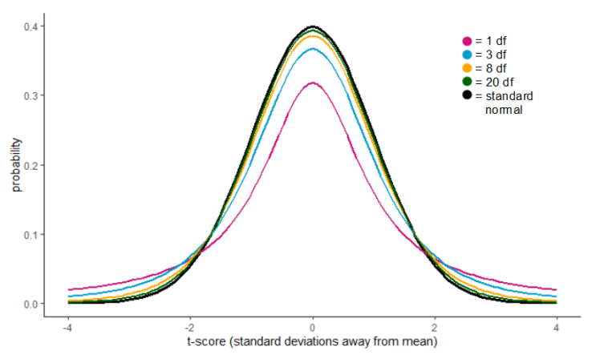
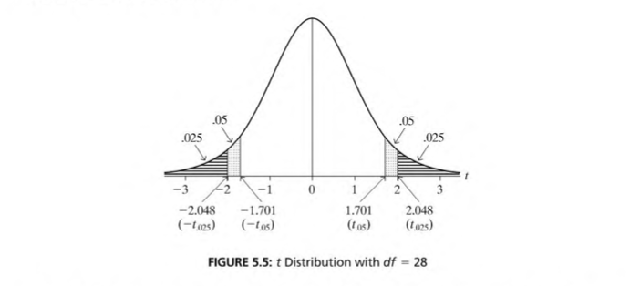
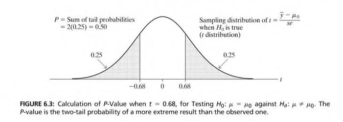
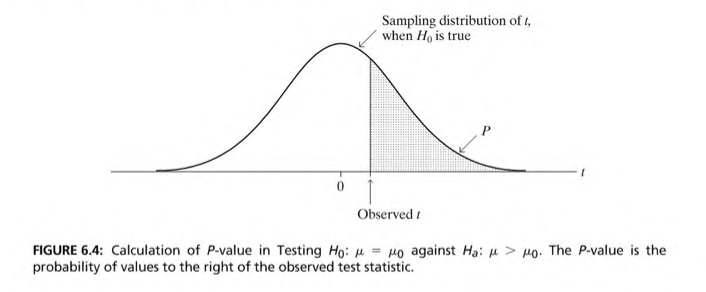

# Logistics & Announcement

- **Problem Set 1** is due on Tue Sep. 29th, 11:59 pm. 
- Make sure to comment on your code. You will get credit for demonstrating your thought process even if you don't get the final answer correct. 

```{r setup, include = T, message = F, warning = F}
knitr::opts_chunk$set(echo = TRUE)
library(tidyverse)

# Import data
weight_df <- read.csv("data/weight.csv")
```

# Part 1 Review: Population and Sample

1. Write down the formula you use to calculate the following sample statistics (assume your sample size $= n$): 
  + Sample mean:
  + Sample variance: 
  + Sample standard deviation: 
  + Standard error of sample mean: 
  + 95% confidence interval of the population mean: 

2. You have collected a sample of 25 on BMI (Body Mass Index). The sample mean is 23 and sample variance is 4. 
  + What is the point estimate of the population mean?
  + What is the 95% confidence interval of the population mean (round to 2 d.p.)? 
  + What is the 95% confidence interval of the population mean if the sample size is 10,000 (round to 2 d.p.)?

# Part 2: Hypothesis and Significance Test

First, let's review the standard steps for conducting a significance test:

## 2.1 The standard procedure of a significance test

- 1. Formulate our research question in the null and alternative hypotheses 

- 2. Select a significance level ($\alpha$) (in social science, usually $\alpha = 0.05$)

- 3. Select which test statistics to use (for small samples, we use the ***t* test statistics**)

- 4. If you are collecting first-hand data, select a sample size that provides you with sufficient statistical power

- 5. Derive the **sampling distribution of the test statistic** under the assumption that **the null hypothesis is true** 

* For the *t* test statistics, its sampling distribution is approximately the Student *t* distribution with $n−1$ degrees of freedom  

* When $n$ gets larger (usually $n > 30$), the *t* distribution is approximately a standard normal distribution (see graph below)  

* The *t* test statistic formula is: $t = \frac{\bar{y} - \mu_0}{se}$ ($\mu_0$ is the population mean in the null hypothesis)  

<center>
{width=60%}
</center>

- 6(A) Derive the critical value of *t* and your rejection region according to the null hypothesis

* The critical value of *t* ($CV_t$) is the value beyond which we will regard our observed *t* as "unusual"

* The rejection region will be $(-\infty, -|CV_t|) \cup (|CV_t|, \infty)$.

* For samples with a $\text{df} \geq 100$, the critical value of *t* is **1.96** for a significance level at 0.05. The rejection region is  $(-\infty, -1.96) \cup (1.96, \infty)$

* For samples with a $\text{df} \leq 100$, you can use the "t Distribution Critical Values" table in your textbook to find out the critical value and rejection region:   

  + For a **two-tailed test** that have a significance level at $0.05$, we find values from the **$t_{.025}$** column  
  
  + For a **one-tailed test** that have a significance level at $0.05$, we find values from the **$t_{.050}$** column 

* You can also use the `qt()` function in `R` to find out the critical value:  

  + To find out critical value of t for a **two-tailed test**, use `qt(p = 0.5*your_alpha, df = your_degree_of_freedom)`  
  
  + To find out critical value of t for a **one-tailed test**, use `qt(p = your_alpha, df = your_degree_of_freedom)`  
  
  + *Note*: the `qt()` function is the quantile function for the Student $t$ distribution in base `R` that gives the $t$ value based on the percentile you input  
  
  
<center>
{width=70%}
</center>

- 6(B) Alternatively, you can calculate the $p$-value of your observed *t* statistic

- $p$-value is the probability that the test statistic equals to (or is more extreme than) what we observed  

  + To find out the **two-tail** $p$-value, use `2*pt(q = observed_t, df = your_degree_of_freedom, lower.tail = FALSE)`  
  
  + To find out the **one-tail** $p$-value, use `pt(q = observed_t, df = your_degree_of_freedom, lower.tail = FALSE)`
  
<p align="center">
{width=70%}
</p>  
        
<p align="center">
{width=70%}
</p>  
  
- 7. Make a conclusion about whether to reject the null hypothesis  
  
  + You can use this [online tool](https://www.geogebra.org/m/b85v7zww) to visualize a $t$-test  

## Exercise

With $\mu_0 = 0$, $\bar{y} = 1.54$, sample $n = 27$, $s = 3.25$, derive:  
  (1) The *t* test statistic  
  (2) The critical value of *t* given $H_0$ is true  
  (3) Your rejection region  
  (4) $p$-value  
  (5) Your conclusion of the significance test  
  
```{r part2.1-exercise}  
    
## you can code your answer here

```

## 2.2 One-sample t-test using R

* When do you use one-sample t-test? 

* R provides a simple function `t.test()` to perform hypothesis testing using the *t* test statistics 

* For example, the data object `weight_df` we just imported records the weight change of anorexic patients who went through therapy programs, and we want to know whether these therapies are effective.

```{r check data}
## check data
head(weight_df)
```

* Before performing any statistical test, it will be useful to (1) check the descriptive statistics and (2) plot the variables of interest. 

```{r summary statistics}

## check descriptive statistics of all variables
summary(weight_df)

## plot histogram and density curve
weight_df %>%
  ggplot(aes(x = change, y=..density..)) +
  geom_histogram(binwidth = 1, fill = "grey", color = "black") +
  geom_density() +
  labs(title = "Distribution of Weight Change") +
  theme_classic()

```

* We test: 
$$H_0: \mu_{\text{change}} = 0$$ 

* the mean weight change is 0 against: 
$$H_{\text{a1}}: \mu_{\text{change}} \neq 0$$ 

* the mean weight change is not 0, a two-tailed test: 
$$H_{\text{a2}}: \mu_{\text{change}} > 0$$

* the mean weight change is larger than 0, a one-tailed test, using the following code:

```{r hypothesis testing using R}

## mean of weight change
mean(weight_df$change)


# ---- one sample two-tail t-test ---- #
two_tail_t <- t.test(         
  weight_df$change,           # the sample value vector that you want to test
  mu = 0,                     # mean given by your null hypothesis
  alternative = "two.sided",  # direction of alternative hypothesis
  conf.level = 0.95           # significance level
  )

## extract test statistic
two_tail_t$statistic

## extract p-value
two_tail_t$p.value

## extract the confidence interval of the mean
two_tail_t$conf.int

## display full result
two_tail_t

# ---- one sample one-tail t-test ---- #
t.test(weight_df$change, 
       mu = 0, 
       alternative = "greater", 
       conf.level = 0.95)
```

## Exercise

The institution that offers therapy programs to the anorexic patients claims that their treatment will lead to a weight increase of 4 lbs. Use the `weight_df` data and with $\alpha = 0.05$, perform both a two-tailed and a one-tailed test:
  $$H_0: \mu_{\text{change}} = 4$$
<p align="center">
against
</p>   
  
  $$H_{\text{a1}}: \mu_{\text{change}} \neq 4 \text{   and    } H_{\text{a2}}: \mu_{\text{change}} < 4 $$  

- Report your hypothesis testing result. 

- *Hint:* Make sure you put correct arguments for your `t.test()` function! (Are you testing for "two.sided", "less", or "greater"? What's your `mu`?) 

```{r part2.2-exercise}

## you can code your answer here

```

# Part 3: Comparing the Mean of Two Groups (Two-sample t-test)

## 3.1 Two independent samples

In the case of comparing the mean of two independent samples, we follow the same procedures as the one sample $t$-test, except the statistics for finding the *t* test statistics change. We will not review all the formulas here. Please review lecture slides and the textbook. 

Using `R`, we can perform a two-sample $t$-test by using the same `t.test()` function but adding a second sample mean vector. 

For example, in treating anorexic patients, three different therapies are used. We can plot a boxplot to visualize how weight changes differ across these therapies.

```{r box plot}
## box plot
weight_df %>%
  ggplot(aes(x = therapy, y = change)) +
  geom_boxplot() +
  geom_point(shape = 1, alpha = 0.7) +
  labs(title = "Weight Changes by Therapy Program",
       y = "weight change") +
  theme_classic()

```

It looks like therapy f tends to result in a higher weight increase compared to other therapies. Let's use a two-sample t-test to see if the mean weight change in therapy f is statistically different from that in therapy c:

$$H_0: \mu_f - \mu_c = 0$$ 
against

$$H_{a}:\mu_f - \mu_c \ne 0$$

```{r two-group-indep}

## filter data for each therapy
weight_f <- weight_df %>% filter(therapy == "f")
weight_c <- weight_df %>% filter(therapy == "c")

# ---- two-group independent two-tailed t-test ---- #
t.test(
  x = weight_f$change,          # mean value vector from the first sample
  y = weight_c$change,          # mean value vector from the second sample
  mu = 0,   
  # mean difference given by your null hypothesis
  alternative = "two.sided"     # direction of alternative hypothesis
)
```

*Note:* The degrees of freedom of the t-distribution will be $n_0 + n_1 - 2$ **if the population variance of the two groups is equal**. This is often not a very realistic scenario. Out of this reason the Welch's approximation (which we will not define here, but can be found [here](https://en.wikipedia.org/wiki/Welch%27s_t-test) if you are curious) is often used for the degrees of freedom of the $t$ distribution. This is, in fact, the default option in the `t.test()` function that we use in `R`.

## 3.2 Two dependent samples

In fact, our example in the one-sample t-test in Part 2 is a two dependent sample t-test. For two dependent sample t-test, you can always create a new variable equal to the difference between the two dependent samples, like what we did in Part 2; or you can use the `t.test()` function and set the argument `paired = TRUE`.

For example, in the `weight_df` data, if we want to test whether the mean weight before the treatment is different from the mean weight after the treatment:
$$H_0: \mu_{\text{before}} - \mu_{\text{after}}  = 0$$ 

against

$$H_{a}: \mu_{\text{before}} - \mu_{\text{after}} \ne 0$$

```{r two-group-dep}

# ---- two-group dependent two-tailed t-test ---- #
t.test(         
  x = weight_df$before,       # mean value vector from the first sample
  y = weight_df$after,        # mean value vector from the second sample
  mu = 0,                     # mean difference given by your null hypothesis
  paired = TRUE,              # dependent samples
  alternative = "two.sided",  # direction of alternative hypothesis
  conf.level = 0.95           # significance level
  )

```

## Part 3 Exercise  

Perform a two-sample two-tailed $t$-test for the difference between therapy b and c:

$$H_0: \mu_b - \mu_c = 0$$ 

against

$$H_{a}:\mu_b - \mu_c \ne 0$$

```{r part2-exercise}

## you can code your answer here

```
