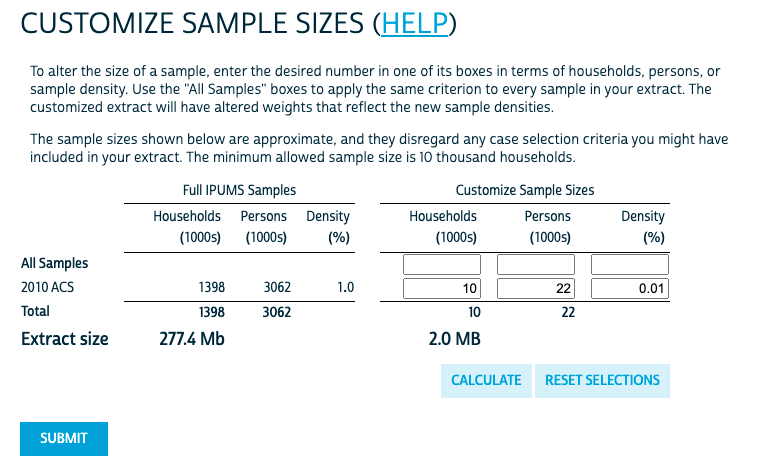
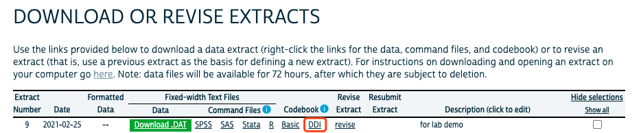
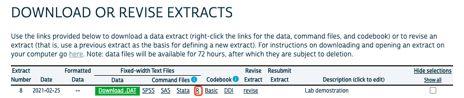
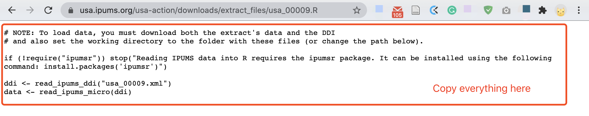
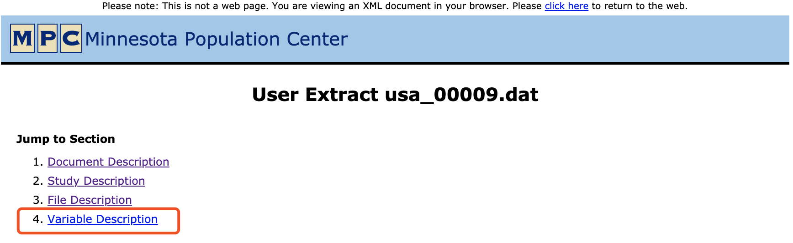
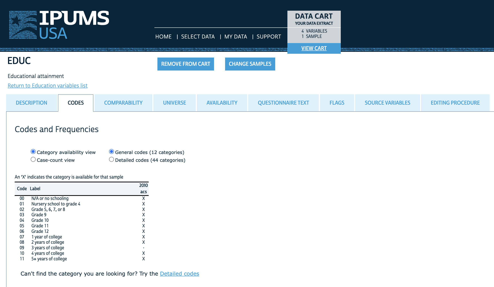

# Logistics & Announcement

- **Problem Set 1** is due on Monday Sep. 30th, 11:59 pm. Remember to submit both your coding file (the R Markdown) and a PDF file knitted from the R Markdown

- Load packages to your environment (today we will use a new package `ipumsr`. Please install the package (`install.packages('ipumsr')`) before you run the following chunks) 

```{r setup, include=TRUE, message=FALSE}
knitr::opts_chunk$set(echo = TRUE)

library(tidyverse)
library(kableExtra) 
library(ipumsr)

```

# Part 1: The OLS Estimator

- Regression is one of the most common tool social scientists use to understand the relationships between variables. 

- The three perspectives about regression:  
  + Regression as describing a relationship  
  + Regression as prediction (for conditional means)  
  + Regression as a causal relationship  

- This week we started on the simplest regression that consists of one outcome ($Y_i$) and one predictor ($X_i$) with the parameters $\beta_0$, $\beta_1$, and the error term $\epsilon_i$. This is called the **bivariate regression**. Consider the underlying **Data Generating Process** (DGP) in the **population**, where

$$Y_i = \beta_0 + \beta_1X_i + \epsilon_i$$

- We never observe the population. Instead, we have a **sample** and statistical methods to estimate the value of $\beta_0$ and $\beta_1$ given observed values of $y_i$ and $x_i$ in the **sample**. This method of estimation is called the **Ordinary Least Squares** (OLS) estimation.

- We assume a linear relation between the observed $y_i$ and $x_i$ in the sample, the same as our DGP.

$$
y_i = \hat{\beta}_0 + \hat{\beta}_1x_i + e_i
$$

- The OLS estimators of $\beta_0$ and $\beta_1$ given the sample *minimize* the sum of squared errors (SSE).

$$
\begin{aligned}
SSE = \sum^{n}_{i=1}e_i^2 = \sum^{n}_{i=1} \left(y_i - (\hat\beta_0 + \hat\beta_1 x_i) \right) ^2  \\
\hat{\beta}_0, \hat{\beta}_1 = \underset{\hat{\beta}_0, \hat{\beta}_1}{\text{argmin}} \sum^{n}_{i=1} \left(y_i - (\hat\beta_0 + \hat\beta_1 x_i) \right) ^2 
\end{aligned}
$$

- We use partial derivative to derive our $\hat{\beta}_0$ and $\hat{\beta}_1$.

$$
\begin{aligned}
\hat{\beta}_1 &= \frac{\sum^{n}_{i=1}(x_i - \bar{x})(y_i - \bar{y})}{\sum^{n}_{i=1}(x_i - \bar{x})^2} \\
&= \frac{Cov(y_i,x_i)}{Var(x_i)}
\end{aligned}
$$
$$\hat{\beta}_0 = \bar{y} - \hat{\beta}_1\bar{x}$$

- Does the error term $e_i$ have a mean value of zero?

- Is the covariance between $e_i$ and $x_i$ zero? (*e_i* and *x_i* are not correlated)
  + Does it mean $e_i$ and $x_i$ is independent?

- What happens when we have more than 1 predicting variable?

$$
\begin{aligned}
\hat{\beta}_0, \hat{\beta}_1 , \hat{\beta}_2 ... , \hat{\beta}_k &= \underset{\hat{\beta}_0, \hat{\beta}_1 , \hat{\beta}_2 ... , \hat{\beta}_k}{\text{argmin}} \sum^{n}_{i=1} \left(y_i - (\hat\beta_0 + \hat\beta_1 x_i + \hat\beta_2 x_2 + ... + \hat\beta_k x_k) \right) ^2 \\
\hat{\beta}_k &= \frac{Cov(y_i, \tilde{x}_{ki})}{Var(\tilde{x}_{ki})}
\end{aligned}
$$

where $\tilde{x}_{ki}$ is the residual from the regression of $x_{ki}$ on all other covariates.

- Now we create a toy example with only five data points in our sample, and calculate the OLS estimators by hand. 

```{r ols example, fig.height = 3, fig.width = 3, fig.align = "center"}

## value of x and y are observed
x <- c(-2, 0, 3, 6, 10) 
y <- c(-1, 8, 15, 12, 28)

## create a dataframe of x and y
ols_df <- data.frame(
  x = x,
  y = y
)

## scatter plot of x and y
ols_df %>%
  ggplot() +
  geom_point(aes(x, y), shape = 1) +
  labs(title = "Scatterplot of Example Data")
```

## Part 1 Exercise: Calculate OLS estimators by hand

Let us apply the formulas we learned in the lecture to work out the value of $\hat{\beta}_0$ and $\hat{\beta}_1$ in the above toy example using OLS.  

1. Hand-calculate the value of $\hat{\beta}_0$ and $\hat{\beta}_1$ using the formulas below. 

2. Calculate $\hat{\beta}_0$ and $\hat{\beta}_1$ using `R`. *Hint:* You can perform vector operations in `R`.  

```{r part1-q1}

## your code here

```
  
3. In `R`, you can get the variance of a value vector using the function `var()`, and the covariance of two value vectors using the function `cov()`.

```{r part1-q2}

## your code here

```
 
4. You can use the `cor()` function in R to calculate the correlation coefficient $\rho$ of two value vectors. Now calculate $\hat\beta_1$ using the formula below.

$$
\begin{aligned}
\hat{\beta}_1 &= \frac{\sum^{n}_{i=1}(x_i - \bar{x})(y_i - \bar{y})}{\sum^{n}_{i=1}(x_i - \bar{x})^2} \\
&= \frac{Cov(y_i,x_i)}{Var(x_i)} \\
&= \rho_{x,y} \cdot \frac{s_y}{s_x}
\end{aligned}
$$
 
```{r part1-q3}

## your code here

```
  
5. Create a new dataframe based on `ols_df` that has a new variable called `fitted_y` that equals to your predicted value of y given your OLS regression equation. *Hint:* Use `mutate()` in `tidyverse` to create a new variable.
  
```{r part1-q4}

## your code here

```

6. Calculate your OLS regression's **SSE (sum of squared errors)**.

```{r part1-q5}

## your code here

```

7. Draw your OLS regression line on the scatter plot created earlier. *Hint:* You can add a line with customized intercept and slope value using the `geom_abline()` function:

```
your_plot +
  geom_abline(intercept = your_intercept, slope = your_slope)

```
```{r part1-q6}

## your code here


```

## Estimate OLS Regression Using R

Estimating linear models using OLS is very simple in `R`. We can use the linear model function `lm()` to estimate regression models. However, you should always remember that OLS estimation entails a set of assumptions about your data that you should always check before estimating your models. 

## Gauss-Markov Assumptions: 

1. Linear in parameters
2. Random sampling
3. No perfect collinearity
4. Zero conditional mean (Do we force this to be true in estimating OLS? No! We hope this is true in the DGP such that our OLS estimation is consistent and unbiased)
5. Homoskedasticity (error term has a constant variance across the value of $x$): $\mathrm{Var}(\epsilon\mid x_1, x_2, \dots, x_k) = \sigma^2$

#### Estimate OLS in R

```{r lm}

## estimate a linear model
ols_m1 <- lm(y ~ x, data = ols_df)

## check model result
ols_m1

## for details, use the summary() function
summary(ols_m1)

## the SSE is not directly displayed, but we can calculate it by its definition
sum(ols_m1$residuals^2)

```


# Part 2: Getting Started on the Replication Project

Now let's move on to use real-world data for estimating regression models. Since we will need to use IPUMS for the final replication project, let's download data from IPUMS. 

## IPUMS

[IPUMS](https://ipums.org/) is a "data resource center" that stores various census and survey data. It harmonizes survey measures across the years and provide detailed documentations for researchers. 

For the replication project, we will use **IPUMS USA** that stores the U.S. Census and American Community Survey data. 

## Part 2 Exercise 1: Download Data from IPUMS

1. Register an account for using IPUMS-USA [here](https://usa.ipums.org/usa/)
2. Once your account is created, log in to IPUMS-USA and create a data extract request by selecting the **2010 ACS** sample and the **SEX**, **EDUC**, and **INCWAGE** variables. You can keep the preselected variables. Your "Data Cart" should be similar to this:  

<center>
{width=50%}
</center>  

3. To save time, create a small data extract with a customized sample size of **0.01%**. As shown in the following screenshot. Submit your data extract request. 

<center>
{width=50%}
</center> 

4. While IPUMS is processing our data extract request, you can prepare the file needed for loading the IPUMS data to R. Open the "DDI" page in your browser, it should be a `.xml` page. Save this `.xml` file to your current lab folder, or you can save it in a sub-folder devoted to data files, such as a sub-folder called "data" within your current lab folder.

<center>
{width=60%}
</center>  


5. Once your data is ready on IPUMS, you will receive an email with a download link. (The wait time varies from a couple minutes to a couple days, depending on how large your files are and how busy the server is.) Follow the link in your email and download your data (the default format is `.dat.gz`). **Make sure to save it at the same directory with your `.xml` file**

6. Unzip the `.gz` data file using your computer's unzip applications (for Mac users, if the default extractor doesn't work, try the [Unarchiver application](https://theunarchiver.com/)). Now you should have the `.dat` file and the `.xml` file in the same directory. 

7. Load the data to your R environment, by using the code shown in the webpage when you click the `R` Command File link in your IPUMS data downloading page. 

<center>
{width=60%}
</center>

<center>
{width=60%}
</center>


```{r part2-exercise1-ipums}

## your code here

## NOTE: To load data, you must download both the extract's data and the DDI
## and also set the working directory to the folder with these files (or change the path below).

if (!require("ipumsr")) stop("Reading IPUMS data into R requires the ipumsr package. It can be installed using the following command: install.packages('ipumsr')")

ddi <- read_ipums_ddi("data/usa_00043.xml")
data <- read_ipums_micro(ddi)

```

## Read IPUMS Documentations

Before working with the data, we should be clear about how the variables are coded. You can access the documentation of each variables through the `.xml` webpage you opened earlier.  

<center>
{width=60%}
</center>  

When you have that page open in your browser, click "Variable Description" to access the codebook for each variables we just downloaded. 

<center>
{width=60%}
</center>  

The other way is to read the documentation of each variable directly in the online system. This is my preferred approach.

<center>
{width=60%}
</center>  

## Part 2 Exercise 2: Read Data Codebook

Going through the variable description, and answer the following question:

1. What does the variable "PERNUM" represents? How can you uniquely identify each person within the IPUMS with this variable? 

2. What does the variable "PERWT" represents? When should you consider using this variable?   

3. For the variable "SEX", what are the possible values it can take? What does each value represent? Try run `str(data$SEX)`, what do you see?

4. What does the variable "EDUC" represents? How many values this variable can take? What is the value that represents N/A?   

5. For the variable "INCWAGE", what are the codes for N/A and missing data?

# Part 3: Analyzing IPUMS Data

We will try fit an OLS regression on the relationship between **education and wage income**. However, before doing that, we need to make sure we know how the variables are distributed in the sample and remove N/A and missing values (we do not consider imputing missing values at this point).

*Note:* Since we each extracted a 0.01% random sample, it is normal if your results are slightly different from this demo.  

First, make sure your data is loaded in your environment. 

```{r import IPUMS}
## load ipums data
ddi <- read_ipums_ddi("data/usa_00043.xml")
data <- read_ipums_micro(ddi)
```

Then, we will keep the following variables for subsequent data analysis: SAMPLE, SERIAL, PERNUM, PERWT, SEX, EDUC, INCWAGE

```{r IPUMS select var}

## select variables
data_clean <- data %>%
  select(PERWT, SEX, EDUC, INCWAGE)

```

## Remove missing value

Since we are running regression for **education and wage income**, we need to remove observations that do not have any of the two values. You can either remove then by filtering out the values that represent N/A or missing based on the variable codebook, or you can recode these values to `NA` so that you keep all the observations. We will cover this latter method in the future. 

```{r remove missing, fig.height = 3, fig.width = 3, fig.align = "center"}

## check number of observations for each value of EDUC
table(data_clean$EDUC)

## check coding scheme for EDUC in codebook
## --> we need to remove value 0, which means N/A or no schooling

## check distribution of INCWAGE
data_clean %>%
  ggplot() +
  geom_histogram(aes(INCWAGE), binwidth = 15000, color = "black", fill = "grey")

## check coding scheme for INCWAGE in codebook
## --> we need to remove value 999998 (missing) and value 999999 (N/A) 
max(data_clean$INCWAGE)

## remove missing value use filter()
data_clean <- data_clean %>%
  filter(EDUC != 0 & INCWAGE < 999998)

## check distribution after removing missing values
## EDUC
table(data_clean$EDUC)

## INCWAGE
data_clean %>%
  ggplot() +
  geom_histogram(aes(INCWAGE), binwidth = 15000, color = "black", fill = "grey")
```

## Estimate Regression

Now, let's try estimate a OLS regression model for wage income and education levels. Let's make an unrealistic assumption that we can treat the EDUC variable as a discrete numeric variable, that the value 1, 2, 3, ..., 11 correspond to the years of education one receives. (Of course, if you read the codebook carefully, you know this is not what each value represents. We will learn how to correctly use categorical predictors in future lectures.) 

## Part 3 Exercise: Estimate OLS Model Using IPUMS Data
  
1. Clean your data using the code above (create `unique_id` and remove missing values for INCWAGE and EDUC)

```{r part3-exercise-q1}

## your code here

```

2. Plot a scatter plot with EDUC on the x axis and INCWAGE on the y axis

```{r part3-exercise-q2}

## your code here

```

3. Use `lm()` to fit a OLS regression model with INCWAGE as the dependent variable and EDUC as the independent variable. Report your $\hat{\beta}_0$, $\hat{\beta}_1$, and SSE. No need to weight individuals at this point.

```{r part3-exercise-q3}

## your code here

```

4. Use `+ geom_smooth(aes(x = your_x, y = your_y), method = "lm")` to plot the fitted regression line on top of your scatter plot. 

```{r part3-exercise-q4}

## your code here

```

5. Plot the following diagnostic plots. What patterns do you see about the residual terms relative to the value of EDUC and fitted y? Do you think the data and the model set up fulfill the Gauss-Markov assumptions?  

*Hint:* Use the base R function `plot(x = your_x_vector, y = your_y_vector)` for quick plotting.  

- $\epsilon_i$ vs $x_i$: Make a scatter plot with the predictor on the x axis and the model residuals on the y axis.  

```{r part3-exercise-q5-1}

## your code here

```
