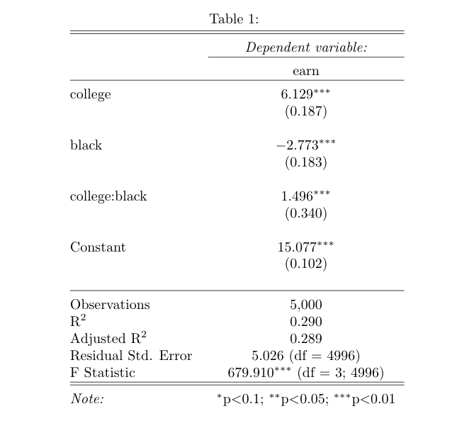

# Part 1: Gauss-Markov Assumption and Strict Exogeneity

- In lecture, we talked about Gauss-Markov Assumption and the fact that the OLS estimator is the Best Linear Unbiased Estimator (BLUE) if the assumptions are met. For a data generating process (DGP):

$$
Y_i = \beta_0 + \beta_1 X_i + \epsilon_i
$$

- Zero conditional mean: in this population, $\mathbb{E}(\epsilon_i | X) = 0$. We also call this the strict exogeneity assumption. This means that, no matter which value $X$ takes, the expectation of $\epsilon_i$ associated with this $X$ value will be 0. If the assumption is met, the following statements will be true:

  - $\mathbb{E}(\epsilon_i) = 0$. This is because of the Law of Iterated Expectations [(detailed explanations here)](https://en.wikipedia.org/wiki/Law_of_total_expectation): $\mathbb{E}(\epsilon_i) = \mathbb{E}(\mathbb{E}(\epsilon_i | X)) = \mathbb{E}(0) = 0$
  
  - $\epsilon_i$ is independent of $X$. In other words, $\epsilon_i$ is not a function of $X$, otherwise $\mathbb{E}(\epsilon_i | X) = \mathbb{E}(f(X)| X) = f(X) \neq 0$

- The independence between $\epsilon_i$ and $X$, if violated, would produced a biased estimation. That is, if we sample from this population and derive $\hat{\beta_1}$, $\mathbb{E}(\hat{\beta_1}) \neq \beta_1$.
  
  - This will be part of your assignment 2. 
  
  - You don't even have to sample from the population. You can see this biasedness by creating a population where $\epsilon_i$ and $X$ are not independent, and when you regress $Y_i$ on $X$, your derived $\hat{\beta_1}$ will be very different from $\beta_1$.
  
  - How to force $\epsilon_i$ to be dependent on $X$? You may create $\epsilon_i$ to be any function of $X$. For example, $\epsilon_i = aX_i + b + N(0,1)$ ($N(\mu,\sigma)$ means a normal distribution with mean $\mu$ and SD $\sigma$).
  
  - In reality, this is called omitted variable bias.
  
# Part 2: Important Properties of OLS Estimation 

- OLS minimizes the sum of the square of the error term

$$
\operatorname*{argmin}_{\hat{\beta_0}, \: \hat{\beta_1}} f(\hat{\beta_0}, \hat{\beta_1}) = \sum_{i=1}^{n} \left( Y_i - \hat{\beta_0} -\hat{\beta_1}X_i \right)^2
$$

- We use partial derivative for the solution

$$
\begin{aligned}
\frac{\partial f(\hat{\beta_0}, \hat{\beta_1})}{\partial \hat{\beta_0}} = 0 \\
\text{which gives: } \sum_{i=1}^{n}\left( Y_i - \hat{\beta_0} -\hat{\beta_1}X_i \right) = \sum_{i=1}^{n}e_i = 0 \\
\frac{\partial f(\hat{\beta_0}, \hat{\beta_1})}{\partial \hat{\beta_1}} = 0 \\
\text{which gives: } \sum_{i=1}^{n} X_i \left( Y_i - \hat{\beta_0} - \hat{\beta_1}X_i \right) = \sum_{i=1}^{n}X_i e_i = 0 
\end{aligned}
$$
- The two facts, $\sum_{i=1}^{n}e_i = 0$ and $\sum_{i=1}^{n}X_i e_i = 0$, are forced to be true in OLS estimation

- $e_i$ does not have life on its own. It has its meaning and value through $\hat{\beta_0}$ and $\hat{\beta_1}$

- $\sum_{i=1}^{n}X_i e_i = 0$ forces the covariance between $e_i$ and $X_i$ to be 0. But this does not imply independence.


```{r setup, include=FALSE}
knitr::opts_chunk$set(echo = TRUE)

## load packages
library(tidyverse)
library(psych)
library(foreign)
library(stargazer)
library(ggcorrplot)
library(coefplot)
```

# Part 3: Multivariate Regression & Interaction with One Dummy

## Dummies 

- For categorical variables, we create dummies or convert them to 0 or 1 dummies when we want to include them in a regression model
- Note that for a categorical variable that have $n$ categories, the regression model will only have $n-1$ dummies or categorical variable predictors, because the $n^{th}$ dummy is redundant given that if an observation does not belong to any of the $n-1$ category, then it must be in the $n^{th}$ category
- We call the left-out category the **reference category**
- Question: what if we include all $n$ categories?

- You should always interpret your model coefficients with the reference category in mind. This could get complicated when you have multiple dummy variables, especially when they are interacted in your model

In the case of the dummies representing "race" in the `earnings_df` that we will be using today, we have:

Category | $Dummy_1 (black)$| $Dummy_2 (other)$   
---------|------------|-----------
White    | 0          |    0 
Black    | 1          |    0
Other    | 0          |    1

## Exercise (from Lab 5)

  1. Import `earnings_df.csv` to your environment. Perform the following data cleaning steps: 
    (1) If `age` takes the value 9999, recode it as `NA`; 
    (2) Create a new variable `female` that equals 1 when `sex` takes the value `female`, and equals to 0 otherwise; 
    (3) Create a new variable `black` that equals 1 when `race` is `black` and equals to 0 otherwise; 
    (4) Create a new variable `other` that equals to 1 when `race` is 'other` and 0 otherwise.
  
  2. Use the `describe()` function from the `psych` package to generate a quick descriptive statistics of your data.
  
  3. Now, estimate the following models and display your model results in a single table using `stargazer(m_1, m_2, ..., m_n, type="text")`. 

(1) Model 1: earn ~ age (baseline)
(2) Model 2: earn ~ age + edu 
(3) Model 3: earn ~ age + edu + female
(4) Model 4: earn ~ age + edu + female + race
(5) Model 5: earn ~ age + edu + female + race + edu*female

  4. Write down your prediction equation for Model 5

  5. In Model 5, holding other variables constant, what will be the predicted difference in estimated mean earnings for a white man and a white women?  
  
  6. Holding other variables constant, what will be the predicted difference in estimated mean earnings for a white women and a black women?  
  
  7. Holding other variables constant, what will be the predicted difference in estimated mean earnings for a white man and a black women?

```{r part1-clean, warning=FALSE, message=FALSE}

## read data
earnings_df <- read.csv("data/earnings_df.csv", stringsAsFactors = F)

## recode age
earnings_df <-
  earnings_df %>%
  mutate(age = case_when(
    age > 9000 ~ NA,
    .default = age
  ))

## recode female
earnings_df <- earnings_df %>% 
  mutate(female = case_when(
    sex == "female" ~ 1, 
    .default = 0)) 

## base R way of doing it
earnings_df$female <- 0
earnings_df[earnings_df$sex=="female", "female"] <- 1

## create black and other
earnings_df <- 
  earnings_df %>%
  mutate(black = case_when(
    race == "black" ~ 1,
    .default = 0
  )) %>%
  mutate(other = case_when(
    race == "other" ~ 1,
    .default = 0
  ))
```


```{r part1-estimation, warning=FALSE, message=FALSE}
m1 <- lm(earn ~ age, 
         data = earnings_df)

m2 <- lm(earn ~ age + edu,
         data = earnings_df)

m3 <- lm(earn ~ age + edu + female,
         data = earnings_df)

m4 <- lm(earn ~ age + edu + female + black + other,
         data = earnings_df)

m5 <- lm(earn ~ age + edu + female + black + other + edu*female,
         data = earnings_df)

stargazer(m1, m2, m3, m4, m5,
          type = "text",
          omit.stat=c("ser", "f","rsq"))
```

# Part 4: Interaction with Two Dummy Variables

Given the following modeling result, please answer the questions.

{width=70%}

  1. What will be the predicted difference in estimated mean earnings for a white person with a college degree and a black person with a college degree? Whose earnings will be higher?
  
  2. What will be the predicted difference in estimated mean earnings for a white person with a college degree and a black person without a college degree? Whose earnings will be higher?
  
  3. How to interpret the interaction coefficient? 
  
  4. How to interpret the intercept?

# Part 5: Visualize Modeling Results

## Correlation Matrix

- Sometimes, it is helpful to get an understanding of how variables are linearly related to each other. This is useful in identifying multicollinearity in the data.
- However, since correlation only works with numeric data, you need to remove non-numeric and irrelevant variables before you calculate the correlation matrix using `cor()`.

```{r corr, fig.align = "center"}
## remove non-numeric variables
earnings_df_cat <- earnings_df %>%
  select(-female, -black, -other, -sex, -race, -unique_id)

## correlation matrix
## set use = "complete.obs" to ignore observations with NAs
cor(earnings_df_cat, use = "complete.obs")
```
  

## `stargazer` and Multi-category Dummies
  
  
```{r stargazer model,warning=FALSE,message=FALSE}  

## run models
m4 <- lm(earn ~ age + edu + female + black + other,
         data = earnings_df)

m5 <- lm(earn ~ age + edu + female + black + other + edu*female,
         data = earnings_df)

m6 <- lm(earn ~ age + edu + female + black + other + edu*black + edu*other,
         data = earnings_df)

## examine models and tune the star level
stargazer(m4, m5, m6, 
          star.char = c("*", "**", "***"),
          omit.stat=c("ser", "f","rsq"),
          star.cutoffs = c(0.05, 0.01, 0.001),
          type="text")
  
```

### 3. Coefficient Plots

- Coefficient plot visualizes the coefficients with it's confidence intervals. You can plot it easily using `coefplot()` from the `coefplot` package. There are also other packages that visualize coefficients. 
- You can also visualize them on your own by putting the coefficients together in a dataframe.   
  
```{r coefplot, warning=FALSE, message=FALSE}  

## defualt coefficient plot
coefplot(m5)

## remove the intercept from the plot
coefplot(m5, intercept = F)

## the default innerCI is 1, which is 1 se around the point estimate
## the default outerCI is 2, which is 2 se around the point estimate
## you can set both to 1.96, which is the 95% confidence interval of betas
coefplot(m5, intercept = F, innerCI = 1.96, outerCI = 1.96)

## or only keep the outerCI = 1.96
coefplot(m5, intercept = T, innerCI = F, outerCI = 1.96)
 
## you can also change the color, shape, and size of the texts
## as well as change plot titles and axes labels
## read the documentation for more
coefplot(m5, intercept = F, innerCI = F, outerCI = 1.96, 
         color = "black",                         ## customize color
         title = "Coefficient Plot for Model 5")  ## customize title 

## coefplot is build upon ggplot2
## almost all functions in ggplot2 would work
coefplot(m5, intercept = F, innerCI = F, outerCI = 1.96, 
         color = "red3",                         
         title = "Coefficient Plot for Model 5") +
  theme_bw() +
  xlab("Coefficient") +
  ylab("Variables") +
  theme(plot.title = element_text(hjust = 0.5)) ## center the title
```

### 4. Plot Predicted Effects
  
* We can visualize the predicted effects of key predictors using the `predict()` function in base `R`.  

* The idea behind this task is to first create a dataframe with values of all the predictors included in the model, with **only the value of your predictor(s) of interest vary within the possible range, whereas other predictors held at their mean.**  

* For example, if we want to examine the effect of **education and gender** on earnings, we create a dataframe with a variable `edu` that varies from 0 to 15 with an interval of 1 (so `edu` = 0, 1, 2, ..., 14, 15), because the possible value of `edu` in our data is integers from 0 to 15 (you can use `summary(your_df)` to check value ranges).

* We repeat this number sequence for another time so that we have **each level of education for both male and female**. So we need to generate `edu` = 0, 1, 2, ..., 14, 15, 0, 1, 2, ..., 14, 15. We use `rep(0:15, 2)` to generate this number sequence.  

* `rep(x, times)` replicate `x` (a vector or list) for user-defined `times` (in our case, `times = 2`). You can run this in your `R` console to see what number sequence is returned.  

* Then, we generate a dummy variable `female` that equals to 0 for male and 1 for female.  

* To create a dataframe that have the combination of each level of `edu` and each gender category, we let `female` = 0 for 16 times, and `female` = 1 for 16 times, using `c(rep(0, 16), rep(1, 16))`. You can run this in your R console to see what number sequence is returned.  

* For the rest of the predictors, we fix them at their mean. We add `na.rm = T` in the `mean()` function to specify how we want to deal with NA values. If you don't include `na.rm = T`, `mean()` will return NA if your variable contains NAs. 

```{r predict, warning=FALSE, message=FALSE}

## first, we create a dataframe with all predictor variables
## only the key predictor varies, while the others remain at the mean
pred_IV <- data.frame(edu = rep(0:15, 2)) %>%         ## first, create a df with values of your key predictor
  mutate(female = c(rep(0, 16), rep(1, 16)),          ## b/c we are looking at interaction effects, 
                                                      ## give gender two values, otherwise fix it at mean
         age =  mean(earnings_df$age, na.rm = T),   ## fix other variables at mean
         black = mean(earnings_df$black),
         other = mean(earnings_df$other))
rep(0:15,2)

## examine the df
head(pred_IV, 5)
```

* Now that we have the dataframe `pred_IV` ready for predicting the dependent variable (earning), we can use the R function `predict()` to calculate fitted earning using the regression model and the values specified in each row in `pred_IV`. Then, use `cbind()` to combine this fitted Y value vector with your `pred_IV` for plotting. 

```{r plot effect}
## use `predict` to predict the Y
predicted_earning <- predict(m5,                      ## the model you are using
                             pred_IV,                ## the df you use for predicting
                             interval = "confidence", ## set CI
                             level = 0.95)

## bind the columns
pred_result <- cbind(pred_IV, predicted_earning)

## check df
head(pred_result, 5) 
 
## plot
pred_result %>% 
  mutate(gender = ifelse(female == 0, "Male", "Female")) %>%       ## convert dummy to character variable
  ggplot(aes(x = edu, y = fit, group = gender)) +
  geom_line(aes(linetype = gender)) +                              ## group linetype by gender
  geom_ribbon(aes(ymin = lwr, ymax = upr, fill = gender), alpha = 0.3) +   # add 95% CI
  theme_bw() +
  labs(x = "Years of Education",
       y = "Predicted Earnings") +
  ggtitle("Predicted Earnings by Education and Gender",
          subtitle = "(Modeled with interaction between education and gender)")
```

