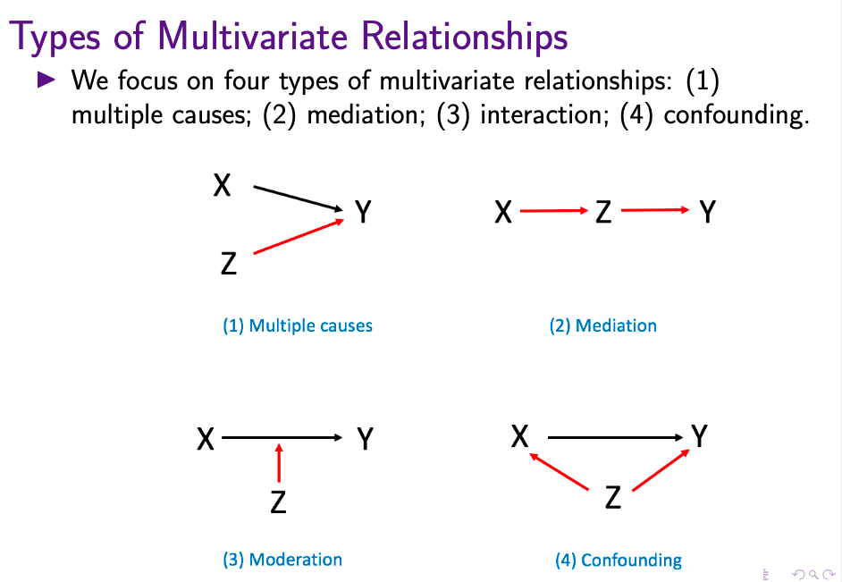
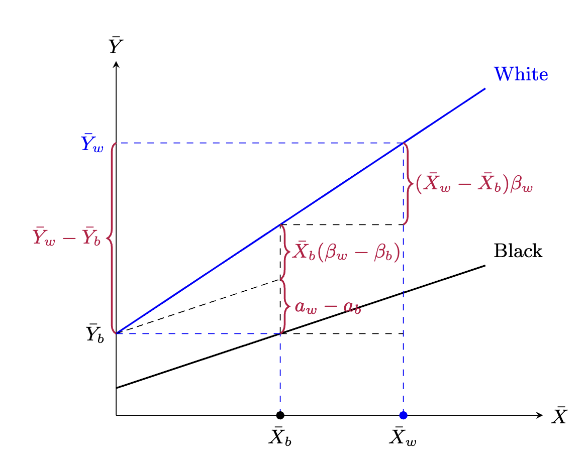

```{r setup, message=FALSE, warning=FALSE}
library(tidyverse)
library(stargazer)
library(coefplot)
library(sandwich)
library(lmtest)
library(ggpubr)
```

# Part 0: Housekeeping

- **Problem Set 2** is due on Friday Oct 25nd, 11:59 pm

- Note: You don't need to wait until the PS2 due day to submit a screenshot of your data cart. You can email me the screenshot once you are done so that I can help check if you have chosen the correct variables.

- There are multiple ways to include a figure in Rmarkdown. Please see one example below.

```{r include figure, fig.cap="Types of Multivariate Relationships", out.width = '65%', fig.align='center'}

```

# Part 1: How Does Multivariate Relationships Affect Regression Estimates

- Multiple Causes

```{r multiple causes, warning=FALSE, message=FALSE}
set.seed(2023)

## empty results
woz <- c()
wz <- c()

for (i in 1:1000){
  
 ## create hypothetical variables
  X <- runif(500, min=1, max=10)
  Z <- runif(500, min=2, max=5)
  Y <- 10 + 5*X + Z + rnorm(500,0,1)
  
  ## data
  data <- data.frame(X=X,Y=Y,Z=Z)
  
  ## regression
  lm1 <- lm(Y ~ X, data)
  lm2 <- lm(Y ~ X + Z, data) 
  
  ## extract results
  woz <- c(woz, summary(lm1)$coef[2,1])
  wz <- c(wz, summary(lm2)$coef[2,1])
}

## combine results
results <-
  data.frame(estimate = c(woz,wz),
             category = c(rep("Z excluded",1000),rep("Z included",1000)))

mean <- results %>%
  group_by(category) %>%
  summarize(mean = mean(estimate))

## plot
results %>%
  ggplot(aes(x=estimate,group=category)) +
  geom_density(aes(color=category),bw=0.01) +
  geom_vline(data = mean, aes(xintercept = mean, color = category)) +
  scale_color_manual(values=c("#999999", "red3")) +
  xlab("Estimate of X's slope, True = 5") +
  theme_bw()
```

- Confounding

```{r confounding, warning=FALSE, message=FALSE}
set.seed(2023)

## empty results
woz <- c()
wz <- c()

for (i in 1:1000){
  
 ## create hypothetical variables
  Z <- runif(500, min=1, max=10)
  X <- runif(500, min=1, max=5) + 0.5*Z
  Y <- 10 + 5*X + Z + rnorm(500,0,1)
  
  ## data
  data <- data.frame(X=X,Y=Y,Z=Z)
  
  ## regression
  lm1 <- lm(Y ~ X, data)
  lm2 <- lm(Y ~ X + Z, data) 
  
  ## extract results
  woz <- c(woz, summary(lm1)$coef[2,1])
  wz <- c(wz, summary(lm2)$coef[2,1])
}

## combine results
results <-
  data.frame(estimate = c(woz,wz),
             category = c(rep("Z excluded",1000),rep("Z included",1000)))

mean <- results %>%
  group_by(category) %>%
  summarize(mean = mean(estimate))

## plot
results %>%
  ggplot(aes(x=estimate,group=category)) +
  geom_density(aes(color=category),bw=0.01) +
  geom_vline(data = mean, aes(xintercept = mean, color = category)) +
  scale_color_manual(values=c("#999999", "red3")) +
  xlab("Estimate of X's slope, True = 5") +
  theme_bw()
```

- Mediation

```{r mediation, warning=FALSE, message=FALSE}
set.seed(2023)

## empty results
woz <- c()
wz <- c()

for (i in 1:1000){
  
 ## create hypothetical variables
  X <- runif(500, min=1, max=10)
  Z <- runif(500, min=2, max=5) + 0.5*X
  Y <- 2*Z + rnorm(500,0,1)
  
  ## data
  data <- data.frame(X=X,Y=Y,Z=Z)
  
  ## regression
  lm1 <- lm(Y ~ X, data)
  lm2 <- lm(Y ~ X + Z, data) 
  
  ## extract results
  woz <- c(woz, summary(lm1)$coef[2,1])
  wz <- c(wz, summary(lm2)$coef[2,1])
}

## combine results
results <-
  data.frame(estimate = c(woz,wz),
             category = c(rep("Z excluded",1000),rep("Z included",1000)))

mean <- results %>%
  group_by(category) %>%
  summarize(mean = mean(estimate))

## plot
results %>%
  ggplot(aes(x=estimate,group=category)) +
  geom_density(aes(color=category),bw=0.01) +
  geom_vline(data = mean, aes(xintercept = mean, color = category)) +
  scale_color_manual(values=c("#999999", "red3")) +
  theme_bw()
```

- Moderation

# Part 2: Additional Topics in Regression

## 1. Heteroskedasticity and Robust Standard Errors

- Heteroskedasticity occurs when the **variance of the error term changes across different values of the explanatory variables**; $Var(\epsilon_i | X) \neq Var(\epsilon_i)$, or, as we see in lecture, we assume that $Var(\epsilon_i | X) = \sigma^2 h(X)$
- Heteroskedasticity violates the basic assumption of OLS, in which the variance of the error term should be constant across different values of the explanatory variables. 
- Will heteroskedasticity make estimates biased and inconsistent?
- In OLS estimation, the standard error of $\hat{\beta}_1$, $se_{\hat{\beta}_1}$ is derived by assuming homoskedasticity. Specifically, given known $X$ and the uncertainty coming from sampling the same $X$ but with different $\epsilon_i$ from the population, we assume $Var(y|X) = Var(\epsilon|X) = Var(\epsilon) = \sigma^2$

$$
\begin{aligned}
\hat{\mathbf{\beta}} &= (\mathbf{X}^{\prime} \mathbf{X})^{-1} \mathbf{X}^{\prime} \mathbf{y} \\
\textrm{Var}(\hat{\mathbf{\beta}}|\mathbf{X}) &= (\mathbf{X}^{\prime} \mathbf{X})^{-1} \mathbf{X}^{\prime}
  \; \textrm{Var}(\mathbf{y}|\mathbf{X}) \; \mathbf{X}  (\mathbf{X}^{\prime} \mathbf{X})^{-1} \\
 &= (\mathbf{X}^{\prime} \mathbf{X})^{-1} \mathbf{X}^{\prime}
 \;\sigma^2 \mathbf{I} \; \mathbf{X}  (\mathbf{X}^{\prime} \mathbf{X})^{-1} \\
 &= \sigma^2 (\mathbf{X}^{\prime} \mathbf{X})^{-1} (\mathbf{X}^{\prime}
 \mathbf{X})  (\mathbf{X}^{\prime} \mathbf{X})^{-1} \\
 &= \sigma^2  (\mathbf{X}^{\prime} \mathbf{X})^{-1}
\end{aligned}
$$

```{r heteroskedasticity, warning=FALSE, message=FALSE}
set.seed(2023)

## empty results
homo <- c()
hetero <- c()

## create x
X <- rgamma(5000, 5, 4)

for (i in 1:1000){
  
 ## create hypothetical data
  homo_Y <- -0.25 + 1.2*X + rnorm(5000,0,1)
  hetero_Y <- -0.25 + 1.2*X + rnorm(5000,0,0.5*X)
  
  ## data
  homo_data <- data.frame(X=X,homo_Y)
  hetero_data <- data.frame(X=X,hetero_Y)
  
  ## regression
  lm1 <- lm(homo_Y ~ X, homo_data)
  lm2 <- lm(hetero_Y ~ X, hetero_data)
  
  ## extract results
  homo <- c(homo, summary(lm1)$coef[2,1])
  hetero <- c(hetero, summary(lm2)$coef[2,1])
}

## combine results
results <-
  data.frame(estimate = c(homo,hetero),
             category = c(rep("homoskedasticity",1000),rep("heteroskedasticity",1000)))

## plot
hetero <-
  results %>%
  filter(category=="heteroskedasticity") %>%
  ggplot(aes(x=estimate)) +
  geom_histogram(aes(y=..density..),fill="grey",color="black") +
  stat_function(fun = dnorm, 
                args = list(mean = 1.2, 
                            sd = summary(lm2)$coef[2,2]),
                color = "red3") +
  ggtitle("Estimate under heteroskedasticity") +
  theme_bw() +
  theme(plot.title = element_text(hjust = 0.5))

homo <-
  results %>%
  filter(category=="homoskedasticity") %>%
  ggplot(aes(x=estimate)) +
  geom_histogram(aes(y=..density..),fill="grey",color="black") +
  stat_function(fun = dnorm, 
                args = list(mean = 1.2, 
                            sd = summary(lm1)$coef[2,2]),
                color = "red3") +
  ggtitle("Estimate under Homoskedasticity") +
  theme_bw() +
  theme(plot.title = element_text(hjust = 0.5))

ggarrange(hetero, homo)

```

- Detecting heteroskedasticity by plotting $Y - \hat{Y}$ over $X$

```{r detect hetero, warning=FALSE, message=FALSE}
data.frame(X = X, e = hetero_Y - predict.lm(lm2,hetero_data)) %>%
  ggplot(aes(x=X,y=e)) +
  geom_point(color="red3",alpha=0.4) +
  theme_bw()

```

- Robust standard error

- If you have a reason to believe that your dataset violates the assumption of homoskedasticity, you can use the packages `sandwich` and `lmtest` to get robust standard errors. 

```{r robust se, warning=FALSE, message=FALSE}

## original SE
summary(lm2)$coef

## robust SE
coeftest(lm2, vcov = vcovHC(lm2, type="HC1"))

results %>%
  filter(category=="heteroskedasticity") %>%
  ggplot(aes(x=estimate)) +
  geom_histogram(aes(y=..density..),fill="grey",color="black") +
  stat_function(fun = dnorm, 
                args = list(mean = 1.2, 
                            sd = coeftest(lm2, vcov = vcovHC(lm2, type="HC1"))[2,2]),
                color = "red3") +
  ggtitle("Estimate Uncertainty under heteroskedasticity and Robust SE") +
  theme_bw() +
  theme(plot.title = element_text(hjust = 0.5))
```

## 2. Clustering of Errors

- One of the basic OLS assumptions is that the error term is independently distributed across observations. i.e.: $$\text{Corr}(\epsilon_i, \epsilon_j | X) = 0 \:\: \forall \:\: i\neq j$$

- This assumption could be violated when your data have a "nested" structure, or your data is ordered by time and the trend is highly correlated between time unit. In such cases, you should employ other modeling techniques to address correlated errors. For example, you can use multilevel modeling for nested data, and longitudinal data analysis techniques for time-series data.

# Part 3: Replication Project Tips

## 1 Samples

* For the 1970 sample, use the 1% state sample
* For the 1990 sample, use the 1% metro sample 
  + The reason is that it is the only 1970 sample that provides non-missing `METRO` information
* For the 2010 sample, use the single-year ACS sample, not 3- or 5-year pooled sample
* Some of you may encounter memory issues.
  + A. Try restarting your PC. This will release some used memories.
  + B. Try restricting the sample first before doing any operations. Specifically, you should drop Rs who are younger than 25 and older than 59 (confirm if this is the case in the paper); keep only non-Hispanic White and Black Rs; Rs who are in the workforce (variable `LABFORCE`) and have valid occupation (variable `OCC1990`); and who are economically active (`INCWAGE>0`; pp.1046)
* If you read pp.1046 carefully, you will notice that Rs with the top and bottom earning percentile are excluded
  + You can create percentiles using `quantile(ma$WEEKEARN, seq(0.01,1,0.01))`, suppose your dataframe is `ma`, and the weekly earning variable is `WEEKEARN`
* You should also drop Rs who have missing values for any of the used variables
  + You may consider using the function `complete.cases()` to enable this feature. [Reference](https://stackoverflow.com/questions/4862178/remove-rows-with-all-or-some-nas-missing-values-in-data-frame)

## 2 Variables

* Use `BPL` rather than `NATIVITY`
 + The latter has no valid values for most samples
* Use `HISPAN` to exclude Hispanic Whites and Hispanic Blacks
* Use `CLASSWKR` to determine whether R is in a public sector or not
  + You should look at CLASSWKRD, which gives detailed classification of `CLASSWKR`
* Use CPI99 to adjust inflation for `INCWAGE`
* The main dependent variable is the logged form of **weekly earnings**
  + You will need `WKSWORK1` and `WKSWORK2` to measure the number of weeks worked last year. `WKSWORK1` always gives the best continuous estimate, but when `WKSWORK1` is not available, you should turn to `WKSWORK2`
  + `WKSWORK2` is coded in intervals. For example, `WKSWORK2` = 1 means R worked for 1-13 weeks. Use the middle number as a proxy, that is, 7 weeks.
* Recoding weekly working hours has a similar process. You will need `UHRSWORK` and `HRSWORK2` to construct the measure.   `UHRSWORK` always gives the best continuous estimate, but when `UHRSWORK` is not available, you should turn to `HRSWORK2` using the middle number as a proxy for the interval estimate. 
* To estimate potential years of experience, the formula is given by `LMEXP = AGE - EDUYEAR - 6`
  + `EDUYEAR` needs to be estimated
  + Codes for this process are available in the `code` folder
  
## 3 Duncan's Dissimilarity Index

* In Table A1a and A1b, you will notice that there is a dissimilarity index. This is a very commonly used measure of occupational segregation. 
  + Check [Martin-Caughey (2022)](https://doi.org/10.1177/00031224211042053) on within-occupation variation and gender segregation using job titles and verbatim texts in GSS that describe jobs
  + The standard Duncan's Dissimilarity/Segregation Index is given by:

$$D = \frac{1}{2} \sum_{i=1}^{n} \left| \frac{a_i}{A} - \frac{b_i}{B} \right|$$

where $a_i$ and $b_i$ is the number of White and Black workers in occupation group $i$. $A$ and $B$ represents the total number of White and Black workers. 
* Instead of using hundreds of `OCC1990` categories, you will use 2-digit aggregated categories of `OCC1990`
  + Codes are available on Brightspace
  + Use the `merge()` function
  
## 4 General Instructions

* It is totally okay if you cannot get exactly the same numbers! I also couldn't.
* But they should be close enough. If they deviate a lot, you need to explain your speculations why the numbers differ this much.
* The total number of observation $N$ may give you some hints (e.g., you did not restrict your sample as much as the original paper).
* I am able to set up personal meetings next week after Wednesday in most time; I won't be able to meet in our regular OH, but send me emails to set up a time/ask me questions any time.

# Part 4: Kitagawa-Oaxaca-Blinder (KOB) Decomposition 

* KOB Decomposition is a common practice to decompose group-wise difference into 1. endowment difference, 2. coefficient (slope) difference, and 3. unexplained portion.
  + The group-wise difference is measured at the mean level, e.g. *mean* weakly income
  + For example, gender difference in mean weekly income can be decomposed into:
    + 1. the gender difference in *mean* education, years of experience, etc. Women once lagged behind men in education, but now has surpassed men in mean education
    + 2. the gender difference in *returns* to education, years of experience, etc. Women typically have lower returns to education, but the trend is recently reversed, especially at the lower end (e.g. women with HS or some college are less penalized than men).
    + 3. the portion that cannot be explained by above observed characteristics

* KOB starts from OLS regression. Now we focus on racial (White-Black) gap in mean weakly income
  + OLS by race, White: $Y_{iw} = \alpha_{w} + \sum_{k=1}^{\ell} \beta_{kw}X_{ikw} + \epsilon_{iw}$  
  + OLS by race, Black: $Y_{ib} = \alpha_{b} + \sum_{k=1}^{\ell} \beta_{kb}X_{ikb} + \epsilon_{ib}$

* The mean value of $Y_i$, $\bar{Y}_{w}$ or $\bar{Y}_{b}$, according to the properties of OLS, is:

$$
\bar{Y}_{w} = \alpha_{w} + \sum_{k=1}^{\ell} \beta_{kw}\bar{X}_{kw} \\
\bar{Y}_{b} = \alpha_{b} + \sum_{k=1}^{\ell} \beta_{kb}\bar{X}_{kb}
$$

* The mean racial pay gap:

$$
\begin{aligned}
\bar{Y}_{w} - \bar{Y}_{b} &= \alpha_{w} + \sum_{k=1}^{\ell} \beta_{kw}\bar{X}_{kw} - \alpha_{b} - \sum_{k=1}^{\ell} \beta_{kb}\bar{X}_{kb} \\
&= \underbrace{\sum_{k=1}^{\ell}(\bar{X}_{kw}-\bar{X}_{kb})\beta_{kw}}_{\text{endowment difference}} + \left[ \underbrace{\sum_{k=1}^{\ell}\bar{X}_{kb}(\beta_{kw} - \beta_{kb})}_{\text{coefficient difference}} + \underbrace{(\alpha_{w}-\alpha_{b})}_{\text{intercept difference}}   \right]
\end{aligned}
$$

* When we focus on one of the explanatory features, such as education, we may visualize the decomposition as follows:

```{r KOB figure, fig.cap="Graphical Demonstration of KOB Decomposition", out.width = '65%', fig.align='center'}

```

* Although KOB Decomposition is clean and intuitive, it also has some clear shortcomings. One of the key problems of KOB is that the decomposition results are sensitive to the reference group. E.g., when analyzing the education component in the racial pay gap, whether HS or graduate education is used as the reference group will change the results. 
  + For a detailed demonstration of this problem, see [Jones and Kelley (1984)](https://doi.org/10.1177/0049124184012003004)
  + Recent work used normalized coefficients to address the issue. Check this well-cited SMR paper: [Kim (2010)](https://doi.org/10.1177/0049124110366235)
  + It also suffers from the typical problem of OLS. Without a causal inference design, the "discrimination" part of the model may be due to unmeasured characteristics (e.g., years of education vs field of studies). 

