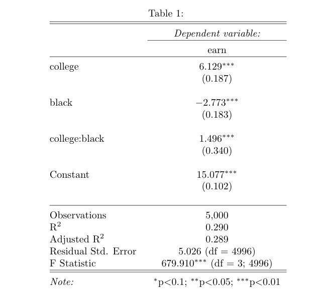

```{r setup, include=FALSE}
knitr::opts_chunk$set(echo = TRUE)

## load packages
library(tidyverse)
library(psych)
library(foreign)
library(stargazer)
library(QuantPsyc)
```

# Part 1: Multivariate Regression & Interaction with One Dummy

## Dummies 

- For categorical variables, we create dummies or convert them to 0 or 1 dummies when we want to include them in a regression model
- Note that for a categorical variable that have $n$ categories, the regression model will only have $n-1$ dummies or categorical variable predictors, because the $n^{th}$ dummy is redundant given that if an observation does not belong to any of the $n-1$ category, then it must be in the $n^{th}$ category
- We call the left-out category the **reference category**
- Question: what if we include all $n$ categories?

- You should always interpret your model coefficients with the reference category in mind. This could get complicated when you have multiple dummy variables, especially when they are interacted in your model

In the case of the dummies representing "race" in the `earnings_df` that we will be using today, we have:

Category | $Dummy_1 (black)$| $Dummy_2 (other)$   
---------|------------|-----------
White    | 0          |    0 
Black    | 1          |    0
Other    | 0          |    1

## Exercise

  1. Import `earnings_df.csv` to your environment. Perform the following data cleaning steps: 
    (1) If `age` takes the value 9999, recode it as `NA`; 
    (2) Create a new variable `female` that equals 1 when `sex` takes the value `female`, and equals to 0 otherwise; 
    (3) Create a new variable `black` that equals 1 when `race` is `black` and equals to 0 otherwise; 
    (4) Create a new variable `other` that equals to 1 when `race` is 'other` and 0 otherwise.
  
  2. Use the `describe()` function from the `psych` package to generate a quick descriptive statistics of your data.
  
  3. Now, estimate the following models and display your model results in a single table using `stargazer(m_1, m_2, ..., m_n, type="text")`. 

(1) Model 1: earn ~ age (baseline)
(2) Model 2: earn ~ age + edu 
(3) Model 3: earn ~ age + edu + female
(4) Model 4: earn ~ age + edu + female + race
(5) Model 5: earn ~ age + edu + female + race + edu*female

  4. Write down your prediction equation for Model 5

  5. In Model 5, holding other variables constant, what will be the predicted difference in estimated mean earnings for a white man and a white women?  
  
  6. Holding other variables constant, what will be the predicted difference in estimated mean earnings for a white women and a black women?  
  
  7. Holding other variables constant, what will be the predicted difference in estimated mean earnings for a white man and a black women?

```{r part1-clean, warning=FALSE, message=FALSE}

earnings_df <- read.csv("data/earnings_df.csv", stringsAsFactors = F)

## recode age
earnings_df <-
  earnings_df %>%
  mutate(age = case_when(
    age > 9000 ~ NA,
    .default = age
  ))

## recode female
earnings_df <- earnings_df %>% 
  mutate(gender = case_when(
    sex == "female" ~ 1, 
    .default = 0)) 

## base R way of doing it
earnings_df$female <- 0
earnings_df[earnings_df$sex=="female", "female"] <- 1

## create black and other
earnings_df <- 
  earnings_df %>%
  mutate(black = case_when(
    race == "black" ~ 1,
    .default = 0
  )) %>%
  mutate(other = case_when(
    race == "other" ~ 1,
    .default = 0
  ))

```


```{r part1-estimation, warning=FALSE, message=FALSE}
m1 <- lm(earn ~ age, 
         data = earnings_df)

m2 <- lm(earn ~ age + edu,
         data = earnings_df)

m3 <- lm(earn ~ age + edu + female,
         data = earnings_df)

m4 <- lm(earn ~ age + edu + female + black + other,
         data = earnings_df)

m5 <- lm(earn ~ age + edu + female + black + other + edu*female,
         data = earnings_df)

stargazer(m1, m2, m3, m4, m5,
          type = "text",
          omit.stat=c("ser", "f","rsq"))
```

# Part 2: Interaction with Two Dummy Variables

Given the following modeling result, please answer the questions.

{width=70%}

  1. What will be the predicted difference in estimated mean earnings for a white person with a college degree and a black person with a college degree? Whose earnings will be higher?
  
  2. What will be the predicted difference in estimated mean earnings for a white person with a college degree and a black person without a college degree? Whose earnings will be higher?
  
  3. How to interpret the interaction coefficient? 
  
  4. How to interpret the intercept?

## Plot Predicted Effects
  
* We can visualize the predicted effects of key predictors using the `predict()` function in base `R`.  

* The idea behind this task is to first create a dataframe with values of all the predictors included in the model, with **only the value of your predictor(s) of interest vary within the possible range, whereas other predictors held at their mean.**  

* For example, if we want to examine the effect of **education and gender** on earnings, we create a dataframe with a variable `edu` that varies from 0 to 15 with an interval of 1 (so `edu` = 0, 1, 2, ..., 14, 15), because the possible value of `edu` in our data is integers from 0 to 15 (you can use `summary(your_df)` to check value ranges).

* We repeat this number sequence for another time so that we have **each level of education for both male and female**. So we need to generate `edu` = 0, 1, 2, ..., 14, 15, 0, 1, 2, ..., 14, 15. We use `rep(0:15, 2)` to generate this number sequence.  

* `rep(x, times)` replicate `x` (a vector or list) for user-defined `times` (in our case, `times = 2`). You can run this in your `R` console to see what number sequence is returned.  

* Then, we generate a dummy variable `female` that equals to 0 for male and 1 for female.  

* To create a dataframe that have the combination of each level of `edu` and each gender category, we let `female` = 0 for 16 times, and `female` = 1 for 16 times, using `c(rep(0, 16), rep(1, 16))`. You can run this in your R console to see what number sequence is returned.  

* For the rest of the predictors, we fix them at their mean. We add `na.rm = T` in the `mean()` function to specify how we want to deal with NA values. If you don't include `na.rm = T`, `mean()` will return NA if your variable contains NAs. 

```{r predict, warning=FALSE, message=FALSE}

## first, we create a dataframe with all predictor variables
## only the key predictor varies, while the others remain at the mean
pred_IV <- data.frame(edu = rep(0:15, 2)) %>%         ## first, create a df with values of your key predictor
  mutate(female = c(rep(0, 16), rep(1, 16)),          ## b/c we are looking at interaction effects, 
                                                      ## give gender two values, otherwise fix it at mean
         age =  mean(earnings_df$age, na.rm = T),   ## fix other variables at mean
         black = mean(earnings_df$black),
         other = mean(earnings_df$other))
rep(0:15,2)

## examine the df
head(pred_IV, 5)
```

* Now that we have the dataframe `pred_IV` ready for predicting the dependent variable (earning), we can use the R function `predict()` to calculate fitted earning using the regression model and the values specified in each row in `pred_IV`. Then, use `cbind()` to combine this fitted Y value vector with your `pred_IV` for plotting. 

```{r plot effect}
## use `predict` to predict the Y
predicted_earning <- predict(m5,                      ## the model you are using
                             pred_IV,                ## the df you use for predicting
                             interval = "confidence", ## set CI
                             level = 0.95)

## bind the columns
pred_result <- cbind(pred_IV, predicted_earning)

## check df
head(pred_result, 5) 
 
## plot
pred_result %>% 
  mutate(gender = ifelse(female == 0, "Male", "Female")) %>%       ## convert dummy to character variable
  ggplot(aes(x = edu, y = fit, group = gender)) +
  geom_line(aes(linetype = gender)) +                              ## group linetype by gender
  geom_ribbon(aes(ymin = lwr, ymax = upr, fill = gender), alpha = 0.3) +   # add 95% CI
  theme_bw() +
  labs(x = "Years of Education",
       y = "Predicted Earnings") +
  ggtitle("Predicted Earnings by Education and Gender",
          subtitle = "(Modeled with interaction between education and gender)")
```

# Part 3 F-test for Nested Models

- We can use F-test to compare two regression models. The idea behind the F-test for nested models is to check **how much errors are reduced after adding additional predictors**.  A relatively large reduction in error yields a large F-test statistic and a small P-value. The P-value for F statistics is the right-tail probability.  

- If the F's p-value is significant (smaller than 0.05 for most social science studies), it means that at least one of the additional $\beta_j$ in the full model is not equal to zero.  
  
- The F test statistic for nested regression models is calculated by:

$$F = \frac{(SSE_\text{restricted} - SSE_\text{full})/df_1}{SSE_\text{full}/df_2} $$
where $df_1$ is the number of **additional** predictors added in the full model and $df_2$ is the **residual df for the full model**, which equals $(n - 1 - \text{number of IVs in the complete model})$. The $df$ of the F test statistic is $(df_1, df_2)$.  

For example, according to the equation, we can hand-calculate the F value for `m3` vs `m4`:

```{r F-hand}

# SSE_restricted:
sse_m3 <- sum(m3$residuals^2)

# SSE_full:
sse_m4 <- sum(m4$residuals^2)

# We add one additional IV, so:
df1 <- 2

# Residual df for the full model (m5):
df2 <- m4$df.residual

# Calculate F:
F_stats <- ((sse_m3 - sse_m4)/df1)/(sse_m4/df2)
F_stats

# Check tail probability using `1 - pf()`
1 - pf(F_stats, df1, df2) 
```
  
- You can also use `anova()` to perform a F-test in R. 

```{r anova}

anova(m3, m4)

```
  
- What is your null and alternative hypotheses? What's your decision given the F-test result?  

# Part 4: Standardized Regression Coefficients

- Why sometimes people report standardized regression coefficients? As we covered in the lecture, the size of a regression coefficient depends on **the scale at which the independent and dependent variables are measured**. 

- For example, assume that in a regression model the coefficient of population on the national GDP is 0.0001. This means that 1 additional person will lead to 0.0001 increase in the GDP. However, this value does not necessarily imply that the effect of population is less pronounced than other predictors whose coefficients have a larger value. Because the value of the coefficient depends on the measurement unit of the IV. If we now change population to **population in million**, the new coefficient of population will become $0.0001 \cdot 10^6 = 100$. Although the value of the coefficient gets much larger, this increase is caused by a change in the measurement unit, not the actual effect of population. 

- Therefore, it is problematic to use the raw value of the regression coefficient as indicators of relative effect size if the predictors in the model have different measurement units. In such scenarios, standardized regression coefficients can help compare the relative effect size of the predictors even if they are measured in different units. 

- Standardized coefficients convert both your dependent variable and independent variables to **z-scores**. That is, each of your original (numeric) variables are converted to have a mean of 0 and a standard deviation of 1. Thus, **standardized coefficients tell us the change in $Y$, in $Y$'s standard deviation units, for a one-standard-deviation increase in $X_i$, while holding other $X$s constant**.  

- There are two methods of getting standardized regression coefficients in R.

## Method 1: Use `lm.beta()` from the `QuantPsyc` package

You can get standardized regression coefficients by using the `lm.beta()` function in the `QuantPsyc` package. For example, if we want to get the standardized coefficients for Model 2 (`earn ~ age_recode + edu`):

```{r lmbeta}

## original model
m2

## standardized coefficients
std_m2 <- lm.beta(m2)
std_m2
```

  
- But this method will only report the point estimates instead of a comprehensive modeling result. To obtain that, we need to convert all numeric variables to z-scores and estimate regression models based on the transformed data.

## Method 2: Create Z-scores for All Numeric Variables

- For each numeric variables, we create the "standardized variables" by calculating their z-scores: 

$$z = \frac{x - \bar{x}}{s_x}$$
  
- For example, we can use `mutate_at()` to covert numeric variables to z-scores in `earnings_df` using the above formula:
  
```{r z-standardize}
## a function that convert a numeric vector to a z-score vector
get_zscore <- function(x){
  (x - mean(x, na.rm = T))/sd(x, na.rm = T)
  }

## create a df with numeric variables converted to z-score
earnings_df_std <- earnings_df %>%
  mutate_at(c("edu", "age", "earn"), get_zscore)

## estimate model
m2_std_zscore <-  lm(earn ~ age + edu, data = earnings_df_std)

## compare results
stargazer(m2, m2_std_zscore, type = "text")
```