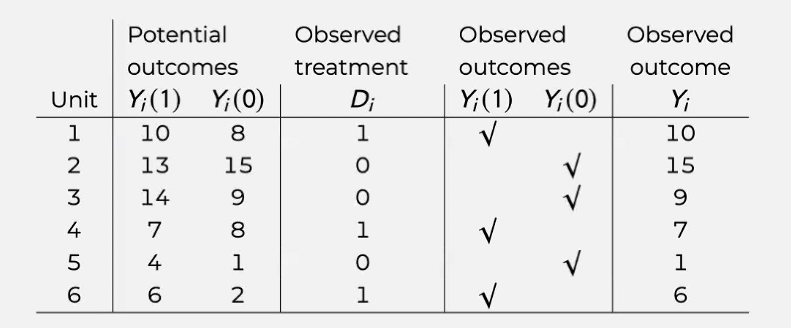

# Logistics

* Assignment 3 has been released. Due date Nov. 22 (11:59pm)
* Quiz explanations

# Part 1: Replication Project Tips

## 1.1 Samples

* For the 1990 sample, use the 1% metro sample
* For the 2010 sample, use the single-year ACS sample, not 3- or 5-year pooled sample
* If you read pp.1046 carefully, you will notice that Rs with the top and bottom earning percentile are excluded
  + You can create percentiles using `quantile(ma$WEEKEARN, seq(0.01,1,0.01))`, suppose your dataframe is `ma`, and the weekly earning variable is `WEEKEARN`

## 1.2 Variables

* Use `BPL` rather than `NATIVITY`
 + The latter has no valid values for most samples
* Use `HISPAN` to exclude Hispanic Whites and Hispanic Blacks
* Use `CLASSWKR` to determine whether R is in a public sector or not
  + You should look at CLASSWKRD, which gives detailed classification of `CLASSWKR`
* Use CPI99 to adjust inflation for `INCWAGE`
* The main dependent variable is the logged form of **weekly earnings**
  + You will need `WKSWORK1` and `WKSWORK2` to measure the number of weeks worked last year. `WKSWORK1` always gives the best continuous estimate, but when `WKSWORK1` is not available, you should turn to `WKSWORK2`
* To estimate potential years of experience, the formula is given by `LMEXP = AGE - EDUYEAR - 6`
  + `EDUYEAR` needs to be estimated
  + Codes for this process are available in the `code` folder
  
## 1.3 Duncan's Dissimilarity Index

* In Table A1a and A1b, you will notice that there is a dissimilarity index. This is a very commonly used measure of occupational segregation.

  + Check [Martin-Caughey (2022)](https://doi.org/10.1177/00031224211042053) on within-occupation variation and gender segregation using job titles and verbatim texts in GSS that describe jobs
  
  + The standard Duncan's Dissimilarity/Segregation Index is given by:

$$D = \frac{1}{2} \sum_{i=1}^{n} \left| \frac{a_i}{A} - \frac{b_i}{B} \right|$$

where $a_i$ and $b_i$ is the number of White and Black workers in occupation group $i$. $A$ and $B$ represents the total number of White and Black workers. 

* Instead of using hundreds of `OCC1990` categories, you will use 2-digit aggregated categories of `OCC1990`
  + Codes are available on Brightspace
  + Use the `merge()` function
  
## 1.4 General Instructions

* It is totally okay if you cannot get exactly the same numbers! I also couldn't.
* But they should be close enough. If they deviate a lot, you need to explain your speculations why the numbers differ this much.
* The total number of observation $N$ may give you some hints (e.g., you did not restrict your sample as much as the original paper).

# Part 2: Causality: The Potential Outcome Framework

## 2.1 The Fundamental Problem of Causal Inference

* The modern way of thinking about causality is to think about outcomes in a counterfactual approach

* For example, the effect of a policy treatment on an outcome $Y$, is to think about the difference between $Y_{i}^{t}$, i.e., the potential outcome of individual $i$ receiving the treatment, and $Y_{i}^{c}$, i.e., the potential outcome of **the same individual**, if not receiving the treatment. Either one of the two terms is never observed.

  + Notation-wise, $Y^{c}$ and $Y^{t}$ are both **potential outcomes** (i.e., Rubin's approach)
  + ATE is defined as $ATE = \mathbb{E}[Y_{i}^{t}] - \mathbb{E}[Y_{i}^{c}] = \mathbb{E}[Y_{i}^{t}-Y_{i}^{c}]$
  + We can only observe $\mathbb{E}[Y_{i}^{t} | D_i = 1]$ and $\mathbb{E}[Y_{i}^{c} | D_i = 0]$

## 2.2 Naive Estimation of the Average Treatment Effect

* At the population level, the **average treatment effect (ATE)** is defined as:

$$\tau = ATE = \mathbb{E}[Y_{i}^{t} - Y_{i}^{c}] = \mathbb{E}[Y_{i}^{t}] - \mathbb{E}[Y_{i}^{c}]$$
* Since we do not observe the population level $Y^T$ or $Y^C$, the naive approach to estimate the population level ATE uses the following equation:

$$\hat{\tau} = \mathbb{E}[Y_{i}^{t}|D_i = 1] - \mathbb{E}[Y_{i}^{c}|D_i = 0]$$
  
* which calculates the difference in the expected value of $Y_i$ in the observed treated group ($\mathbb{E}[Y_{i}^{t}|D_i = 1]$) and the expected value of $Y_i$ in the observed control group ($\mathbb{E}[Y_{i}^{c}|D_i = 0]$).  
  
* The estimated naive ATE will be unbiased **if the assignment to treatment is purely random**.  

## 2.3 Selection Bias
  
* However, if there are selection bias that lead to certain kinds of unit to go into the treatment or control group, the naive estimator will be biased.  
  
* This is due to the fact that this additional factor is related to both assignment to treatment and the potential outcome.  

* As covered in the lecture, we can decompose the naive estimator to:

$$
\begin{aligned}
\hat{\tau} &= \mathbb{E}[Y_{i}^{t}|D_i = 1] - \mathbb{E}[Y_{i}^{c}|D_i = 0] \\ 
&= \underbrace{\mathbb{E}[Y_{i}^{t}|D_i = 1] - \mathbb{E}[Y_{i}^{c}|D_i = 1]}_{\text{ATT}} + \underbrace{\mathbb{E}[Y_{i}^{c}|D_i = 1] - \mathbb{E}[Y_{i}^{c}|D_i = 0]}_{\text{selection bias}}
\end{aligned}
$$

where $\mathbb{E}[Y_{i}^{t}|D_i = 1] - \mathbb{E}[Y_{i}^{c}|D_i = 1]$ is the **treatment effect on the treated** and $\mathbb{E}[Y_{i}^{c}|D_i = 1] - \mathbb{E}[Y_{i}^{c}|D_i = 0]$ is the **selection bias**. You can think of it as the baseline difference of $Y_i$ if both the treatment and the control group are not treated.

* For example, if family income both affects the likelihood of a child going to college ($D_i=1$) and potential future income ($Y_i$), will the selection bias be positive or negative? Will the naive estimation of ATE estimating the income returns to college education **overestimate** or **underestimate** the true causal college effect?

* There is also a definition of the **treatment effect on the control** (ATC), which can be expressed as $\mathbb{E}[Y_{i}^{t}|D_i = 0] - \mathbb{E}[Y_{i}^{c}|D_i = 0]$

* In old-school regression adjustments (i.e., including controls), the assumption is that

* $\underbrace{\mathbb{E}[Y{_i}^c|D_i=1, X_i] - \mathbb{E}[Y_{i}^c|D_i=0,X_i]}_{\text{selection bias}} = 0$

  + This is a strong assumption, i.e., strong ignorability assumption
  + Failure to satisfy the assumption will lead to omitted variable bias, or selection bias, or the violation of zero-conditional mean assumption

## Part 2 Exercise
Assuming you know both potential outcomes $Y_i^t$ and $Y_i^c$ on the same individual, as well as their realized outcomes. Answering the following questions:

{width=70%}

 

1. Calculate ATE: 

2. Calculate ATT: 

3. Calculate ATC:

4. Naive estimate of the ATE:

5. What causes the naive ATE to deviate from the true ATE in this example? 

# Part 3: Some Examples of Causal Inferential Studies

* The most straightforward approach is to manipulate treatment assignment to be completely random. In this case, selection bias is zero, by design.

* [Effect of neighborhood stigma on economic transactions](https://www.pnas.org/doi/abs/10.1073/pnas.1414139112), The Proceedings of the National Academy of Sciences (PNAS)

  - Random assignment of seller's neighborhood information on an online market
  
* [The mark of a criminal record](https://www.journals.uchicago.edu/doi/full/10.1086/374403), AJS

  - Random assignment of racial background of job seekers with criminal record
  
* [Exposure to Opposing Views can Increase Political Polarization: Evidence from a Large-Scale Field Experiment on Social Media](https://www.pnas.org/doi/10.1073/pnas.1804840115), PNAS

  - Random assignment of Republican or Democrats voters to follow twitter accounts from elected officials and opinion leaders with opposing political views

* In many cases, experiments with random assignment is either unethical or unfeasible. People therefore turn to natural experiments, where assignment of treatment is quasi-random.

[Nation building through foreign intervention: Evidence from discontinuities in military strategies](https://academic.oup.com/qje/article/133/2/701/4110419), QJE

  - Quasi-random assignment of bombing and airstrikes in the Vietnam War
  
[Lifetime earnings and the Vietnam era draft lottery: evidence from social security administrative records](https://www.jstor.org/stable/2006669), AER

  - Quasi-random assignment of military participation in the Vietnam War
  
* Instrumental variables are seen as quasi-experiments if their variations come from certain social or natural designs

* [Commitment through Sacrifice: How Longer Ramadan Fasting Strengthens Religiosity and Political Islam](https://journals-sagepub-com.proxy.library.nyu.edu/doi/full/10.1177/00031224221101204), ASR

  - IV from the time-shifting feature of Ramadan that makes the fasting duration vary from year to year
  
* [Community and the Crime Decline: The Causal Effect of Local Nonprofits on Violent Crime](https://journals.sagepub.com/doi/full/10.1177/0003122417736289), ASR

  - IV from nonprofit organizations in art, media, and medical industries to instrument local nonprofit organizations targeting violent crimes

