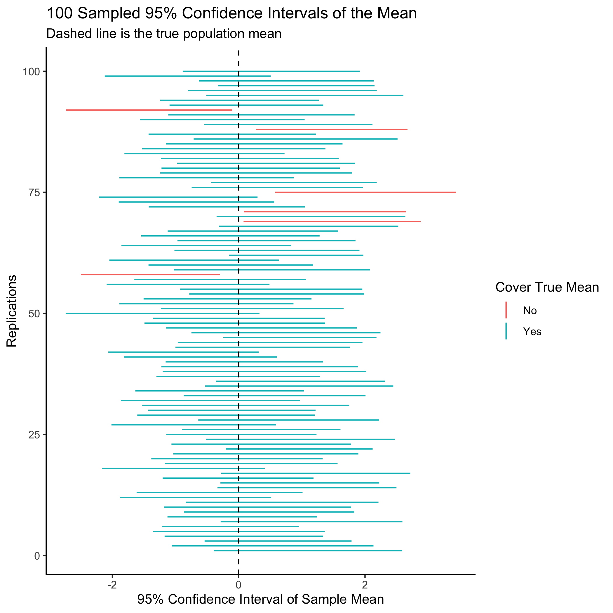

# Instructions

\begin{enumerate}
    \item Submit two files for each problem set. The first is a \textbf{R Markdown} (\texttt{.Rmd}) file that can be run without error from start to end. The second is a \textbf{PDF} rendered from your R Markdown file or created using \LaTeX{}. 
    \item Name your files following this convention: \texttt{[Last Name]\_ps1.Rmd} and \texttt{[Last Name]\_ps1.pdf} (for example, \texttt{Jiang\_ps1.Rmd}). 
    \item Both files should be submitted to the TA via e-mail (wj2068@nyu.edu) before the time specified above. Please email the TA at least three days before the due date if you need extensions with justified reasons. Please plan ahead and start early.
    \item You are encouraged to discuss the problems with your classmates. But \textbf{the R Markdown and PDF files that you submit have to be created on your own}. Please do not ask for solutions from students in earlier cohorts.
    \item Comment on your code wherever possible and explain your ideas in detail. You will get credits for showing the steps you take and for explaining your reasoning, even if you do not get the correct final result.
\end{enumerate}

\noindent\rule{16.5cm}{0.4pt}

# Prerequisite

Load multiple packages to your environment using the following code (you can add more packages to the current list as per your need):

```{r setup, message=FALSE, warning=FALSE}
knitr::opts_chunk$set(echo = TRUE, fig.pos = 'H', fig.align="center")

library(tidyverse)
library(kableExtra)
library(gridExtra)
```

# Part 1. Functions

Recall the formulas for population mean:
    \begin{equation}\label{eq:pop_mean}
        \mu = \frac{1}{N}\sum_{i=1}^N x_i
    \end{equation}
    and variance:
    \begin{equation}\label{eq:pop_var}
        \sigma^2 = \frac{1}{N}\sum_{i=1}^N(x_i-\mu)^2
    \end{equation}
    where $N$ is the population size.  
      
      
1.[5pts] Write a function that calculates the **population mean** according to Equation 1 without using any R functions that directly calculate the mean. For example, you cannot use `mean()` from base R, or `summarise(., mean = mean())` from `tidyverse`.  
  
  
```{r q1 pop_mean}

```
  
  
2.[5pts] Write a function that calculates the **population variance** according to Equation 2 without using any R functions that directly calculate the variance. For example, you cannot use `var()` from base R, or `summarise(., var = var())` from `tidyverse`. You cannot use `mean()` from base R, either.    
  
  
```{r q1 pop_var}


```
  
3.[10pts] Import `gapminder.csv` to your R environment.  

  - Apply the two functions you just created to the `lifeExp` variable in `gapminder`.  
  - Use base R functions that directly calculate mean and variance to the same `lifeExp` variable vector.  
  - Report your results of the above two steps either in text or in a table. The results for the mean should be equal, but the results for variance should be different. Find out and explain why the results in variance differ.

```{r q1-3}

```


# Part 2. Population, sample, and sampling distribution

1.[3pts] Create a population that follows a normal distribution with population mean $\mu = 5$ and population variance $\sigma^2 = 1$ with $100,000$ observations.

```{r q2-1}

```

2.[3pts] Create a histogram of the population with appropriate title and labels. Add a vertical line at the population mean.

```{r q2-2}


```

3.Draw a random sample from the population, with sample size $n = 50$.

```{r q2-3}


```

4.[3pts] Plot a histogram of the sample with appropriate title and labels. Add a vertical line at your point estimate of the population mean. How does this histogram compare to the one you created in question 2?

```{r q2-4}


```
  


5.[6pts] Based on your sample, report your point estimate, $\hat\mu$, of the population mean and the standard error of this estimate.  

```{r q2-5}


```
  
6.[6pts] Simulate the sampling distribution of the sample mean ($n = 50$) using $1000$ draws. That is, repeat the action you took for question 3 for $1000$ times and save the mean you get for each repetition to a numeric vector.

```{r q2-6}

```
  
7.[3pts] Create a histogram of the sampling distribution of the sample mean you simulated in question 6 with appropriate title and labels. Add a vertical line at your point estimate of the population mean.

```{r q2-7}

```

8.[6pts] Using the sampling distribution you obtained in question 6, report your point estimate of the population mean $\hat\mu$ and the standard error of this estimate. 

```{r q2-8}

```


9.[20pts] Repeat questions 3 to 8 increasing the size of your sample to $n = 1000$. Plot and report your results. Then, using the concepts that we learned in class, summarize the differences with respect to what you obtained with a sample of $50$ (Hint: there are two related concepts, one related to the sample estimate of the population mean, and the other related to the uncertainty of the standard error of this estimate).

```{r q2-9}

```

  

# Part 3. Simulate confidence interval 

1.[10pts] In your own words, explain what is a 95% confidenece interval and what is a p-value.  


2.[5pts] Write down the mathematical formulas you use to calculate the 95% confidence interval of the sample mean for a given sample (assume the sample size is larger than 50 so you can use the z instead of the t-statistics). Make sure you explain the meanings of the notations you use in your formulas.  


3.[15pts] Replicate the plot below and interpret the plot in one or two sentences.  
  
  *Hint:* The plot shows the simulation result when a sample (size $n$) is randomly drawn 100 times without replacement from a hypothetical population with mean $\mu$ and standard deviation $\sigma$. $\mu$ has a correct, fixed answer, but $n$ and $\sigma$ depend on your choice, as long as the simulation results look similar to the plot.
  
  *Note:* As there is randomness involved in the simulation process, your plot does not need to replicate the exact same result as the example. Also, try your best to tweak the layout of your plot, but it does not need to look exactly the same as the example. You will get credits as long as you generate a similar enough graph that convey the conceptual points clearly and correctly. Remember to use `set.seed()` for any random process.

\centering
{width=70%}


```{r q3-3}

```
