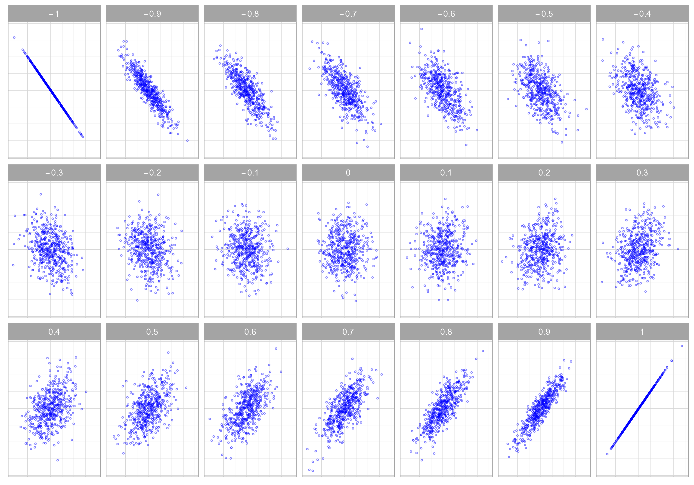
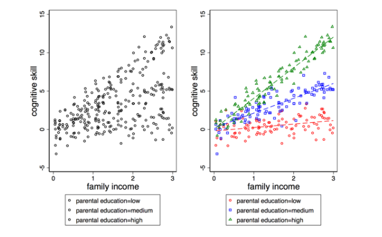
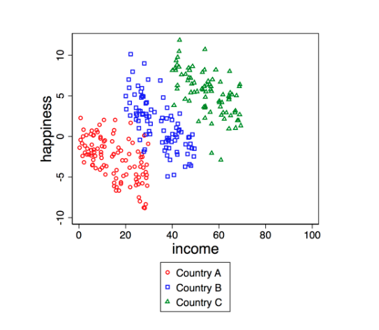

# Instructions

\begin{enumerate}
    \item Submit two files for each problem set. The first is a \textbf{R Markdown} (\texttt{.Rmd}) file that can be run without error from start to end. The second is a \textbf{PDF} rendered from your R Markdown file or created using \LaTeX{}. 
    \item Name your files following this convention: \texttt{[Last Name]\_ps2.Rmd} and \texttt{[Last Name]\_ps2.pdf} (for example, \texttt{Jiang\_ps2.Rmd}). 
    \item Both files should be submitted to the TA via e-mail (wj2068@nyu.edu) before the time specified above. Please email the TA at least three days before the due date if you need extensions with justified reasons. Please plan ahead and start early.
    \item You are encouraged to discuss the problems with your classmates. But \textbf{the R Markdown and PDF files that you submit have to be created on your own}. Please do not ask for solutions from students in earlier cohorts.
    \item Comment on your code wherever possible and explain your ideas in detail. You will get credits for showing the steps you take and for explaining your reasoning, even if you do not get the correct final result.
\end{enumerate}

\noindent\rule{16.5cm}{0.4pt}
\


```{r setup, warning=FALSE, message=FALSE}
knitr::opts_chunk$set(echo = TRUE)

## load packages here
```

  
```{r package hidden, message=FALSE, include=FALSE}
library(knitr)
```

# Part 1: Assumptions

Consider the "true" data-generating process (DGP): 
  $$Y = \beta_0 + \beta_1X + \epsilon$$
  
1. [10pts] Suppose we obtain a sample of size $n$ from this process. State the assumptions under which the OLS estimator $\hat \beta_1$ is BLUE (Best Linear Unbiased Estimator) for $\beta_1$.  

2. [10pts] For each of the assumptions, discuss what will go wrong when the assumption is violated.  

3. [5pts] Let $\beta_0 = -0.25$, $\beta_1 = 1.2$, $X \sim \Gamma(5, 4)$, and $\epsilon \sim \text{Normal}(0, 1)$. Here, $\Gamma(\alpha, \psi)$ denotes the Gamma distribution with shape parameter $\alpha$ and rate parameter $\psi$. A simple Google search will lead you to a way to simulate from this distribution (Don't get scared away from the new distribution and the fancy Greek letters!). Simulate a dataset of size $n = 3, 000$ from this process in which all of the assumptions you've discussed above hold.  

4. [20pts] For each of the assumptions, create a plot which illustrates how the violation of the assumption affects the regression results (all other assumptions should be satisfied). This can be a scatter plot, a plot of the regression line, the sampling distribution of the OLS estimator (comparing what the regression table suggest with actual simulations), or anything else. The important point is to show how the violation leads us to false decisions if we assume the assumption is true, not just showing that the assumption is violated. When simulating data, you don't have to use the parameters set in the previous problem. Also, you can skip the "no autocorrelated errors" assumption, which goes beyond the course materials.  

  *Hint*: Plots will reflect what you have discussed in Question 1.2. For example, for the violation of linearity assumption, you may create a vector of $x$ and a corresponding vector of $y$ that has a non-linear relation to $x$. Then you fit the relation linearly and plot the linear line with the true, non-linear curve on a same scatter plot with points of $x$ and $y$. You may use `geom_function()` in `ggplot2` to add a curve based on a non-linear function.
  
  *Further bigger hint*: For the violation of exogeneity assumption, the easiest way is to create two variables, $x_1$ and $x_2$, with non-zero covariances between the two. $y$ is a function of $x_1$ *and* $x_2$, while when you specify the OLS regression, you omit either $x_1$ or $x_2$. In this case, the error term, by construction, will be correlated with the independent variable. Then discuss the difference between the true model, where exogeneity assumption is satisfied.

```{r part1}

```
  
# Part 2 Simulate and Plot Correlation

[15pts] Replicate the following figure which demonstrates the different levels of Pearson's correlation.  
  
  *Hint*: Look up `mvrnorm()` from the `MASS` package. 

{width=100%}

```{r part2}

```

  
# Part 3 Simulate Interactions 

1) [15pts] Simulate a data generation process that will provide you data to roughly replicate the two-panel figure below. You should show your code and replicate the two-panel example figure.

  *Note:* Your output does not need to replicate the exact layout of the example figures. You will get credit as long as you generate a similar plot that illustrates the relationship clearly. Remember to use `set.seed()` for any random process.

```{r, echo=FALSE, fig.align='center', out.width="90%"}

```

2) [15pts] Simulate a scatter plot that demonstrates the Simpson's Paradox:
  
```{r, echo=FALSE, fig.align='center', out.width="60%"}

```

3) [10pts] Choose one of the above data simulations you just generated, write down the regression equation you estimated using OLS, and interpret the coefficients in your own words.

  *Hint:* You will need to specify group-specific slopes and intercepts.


```{r part3}


```


# Part 4: The Replication Project 

Download the article for the replication project: Hadas Mandel and Moshe Semyonov (2016). "Going back in time? Gender differences in trends and sources of the racial pay gap, 1970 to 2010." American Sociological Review 81(5): 1039-1068. Make sure to also download and save the Online Appendix (you will find it on the ASR website).  

Read through the article and determine which variables you will need to replicate the project. Go to the IPUMS webpage and submit a screenshot of the page where you can see the samples and variables that you have selected (you can obtain this from your "Data Cart").

